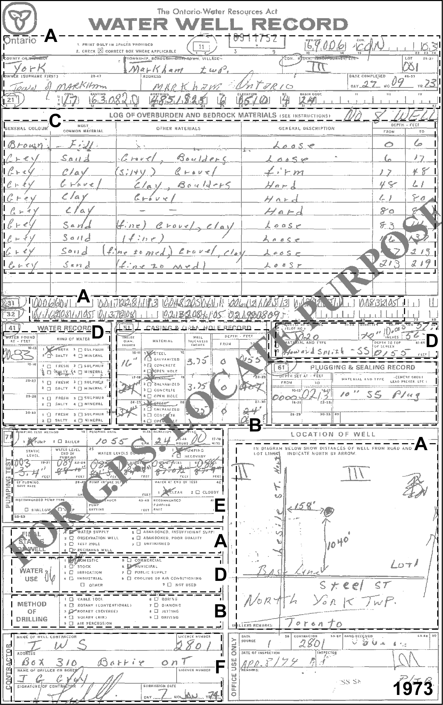

## Section 2.3.1 MOE Records

Over the years, there have been a number of slightly different MOE borehole
report forms that are submitted by well drillers - four are provide here (from
the years: 1954, 1967, 1973 and 1995).  Information on the forms remains mostly consistent and has been grouped into the following sections:

* **A.** Location Information
* **B.** Borehole Information
* **C.** Geologic Information
* **D.** Water Levels and Water Description
* **E.** Pumping Information
* **F.** Driller Details

Note that the information recorded in the database (and described below) is not shown on these sheets but is rather assembled, for example, by:  the type of location we're describing (a borehole/well); the reassignment of purposes to a ORMGP code versus the original MOE code; where the quality-of-positioning codes can be found within the database; etc...  Additional notes have been provided in many of these cases to avoid the confusion that these values/codes have been 'issued' by the MOE. 

#### A - Location Information

Affected tables (and their fields; 'REF' indicates a look-up table; values are
taken from the 1973 example) include:

* D_LOCATION
    + LOC_NAME (MOE Record Number: 6911752)
    + LOC_NAME_ALT1 (Owner Name: Town of Markham)
    + LOC_TYPE_CODE (1; REF, see below)
    + LOC_COORD_EASTING_OUOM (630820)
    + LOC_COORD_NORTHING_OUOM (4851825)
    + LOC_COORD_OUOM_CODE (2; REF, see below)
    + LOC_LOT (001)
    + LOC_CON (3)
    + LOC_COUNTY_CODE (69; REF, see below)
    + LOC_TOWNSHIP_CODE (69006; REF, see below)
    + LOC_STATUS_CODE (1; REF, see below)
* D_LOCATION_PURPOSE
    + PURPOSE_PRIMARY_CODE (10; REF, see below)
    + PURPOSE_SECONDARY_CODE (22; REF, see below)
* D_LOCATION_QA
    + QA_COORD_CONFIDENCE_CODE (variable; REF, see below)

Note that at this time (1973) and right up until about 2008 when the use of GPS units became increasingly pervasive, the coordinates for a well were very rarely, if ever, provided by the driller.  Rather, the Ministry employed students who would use the driller's location map on the well record form to locate the well on a topographic map, and determine the UTM coordinates (in NAD 27 at the time) and elevation of the well.  Accuracy would be based on the scale of topographic map

Additionally, multiple look-up (i.e. R_\*) tables are accessed for populating
some of the above fields (marked REF).

* R_LOC_COORD_OUOM_CODE
    + LOC_COORD_OUOM_CODE (2)
    + LOC_COORD_OUOM_SYSTEM (UTM Northing/Easting, Z17, NAD27; note that until the early 1990s most of the well coordinates were reported in NAD27; subsequently, these coordinates have been translated to NAD83 by the MOE)
* R_LOC_COUNTY_CODE
    + LOC_COUNTY_CODE (69)
    + LOC_COUNTY_DESCRIPTION (YORK)
* R_LOC_STATUS_CODE
    + LOC_STATUS_CODE (1)
    + LOC_STATUS_DESCRIPTION (Active; note that the MOE does not use a status code of 'Active', their status codes are a cross between use - e.g. Water Supply, Recharge Well, etc... - and status - e.g. 'Abandoned - Quality', 'Abandoned - Supply', 'Unfinished', etc...; the original MOE code has been preserved in the D_BOREHOLE table)
* R_LOC_TOWNSHIP_CODE
    + LOC_TOWNSHIP_CODE (69006)
    + LOC_TOWNSHIP_DESCRIPTION (MARKHAM TOWN)
* R_LOC_TYPE_CODE
    + LOC_TYPE_CODE (1)
    + LOC_TYPE_DESCRIPTION (Well or Borehole; note that this coding is not from the MOE, but has been added to differentiate wells/boreholes from climate stations, documents, etc...)
* R_PURPOSE_PRIMARY_CODE
    + PURPOSE_PRIMARY_CODE (10)
    + PURPOSE_PRIMARY_DESCRIPTION (Water Supply; note that this code is not directly taken from the MOE database, but rather is now an amalgamation of several sources of purposes; refer to Section 2.1 - D_LOCATION_PURPOSE)
* R_PURPOSE_SECONDARY_CODE
    + PURPOSE_SECONDARY_CODE (22)
    + PURPOSE_SECONDARY_DESCRIPTION (Municipal Supply; see R_PURPOSE_PRIMARY_CODE, above)
* R_QA_COORD_CONFIDENCE_CODE
    + QA_COORD_CONFIDENCE_CODE (variable)
    + QA_COORD_CONFIDENCE_DESCRIPTION (refer to this table for possible descriptions; note that, as stated previously, the coordinate confidence code is not assigned directly from the water well record form but, rather, after the well was assigned co-ordinates based on the inferred accuracy of driller's map and the scale of the topographic map)

By default, the MOE records currently use the NAD83 geodetic datum.

#### B - Borehole Information

The primary table and fields for dealing with borehole information (values are taken from the 1973 example), and the look-up tables referenced, include:

* D_BOREHOLE
    + BH_GND_ELEV_OUOM (510)
    + BH_GND_ELEV_UNIT_OUOM (fasl; REF, see below; note that the MOE no longer assigns elevation values to the well records; prior to discontinuing elevation assignment, the MOE assigned elevations from the topographic map that was used to locate the particular well; the associated 'Elev_Reliability_Code' - also no longer used - was assigned at the same time)
    + BH_BOTTOM_OUOM (219)
    + BH_BOTTOM_UNIT_OUOM (fasl; REF, see below)
    + BH_DRILL_START_DATE/BH_DRILL_END_DATE (1973-09-27)
    + BH_DRILL_METHOD_CODE (3; REF, see below)
* R_BH_DRILL_METHOD_CODE
    + BH_DRILL_METHOD_CODE (3)
    + BH_DRILL_METHOD_DESCRIPTION (Rotary (reverse))
* R_UNIT_CODE
    + UNIT_DESCRIPTION (fasl and fbgs; note that no numeric is being specified, instead we're using the look-up table to see what units are acceptable for conversion purposes)

For describing the casing, the following tables and fields are used:

* D_BOREHOLE_CONSTRUCTION
    + CON_SUBTYPE_CODE (21; REF, see below)
    + CON_TOP_OUOM (0)
    + CON_BOT_OUOM (155)
    + CON_UNIT_OUOM (fbgs)
    + CON_DIAMETER_OUOM (16)
    + CON_DIAMETER_UNIT_OUOM (inch)
* R_CON_SUBTYPE_CODE
    + CON_SUBTYPE_CODE (21)
    + CON_TYPE_CODE (3; REF, see below)
    + CON_SUBTYPE_DESCRIPTION (Steel Casing)
* R_CON_TYPE_CODE
    + CON_TYPE_CODE (3)
    + CON_TYPE_DESCRIPTION (CASING)

For any description of the plug, this record has very little information provided with respect to either the sand pack that is set around the screen or with respect to the seal/plug.  This is very common for the MOE records so that many wells will not have any of these elements populated into the database.  In the case of this 1973 well record, it appears that there was some kind of seal put into the well but the depths can not be determined.  Certainly with a 20 slot screen set at 155 to 212 feet below ground, there would not be any seal across this interval.  So the plug information that indicates a 0 to 213 ft seal is inaccurate.  The same series of tables would be used, if the information was available, albeit with modified codes.

Note that D_BOREHOLE is linked to D_LOCATION based upon LOC_ID.  D_BOREHOLE_CONSTRUCTION, however, uses BH_ID which is found (as a randomly assigned integer value) in D_BOREHOLE.  Screen information is related to intervals, not construction details.

#### C - Geologic Information

The primary table and fields for dealing with geologic information, and the look-up tables referenced, include:

* D_GEOLOGY_LAYER
    + GEOL_TOP_OUOM
    + GEOL_BOT_OUOM
    + GEOL_UNIT_OUOM (fbgs; REF, see below)
    + GEOL_MAT_COLOUR_CODE
    + GEOL_MAT1_CODE
    + GEOL_MAT2_CODE
    + GEOL_MAT3_CODE
    + GEOL_MAT4_CODE
* R_GEOL_MAT_COLOUR_CODE
    + GEOL_MAT_COLOUR_CODE
    + GEOL_MAT_COLOUR_DESCRIPTION
* R_GEOL_MAT1_CODE
    + GEOL_MAT1_CODE
    + GEOL_MAT1_DESCRIPTION
* R_GEOL_MAT2_CODE (see R_GEOL_MAT1_CODE)
* R_GEOL_MAT3_CODE (see R_GEOL_MAT1_CODE)
* R_GEOL_MAT4_CODE (see R_GEOL_MAT1_CODE)
* R_UNIT_CODE
    + UNIT_DESCRIPTION (fbgs; refer to 'A - General Information', above, regarding the assignment of a code)

#### D - Water Levels And Water Description

Water levels are tied to intervals in the form of 'screen' intervals.  The primary table and fields for dealing with water levels (values are taken from the 1973 example), as well as the look-up tables referenced, include:

* D_INTERVAL
    + INT_NAME (MOE Record Number: 6911752)
    + INT_NAME_ALT1
    + INT_TYPE_CODE (18; REF, see below)
    + INT_START_DATE (1973-09-27)
* D_INTERVAL_MONITOR
    + MON_TOP_OUOM (155)
    + MON_BOT_OUOM (212)
    + MON_UNIT_OUOM (fbgs; see below)
    + MON_SCREEN_SLOT (20)
    + MON_DIAMETER_OUOM (10)
    + MON_DIAMETER_UNIT_OUOM (inch)
* D_INTERVAL_TEMPORAL_2
    + RD_TYPE_CODE (0; REF, see below)
    + RD_DATE (1973-09-27)
    + RD_NAME_CODE (628)
    + RD_NAME_OUOM (Water Level - Manual - Static)
    + RD_VALUE_OUOM (83)
    + RD_UNIT_OUOM (fbgs; see below)
* D_GEOLOGY_FEATURE
    + FEATURE_CODE (1; REF, see below)
    + FEATURE_TOP_OUOM (83)
    + FEATURE_UNIT_OUOM (fbgs; refer to 'A - General Information, above)
* R_FEATURE_CODE
    + FEATURE_CODE (1)
    + FEATURE_DESCRIPTION (WATER_FOUND - FRESH)
* R_INT_TYPE_CODE
    + INT_TYPE_CODE (18)
    + INT_TYPE_DESCRIPTION (Reported Screen)
* R_RD_NAME_CODE
    + RD_NAME_CODE (628 for the static water level, 70899 for the additional four 'pumping' water levels)
    + RD_NAME_DESCRIPTION ('Water Level - Manual - Static' for 628,  'Water Level - Manual - Other' for 70899)
* R_RD_TYPE_CODE
    + RD_TYPE_CODE (0 for the static water level; 65 for the levels during pumping)
    + RD_TYPE_DESCRIPTION ('WL - MOE Well Record - Static' for 0, 'WL_MOE Well Record - Pumping' for 65)
* R_UNIT_CODE (Interval and Water Level)
    + UNIT_DESCRIPTION (fbgs; refer to 'A - General Information', above)

D_INTERVAL contains the LOC_ID necessary to tie back to the D_LOCATION table.  All intervals, though, are accessed through an INT_ID also found in D_INTERVAL.  'Water Found' information (i.e. Water Description - Kind Of Water) is stored in the D_GEOLOGY_FEATURE table.

#### E - Pumping Information

The primary table and fields for dealing with geologic information (values are taken from the 1973 example), and the look-up tables referenced, include:

* D_PUMPTEST
    + PUMPTEST_DATE (1973-09-27)
    + PUMPTEST_NAME (MOE Record Number: 6911752)
    + REC_PUMP_RATE_IGPM (1055)
* D_PUMPTEST_STEP
    + PUMP_RATE_OUOM (1055)
    + PUMP_RATE_UNITS_OUOM (igpm)
    + PUMP_START (1973-09-27 00:00 OR 12:00)
    + PUMP_END (1973-09-28; i.e. 24 hours)

Note that D_PUMPTEST is tied to D_INTERVAL using INT_ID.  D_PUMPTEST_STEP uses, instead, the PUMP_TEST_ID which links to D_PUMPTEST.  D_PUMPTEST_STEP records any changes in the pump rate over the entire pumping interval (e.g. for step tests).  The water levels recorded during pumping are stored in the D_INTERVAL_TEMPORAL_2 table as follows

* D_INTERVAL_TEMPORAL_2
    + RD_DATE (1973-09-27 + Time Steps)
    + RD_TYPE_CODE (65; REF, see below
    + RD_NAME_CODE (70899)
    + RD_NAME_OUOM ('Water Level - Manual - Other')
    + RD_VALUE_OUOM (each of 84,85,97,88,89)
    + RD_UNIT_OUOM (fbgs; see below)
* R_RD_NAME_CODE
    + RD_NAME_CODE (70899)
    + RD_NAME_DESCRIPTION ('Water Level - Manual - Other')
* R_RD_TYPE_CODE
    + RD_TYPE_CODE (65)
    + RD_TYPE_DESCRIPTION (WL - MOE Well Record - Pumping)

Note that there will be multiple recorded water levels, one for each 15 minute period and a final reading after 24 hours (making five records in total).  These are in addition to the Static Water level which is also reported.

*Figure 2.3.1.1 Example MOE Water Well Record - 1954*

*Figure 2.3.1.2 Example MOE Water Well Record - 1967*

*Figure 2.3.1.3 Example MOE Water Well Record - 1973*

*[Figure 2.3.1.4 Example MOE Water Well Record - 1995*

