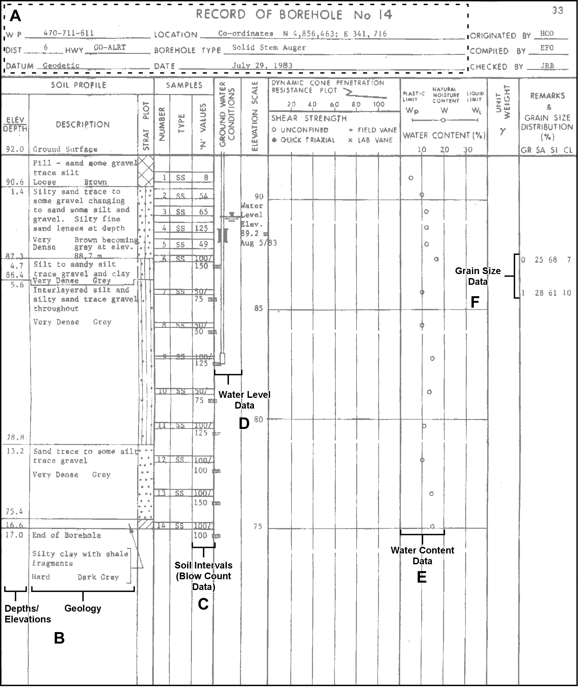

## Section 2.3.2 Consultant Report Data

#### Borehole Records

From a standard borehole reporting sheet, a number of tables are affected when
recording and transcribing information into the database.  These have been
grouped into the following sections:

* **A.** General Information (location and borehole)
* **B.** Geologic Information
* **C.** Soil Intervals (Blow Count Data)
* **D.** Water Levels
* **E.** Laboratory Analysis - Water Content
* **F.** Laboratory Analysis - Grain Size

Note that the example borehole sheet has been pulled from a geotechnical foundation report.

*Figure 2.3.2.1 Borehole Record - example with sections indicated*

#### A - General Information

Affected tables (and their populated fields; REF indicates a look-up table) include:

* D_BOREHOLE
    + BH_GND_ELEV_OUOM (0) (this will subsequently be converted to an elevation based upon the 10 m DEM using a GIS)
    + BH_GND_ELEV_UNIT_OUOM (mbgs; REF, see below)
    + BH_BOTTOM_OUOM (17)
    + BH_BOTTOM_UNIT_OUOM (mbgs; REF, see below)
    + BH_DRILL_START_DATE/BH_DRILL_END_DATE (1983-07-29)
    + BH_DRILL_METHOD_CODE (12; REF, see below)
* D_DOCUMENT_ASSOCIATION
    + LOC_ID linked to DOC_ID
* D_LOCATION
    + LOC_NAME
    + LOC_NAME_ALT1
    + LOC_STUDY
    + LOC_AREA
    + LOC_COORD_EASTING_OUOM (341716)
    + LOC_COORD_NORTHING_OUOM (4856463)
    + LOC_COORD_OUOM_CODE (16; Note that since this well is dated from 1983 the coordinates are likely in NAD 27 and would need to be converted - note that the MTM choice is an educated guess based on the numeric values)
    + LOC_TYPE_CODE (1; REF, see below)
* D_LOCATION_PURPOSE
    + PURPOSE_PRIMARY (3; REF, see below)
    + PURPOSE SECONDARY (47; REF, see below)
* D_LOCATION_QA
    + QA_COORD_CONFIDENCE_CODE (3; REF, see below)

These tables are related through LOC_ID, a randomly assigned integer value, found in the D_LOCATION table (in the D_LOCATION table no duplicated LOC_ID's would be found, i.e. it's a primary key).  The D_DOCUMENT_ASSOCATION table, different from the others, presupposes (in this case) that the document/report from which we are extracting the borehole information has already been added to the database (see Section 2.3.7).  Here we are linking, explicitly, that this location/borehole has been extracted from a particular report (through the association of the LOC_ID with a DOC_ID, the latter found in the D_DOCUMENT table).  Note that we're preferentially making use of the depth values versus the elevation values - the reasons for this are described in Section 2.4.2.

Additionally, multiple look-up (i.e. R_\*) tables are accessed for populating some of these  fields (those marked with REF above):

* R_BH_DRILL_METHOD_CODE
    + BH_DRILL_METHOD_CODE (12)
    + BH_DRILL_METHOD_DESCRIPTION (Hollow Stem Auger)
* R_LOC_COORD_OUOM_CODE
    + LOC_COORD_OUOM_CODE (16)
    + LOC_COORD_OUOM_SYSTEM (MTM Northing/Easting)
* R_LOC_TYPE_CODE
    + LOC_TYPE_CODE (1)
    + LOC_TYPE_DESCRIPTION (Well or Borehole)
* R_PURPOSE_PRIMARY_CODE
    + PURPOSE_PRIMARY_CODE (3)
    + PURPOSE_PRIMARY_DESCRIPTION (Engineering)
* R_PURPOSE_SECONDARY_CODE
    + PURPOSE_SECONDARY_CODE (47)
    + PURPOSE_SECONDARY_DESCRIPTION (Geotechnical Borehole)
* R_QA_COORD_CONFIDENCE_CODE
    + QA_COORD_CONFIDENCE_CODE (3)
    + QA_COORD_CONFIDENCE_DESCRIPTION (estimated 10-30m locational error)
* R_UNIT_CODE
    + UNIT_DESCRIPTION (mbgs; note that this is slightly different as previous - here we're using the look-up table to see what units are acceptable for conversion purposes)

#### B - Geologic Information

The primary table and fields for dealing with geologic information, and the look-up tables referenced, include:

* D_GEOLOGY_LAYER
    + GEOL_TOP_OUOM
    + GEOL_BOT_OUOM
    + GEOL_UNIT_OUOM (mbgs; LU, see below)
    + GEOL_MAT_COLOUR_CODE
    + GEOL_MAT1_CODE
    + GEOL_MAT2_CODE
    + GEOL_MAT3_CODE
    + GEOL_MAT4_CODE
* R_GEOL_MAT_COLOUR_CODE
    + GEOL_MAT_COLOUR_CODE
    + GEOL_MAT_COLOUR_DESCRIPTION
* R_GEOL_MAT1_CODE
    + GEOL_MAT1_CODE
    + GEOL_MAT1_DESCRIPTION
* R_GEOL_MAT2_CODE (see R_GEOL_MAT1_CODE)
* R_GEOL_MAT3_CODE (see R_GEOL_MAT1_CODE)
* R_GEOL_MAT4_CODE (see R_GEOL_MAT1_CODE)
* R_UNIT_CODE
    + UNIT_DESCRIPTION (mbgs; refer to 'A - General Information', above)

Note that, in addition (though not used in this example), the D_GEOLOGY_FEATURES can be used for making specific observations (provided with a depth) about the units encountered.

There will be one recorded row per unit found within the borehole - in this case, there are six units total resulting in six rows of information to be added into the database.  All geologic materials are converted from text descriptions to geologic codes as found in R_GEOL_MAT1_CODE through R_GEOL_MAT4_CODE.  Each of these material tables contain equivalent information and are only present to remove some internal complexity in the database.  Both the top and bottom of each unit are specified as well as the colour (if known).

#### C - Soil Intervals (Blow Count Data)

This type of information is actually related to a (field-collected) soil sample with a specific top and bottom.  In some cases (two here) these samples are further analyzed in a laboratory for additional parameters that would be stored elsewhere (for example, grain size; see 'F - Lab Analysis' and Section 2.3.3).  The primary table and fields for dealing with the soil sample and blow count values, as well as their associated look-up/reference tables include:

* D_INTERVAL
    + INT_NAME
    + INT_NAME_ALT1
    + INT_TYPE_CODE (118; REF, see below)
    + INT_START_DATE (1983-07-29)
* D_INTERVAL_SOIL
    + SOIL_TOP_OUOM
    + SOIL_BOT_OUOM
    + SOIL_UNIT_OUOM (mbgs; see below)
    + SOIL_BLOW_COUNT (per 6" of penetration)
* R_INT_TYPE_CODE
    + INT_TYPE_CODE (118)
    + INT_TYPE_DESCRIPTION (Soil)
* R_UNIT_CODE
    + UNIT_DESCRIPTION (mbgs; refer to 'A - General Information', above)

The D_INTERVAL table contains two keys - a LOC_ID and an INT_ID (this is also an randomly assigned integer serving as a primary key).  All subsequent interval tables are related based upon this INT_ID (as found in, for this example, D_INTERVAL_SOIL).

#### D - Water Levels

Water levels are also tied to intervals, as was the case with the 'Soil Intervals' discussed above, but, they are associated with 'screen' intervals.  The primary table and fields for dealing with water levels, as well as the look-up tables referenced, include:

* D_INTERVAL
    + INT_NAME
    + INT_NAME_ALT1
    + INT_TYPE_CODE (27; REF, see below)
    + INT_START_DATE (1983-08-05)
* D_INTERVAL_MONITOR
    + MON_TOP_OUOM (0)
    + MON_BOT_OUOM (10)
    + MON_UNIT_OUOM (mbgs; see below)
* D_INTERVAL_TEMPORAL_2
    + RD_DATE (1983-08-05)
    + RD_NAME_CODE (628)
    + RD_NAME_OUOM (Water Level - Manual - Static)
    + RD_VALUE_OUOM (2.8)
    + RD_UNIT_OUOM (mbgs; see below)
* R_INT_TYPE_CODE
    + INT_TYPE_CODE (18)
    + INT_TYPE_DESCRIPTION (Reported Screen)
* R_RD_NAME_CODE
    + RD_NAME_CODE (628)
    + RD_NAME_DESCRIPTION (Water Level - Manual - Static)
* R_RD_TYPE_CODE
    + RD_TYPE_CODE (74)
    + RD_TYPE_DESCRIPTION (Static)
* R_UNIT_CODE (Interval and Water Level)
    + UNIT_DESCRIPTION (mbgs; refer to 'A - General Information', above)

Any information measured in the field is to be stored in the D_INTERVAL_TEMPORAL_2 table.  In this case, if more water levels were taken at this location, such information would be added to the temporal table tied back to the same interval as tracked by the INT_ID.

#### E - Laboratory Analysis - Water Content

Information or data produced or determined in a laboratory is stored in the D_INTERVAL_TEMPORAL_1A/1B tables.  As was the case for blow counts and water levels, the Water Content information is also tied back to an interval, in this case a "Soil" Interval (described in 'C - Soil Intervals', above).  The primary table and fields for dealing with sample water content (not including the interval, as previously described), as well as the look-up tables referenced, include:

* D_INTERVAL_TEMPORAL_1A
    + SAM_SAMPLE_NAME
    + SAM_SAMPLE_NAME_OUOM
    + SAM_SAMPLE_DATE (1983-07-29)
    + SAM_SAMPLE_DATE_OUOM (1983-07-29)
    + SAM_TYPE_CODE (12)
* D_INTERVAL_TEMPORAL_1B
    + RD_NAME_CODE (289)
    + RD_NAME_OUOM (Moisture Content)
    + RD_VALUE_OUOM
    + RD_UNIT_OUOM (%)
* R_RD_NAME_CODE
    + RD_NAME_CODE (289)
    + RD_NAME_DESCRIPTION (Moisture Content)
* R_SAM_TYPE_CODE
    + SAM_TYPE_CODE (12)
    + SAM_TYPE_DESCRIPTION (Regular Sample)
* R_UNIT_CODE
    + UNIT_DESCRIPTION (%)

The INT_ID for the particular reading ties the D_INTERVAL and D_INTERVAL_TEMPORAL_1A tables together.  At this point, though, a new identifier (SAM_ID) relates the two temporal tables (1A & 1B).  In this way a particular sample (stored in 1A) can have a number of parameters (stored in 1B).  Note that each of the different soil samples would have a water content value associated with it.

#### F - Laboratory Analysis - Grain Size

Again, as this information is a laboratory determined measurement, it is also held in the D_INTERVAL_TEMPORAL_1A/1B tables.  This information is also tied back to an interval, in this case a 'soil' interval (described in 'C - Soil Intervals', above).  Refer also to Section 2.3.3.  The primary table and fields for dealing with sample grain size distribution (not including the interval, as previously described), as well as the look-up tables referenced, include:

* D_INTERVAL_TEMPORAL_1A
    + SAM_SAMPLE_NAME
    + SAM_SAMPLE_NAME_OUOM
    + SAM_SAMPLE_DATE (1983-07-29)
    + SAM_SAMPLE_DATE_OUOM (1983-07-29)
    + SAM_TYPE_CODE (12)
* D_INTERVAL_TEMPORAL_1B
    + RD_NAME_CODE (each of 70756, 70757,70758,70759)
    + RD_NAME_OUOM (each of %Clay, %Silt, %Sand, %Gravel)
    + RD_VALUE_OUOM (each of 7, 68, 25, 0 for the first sample)
    + RD_UNIT_OUOM (%)
* R_RD_NAME_CODE
    + RD_NAME_CODE (each of 70756, 70757,70758,70759)
    + RD_NAME_DESCRIPTION (each of %Clay, %Silt, %Sand, %Gravel)
* R_SAM_TYPE_CODE
    + SAM_TYPE_CODE (12)
    + SAM_TYPE_DESCRIPTION (Regular Sample)
* R_UNIT_CODE
    + UNIT_DESCRIPTION (%)

The grain size analysis only applies to the sixth and seventh soil sample.  Within the D_INTERVAL_TEMPORAL_1B table, each sample would have four rows associated with it based on the clay, silt, sand and gravel breakdown (eight rows in total).  These would be converted (in this case, through a straight copy procedure, from the OUOM fields to the actual 'value' fields during a SiteFX conversion of 'new' information).  Also note that if the moisture content and the grain size analysis were undertaken on the same sample at the same laboratory, then they could possibly share a sample identifier (i.e. SAM_ID) in the D_INTERVAL_TEMPORAL_1A table.  Since no lab sheets were provided in this report, the data would be split into two different samples.

