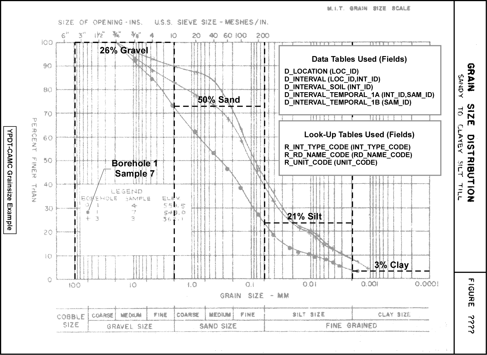

Section 2.3.3 Grain Size Data (Example)

A number of tables are utilized to store the results of a lab-based, soil-sample grain size analysis.

*Figure 2.3.3.1 Grain Size Analysis*

The above example has a number of data points that can be entered into the database, namely:

* 3% Clay
* 21% Silt
* 50% Sand
* 26% Gravel

The following information needs to be captured in the data entry:

* The LOC_ID from D_LOCATION (i.e. from what location is the sample from)
* The INT_ID from D_INTERVAL associated with this sample at this location; if this is a new interval/soil sample, a new INT_ID must be created that is tied back or related to the LOC_ID; the depths from which the sample was taken must also be known and they would be entered into D_INTERVAL_SOIL linked by the INT_ID to the LOC_ID
* If this is a new interval, the interval type needs to be specified in D_INTERVAL (this is from R_INT_TYPE_CODE with an INT_TYPE_CODE of 118 - Soil)
* The names and name codes for the attributes (the fields RD_NAME_CODE and RD_NAME_OUOM from the R_RD_NAME_CODE table:
    + %Clay (70756)
    + %Silt (70757)
    + %Sand (70758)
    + %Gravel (70759)
* The units and unit codes for the attribute values (the fields UNIT_CODE and RD_UNIT_OUOM from the R_UNIT_CODE table):
    + % (107; i.e. percent)
* The date the information was collected (for SAM_SAMPLE_DATE)
* As this is lab data, the sample name (for SAM_SAMPLE_NAME in D_INTERVAL_TEMPORAL_1A)

Combining the information that would reside in D_INTERVAL_TEMPORAL 1A/1B, the input data, then, would have the following approximate form.

*Figure 2.3.3.2 Grain Size Data - data record*

Note that there are four rows of data, dependent upon the reading name code, and they are all tied back to a single soil sample.  This information, upon entry into the database, would then populate one record in the D_INTERVAL_TEMPORAL_1A table (including the sample name and sample date) and four records in the D_INTERVAL_TEMPORAL_1B table (the actual parameter data).  The two tables would be linked based upon an imposed (randomly assigned) key (SAM_ID).  Refer to Section 2.3.4 for a breakdown of fields affected in D_INTERVAL_TEMPORAL_1A and D_INTERVAL_TEMPORAL_1B upon data import.

Note also, that in the D_INTERVAL_TEMPORAL_1A table, there are additional fields that can be used to track information regarding the laboratory that performed the analyses including the laboratories sample numbering (through SAM_LAB_SAMPLE_ID), its internal job number (through SAM_LAB_JOB_NUMBER) and analysis date (through SAM_ANALYSIS_DATE).  This allows one to go back to the original laboratory report or the laboratory itself to check the data entry (or possible analysis error) should a problem with the data be discovered in the future.

