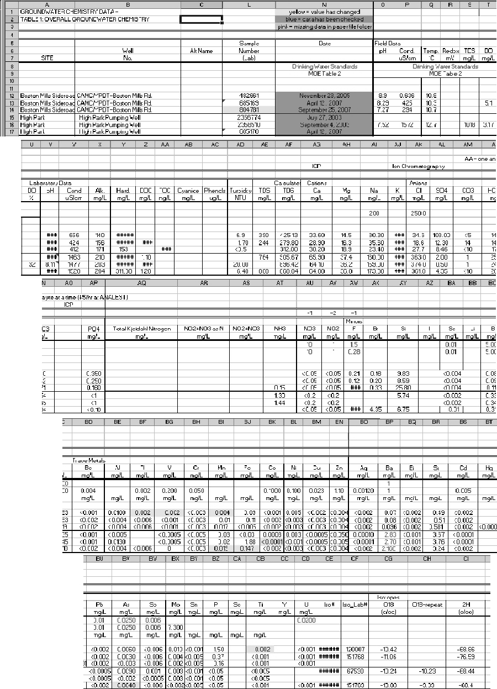
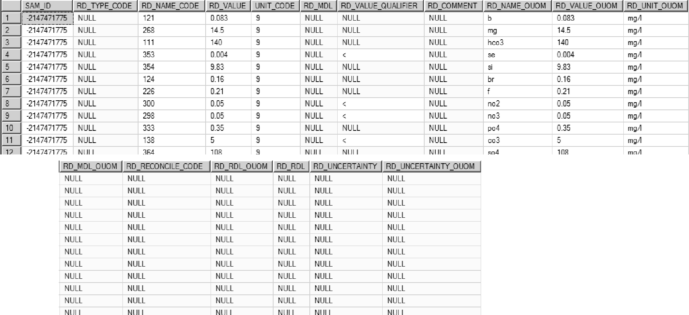

## Section 2.3.4 Chemistry Data (Example)

In general, because of simplicity and so as to ensure consistency, it is presumed here that all chemistry information will be imported into the database using the SiteFX import routines (refer to Section 3.2.2).  However, there should be enough detailed descriptions provided with the data to enable users to apply other methods of data import.

#### Historical Data (Spreadsheet Format - column centric)

Historical data, in this case, applies both to hard-copy reports and spreadsheets (both usually in some tabular format).  The following example dataset shows information in a common spreadsheet-type form where each column contains information on a particular laboratory-analyzed parameter for multiple rows of samples - many older (i.e. historical) datasets are commonly found in this form.  This format is built around a table-type visualization familiar to users for comparison between samples and is referred to here as ‘column-centric’.  As can be seen in the example table, the results for one sample are spread out over three sheets with multiple parameters per row.  Data received in this ‘column-centric’ format cannot be used directly to store information within the ORMGP database.  The ORMGP database uses a ‘row-centric’ table format where all information for a particular parameter and a parameter is stored as a single row.  In the ORMGP database, multiple rows are necessary to store additional parameters for the same sample.

To incorporate chemistry data into the database the following information is required for each sample (and its corresponding parameter values):

* LOC_ID from D_LOCATION (i.e. from what location is the sample from); note that this is only used to find the INT_ID (see following)
* INT_ID from D_INTERVAL associated with the interval which was sampled from this location; if this is a new interval, a new INT_ID must be created that would be tied to the LOC_ID; if the sample is pulled from a well (i.e. a LOC_TYPE_CODE value of ‘1’), the information concerning the screen (including top and bottom depths or elevations, screen slot size, etc ...) would then be entered into the D_INTERVAL_MONITOR table linked by the new INT_ID
* if this is a new interval, the interval type (see R_INT_TYPE_CODE) needs to be specified in D_INTERVAL (note that there are multiple possible values for a well screen type depending upon the details available - refer to R_INT_TYPE_CODE for details)
* names and name codes for the parameters analyzed; available parameter names are found in the R_RD_NAME_CODE table (in the field RD_NAME_DESCRIPTION) and are matched against the code in the field RD_NAME_CODE; note that additional parameter names are available in R_READING_NAME_ALIAS (in the field READING_NAME_ALIAS), these are common alternate names for the same parameter (referenced by RD_NAME_CODE); to reduce errors (and reduce search requirements) we should only store a single recognizable/searchable default parameter name internally in the database
* units and unit codes for the parameter values (these are found in the R_UNIT_CODE table (in the fields UNIT_DESCRIPTION and UNIT_CODE)
* the method-detection-limits (if available) for the particular parameter (stored in RD_MDL_OUOM)
* sample name (stored in SAM_SAMPLE_NAME)
* sample date (stored in SAM_SAMPLE_DATE)

*Figure 2.3.4.1 Chemistry Data - spreadsheet format*

The above data has been re-formatted and is presented below in a (row-centric) form that can now be used as a direct import into the database.  As an example, the description of the method by which the first sample is captured is described (following the screen-capture):

*Figure 2.3.4.2 Chemistry Data - import format*

* this sample is from a ORMGP borehole at Boston Mills, this has a LOC_ID of 1119363068 (not shown here), the LOC_ID is used to determine the correct INT_ID at the location; in the case of the Boston Mills borehole there is only one screen or interval tied to this location
* the LOC_ID maps to the existing INT_ID of 974784333; each row of chemistry data will be tied back to this interval ID
* the date that the sample was taken ‘2005/11/23’ is stored in the SAM_SAMPLE_DATE field; note that, if needed, the table also allows for the laboratory analysis date to be captured as well (in SAM_ANALYSIS_DATE)
* the sample name ‘482661’ is stored in SAM_SAMPLE_NAME; a more appropriate name would instead be like ‘Boston Mills - 2005/11’, with the SAM_LAB_SAMPLE_ID being given the ‘482661’ value; both the date and the name of the sample should be the same for all parameter for a given sample for correct importation of the data (this influences how the samples are stored in the temporal tables D_INTERVAL_TEMPORAL_1A/1B); samples with the same name (though this is depreciated) but with a different date will be stored as in separate ‘rows’
* units are stored in the RD_UNIT_OUOM field - note that only the names (and not the codes) have been used; however, these names would be checked under the R_RD_NAME_CODE table to make sure that the text matches an existing code (this avoids any errors during conversion while importing); for example
    + ‘pH Units’ (UNIT_CODE 32)
    + ‘mg/l’ (UNIT_CODE 9)
    + ‘uS/cm’ (UNIT_CODE  99)
* the actual values are stored in RD_VALUE_OUOM (note that in many cases, a ‘<‘ sign is present before the value indicating that the test detection limits were exceeded and that the particular parameter was found to be less than the given value - in these cases, the indicator is stored in the RD_VALUE_QUALIFIER field upon import)
* parameter names are stored in RD_NAME_OUOM and should have names equivalent to that found in R_RD_NAME_CODE and R_READING_NAME_ALIAS
    + ‘ph_lab’ (found in R_READING_NAME_ALIAS, equivalent to ‘pH’, RD_NAME_CODE 326 in R_READING_NAME_CODE)
    + ‘hard’ (also found in R_READING_NAME_ALIAS, equivalent to ‘Hardness (as CaCO3)’, RD_NAME_CODE 235 in R_READING_NAME_CODE)
    + etc ...
* the ‘DATA_SOURCE’ and ‘RD_COMMENT’ fields are present but should not be used directly for import (note that if importing data from a file, SiteFX will populate the file name and directory path structure directly into the DATA_SOURCE table and assign a new DATA_ID to the file, see below)

Once imported into the database, the chemistry data is stored in two tables,  D_INTERVAL_TEMPORAL_1A and D_INTERVAL_TEMPORAL_1B.  The former contains information concerning the sample (including the sample name, sample date, etc ...) while the latter contains the actual parameter information (including, most importantly ,the parameter name, value and units).  The tables are tied together using a random SAM_ID created upon data import.

Upon import, the following tables/fields are populated:

* D_DATA_SOURCE
    + the DATA_ID field is a random identifier and is assigned to record each data import - this allows the user to track the source of the information through the various tables
    + the DATA_DESCRIPTION field allows for a description of the source of the data to be captured into the database; for the assigned DATA_ID, the user should, subsequent to the import process, update this field to reflect the source of the data that was just imported
    + the DATA_STATUS and DATA_RECORD_COUNT fields record whether the data was imported successfully and the number of records uploaded
    + the DATA_ADDED_USER and DATA_ADDED_DATE are populated automatically (generally determined through Windows Authentication) and provide additional information regarding who and when the information was uploaded

* D_INTERVAL_TEMPORAL_1A

*Figure 2.3.4.3 Chemistry Data - sample record*

    + INT_ID; is populated with the interval against which the sample was taken
    + SAM_ID; is automatically populated as part of the SiteFX import routine and is a random identifier assigned to each sample; this is used to link the D_INTERVAL_TEMPORAL_1A/1B tables
    + SAM_SAMPLE_NAME is the sample name as given in the import file; if the same sample name and date were used across all parameters, only a single sample - one row - will be listed in this table; if multiple records in this table are created for what was a single sample, an error has been made
    + SAM_SAMPLE_DATE (as provided from the import file)
    + DATA_ID; this field is automatically populated as part of the SiteFX import routine, linked to the D_DATA_SOURCE table (which tracks the import of datasets)

The following additional (though optional) fields may also be useful and can be specified as additional fields in the import file

    + SAM_ANALYSIS_DATE; records the date on which the sample was actually analyzed (at the laboratory)
    + SAM_LAB_SAMPLE_ID; records the sample identifier used by the laboratory
    + SAM_LAB_JOB_NUMBER; records the job number for the sample analysis
    + SAM_TYPE_CODE and/or SAM_SAMPLE_NAME_OUOM can be used to identify additional information about the sample (refer to R_SAM_TYPE_CODE for details)

* D_INTERVAL_TEMPORAL_1B

*Figure 2.3.4.4 Chemistry Data - parameter records*

    + SAM_ID; records the random identifier created for the link between the two temporal tables (i.e. D_INTERVAL_TEMPORAL_1A and _1B)
    + RD_NAME_CODE is populated from RD_NAME_OUOM (once the SiteFX conversion routine has been run); the latter should contain the ‘text’ describing the parameter and the former the translated code (refer to R_RD_NAME_CODE and R_READING_NAME_ALIAS)
    + RD_VALUE is populated from RD_VALUE_OUOM (once the SiteFX conversion routine has been run);the former contains the converted/translated numeric value from the latter (refer to R_UNIT_CONV for conversion details)
    + UNIT_CODE is populated from RD_UNIT_OUOM (once the SiteFX conversion routine has been run); they record the original units of measure and the applicable code (the former will be in system units; refer to R_UNIT_CODE and R_UNIT_CONV)
    + RD_VALUE_QUALIFER; is automatically populated as part of the SiteFX import routine - when any text characters are found in RD_VALUE_OUOM, they will be copied into this field (e.g. ‘<‘)

The following (optional) fields may also be useful and can be specified as additional fields in the import file

    + RD_TYPE_CODE; records additional detail regarding the sample or the analysis of this particular parameter (e.g. details concerning the sampling method used, the analysis technique, etc...; refer to R_RD_TYPE_CODE)
    + RD_MDL_OUOM can be specified in the import routine (if available) and records the method-detection limits for the analysis; the RD_MDL field is populated from this once the SiteFX conversion routine has been run
    + RD_RDL_OUOM can be specified for each reading in the import routine and record the ‘reading detection limits’ (if different from the method detection limit or the method detection limit is unknown) for the analysis; the RD_RDL is populated from this once the SiteFX conversion routine has been run
    + RD_UNCERTAINTY_OUOM allows specification of uncertainty (i.e. +/- values) relative to the analysis technique (used, for example, when recording tritium values); RD_UNCERTAINTY is populated from this once the SiteFX conversion routine has been run

In general, for each sample D_INTERVAL_TEMPORAL_1B will generally have multiple records/rows, one for each parameter analyzed (as shown in the above table).  D_INTERVAL_TEMPORAL_1A, alternately, should only have a single record/row (for that sample).

#### Current Laboratory File (Database Format - row centric)

Digital/electronic files submitted directly from a laboratory tend to be in a format directly accessible to import into the ORMGP database (being row-centric; examine the sample import file created in the ‘Historical Data’ section, above, for details).  Prior to import, some details still need to be found and added to these files (e.g. assign the INT_ID the sample is associated with, check the names used for the parameters analyzed against the name codes - or aliases - available in the database, etc...).
