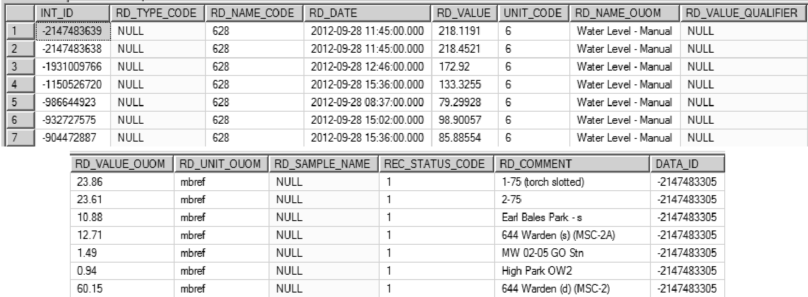
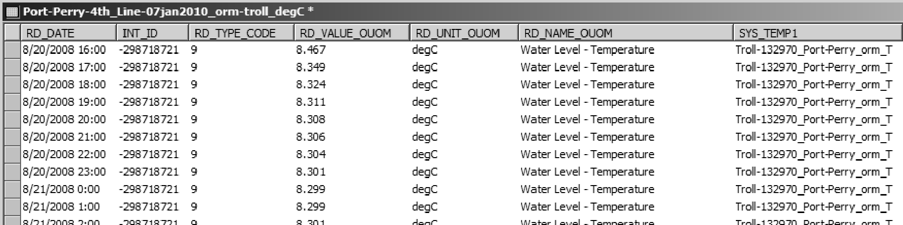
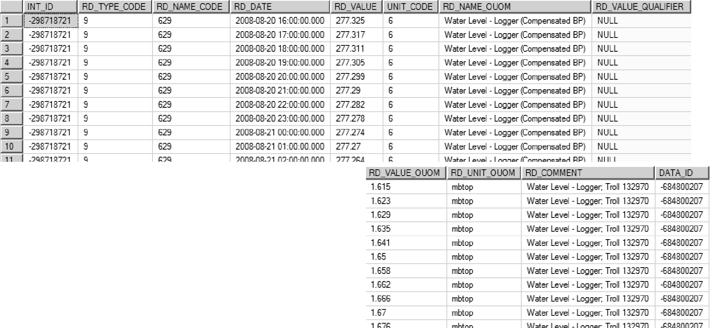
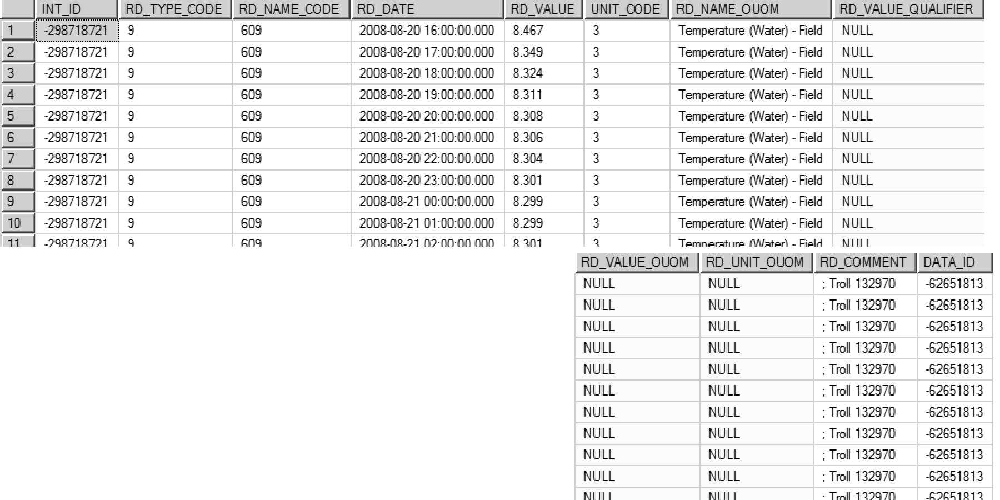

--- 
title:  "Section 2.3.5" 
author: "ormgpmd" 
date:   "20220202" 
output: html_document 
knit:   ( 
           function(input_file, encoding) { 
               out_dir <- ''; 
               rmarkdown::render( 
                   input_file, 
                   encoding=encoding, 
                   output_file=file.path(dirname(input_file), out_dir, 
                   '02_03_05_Water_Level.html') 
               ) 
           } 
       ) 
--- 

## Section 2.3.5 Water Level Data 

Water level measurements, considered field data, are stored in a single table D_INTERVAL_TEMPORAL_2 (along with all other field-type information).   

#### Manual Measurements 

Manually derived water level measurements are typically hand-written/recorded as opposed to being automatically recorded (through some sort of datalogger), and generally record the water level depth measured from a particular reference point (typically the top of a pipe when recorded for a well/borehole) and the date-time at which the measurement was taken.  These are to be linked to the particular interval (i.e. a screen) that is tied to the location.  Example water levels, shown below, have been converted from hard-copy field sheets to a row-centric (digital) file appropriate for importing into the database (similar to that described for importing of chemistry data, described in Section 2.3.4, where each row contains a single piece of information). 

 
*Figure 2.3.5.1 Manual Water Levels - source data* 

Note that, in this case, each water level has already been identified with a location and the interval at that location (through manual_name and int_id).  Prior to import, certain information is required:  

* an INT_ID must be present for importing of water level data into the database; here the manual_name provides enough information to determine the associated interval from D_INTERVAL 
* the reading name and (optionally) reading name codes describing the type of information must be specified; in this case the RD_NAME_OUOM would be set to Water Level - Manual (note that to avoid import problems, the exact text description as found in the reference table R_RD_NAME_CODE should be used; alternatively, an alias of this RD_NAME_CODE can be determined from the R_READING_NAME_ALIAS table and used instead); the equivalent RD_NAME_CODE to the OUOM description is 628 (refer to R_RD_NAME_CODE); note that if no RD_NAME_CODE is provided, the SiteFX conversion (not import) routine would automatically populate the field based upon the text found in the OUOM field 
* the values being imported must be in database-recognizable units; after import, these values will be converted to system units, in this case metres-above sea level (i.e. masl); as such, a RD_UNIT_OUOM field must be populated using units listed in R_UNIT_CODE (for conversion details, refer to R_UNIT_CONV); commonly, for manual water level measurements, these will be one of 
   + mbref (i.e. metres below reference point; this is preferred) 
   + mbgs (i.e. metres below ground surface) 
   + mbtoc (i.e. metres below top of casing) 
* the RD_VALUE_OUOM (here mapped to the wl_manual field) should be the field populated with the original values (i.e. OUOM is equivalent to original-units-of-measure); the RD_VALUE field will (upon subsequent conversion) contain the value converted to the masl system unit 
* the date must be included; if possible, a date-time should be specified (as shown); note that this must be formatted/populated carefully due to the number of possible date-time formats in use, not all will be recognized (correctly) by SiteFX or Microsoft SQL; standardizing to yyyy-mm-dd hh:mm:ss (the Microsoft SQL default) is preferred 
* any comments regarding the measurement taken should be included in the RD_COMMENT field (a free-form text field; e.g. whether a sample was taken at the same time); here, only the site name has been added - this can be used as a form or error correction in the case that water levels are mistakenly assigned to another, incorrect, interval/location 

This dataset (as shown below) can now be imported into the database. 

 
*Figure 2.3.5.2 Manual Water Levels - import format* 

Once imported (and any conversion has been performed), the data will be stored in the database format shown below. 

 
*Figure 2.3.5.3 Manual Water Levels - database records* 

A few points regarding these fields 

* the RD_TYPE_CODE can be used to specify additional information about the reading (e.g. whether the pipe was frozen or dry, the instrument used for measuring, whether a nearby pumping well was running, etc...; refer to R_RD_TYPE_CODE for examples); it is more commonly used, however, for water levels recorded through the use of a logger (each rows has a NULL value here) 
* note that upon import into the database (and subsequent conversion), the RD_VALUE is now in metres above sea level (i.e. a UNIT_CODE of 6; refer to R_RD_UNIT_CODE); the values in RD_VALUE_OUOM are converted from mbref to masl upon import (or other specified time) by SiteFX based upon a reference elevation (found in D_INTERVAL_REF_ELEV); as a default, if no reference elevation is found, SiteFX will use the ground elevation (from D_BOREHOLE) instead 
* note that the original units and units of measure are still preserved in the database (in the OUOM fields) 
* fields not populated/unused by the user are assigned a NULL place holder (rather than a zero or other arbitrary value); refer to Appendix A for details regarding the handling of this value 

Also, the DATA_ID field is populated with a randomly assigned integer (when importing the data through SiteFX; note that each row shown has the same DATA_ID value), linked to a new entry in the D_DATA_SOURCE table.  This is created as a reference to any imported data set.  It is strongly encouraged that the user modify the DATA_DESCRIPTION field found in this table to better reflect the imported information (as shown below, the DATA_DESCRIPTION was changed from the SiteFX default of User Import to CAMC-YPDT Manual WL, 20120928 which is more descriptive) 

 
*Figure 2.3.5.4 Manual Water Levels - Data source information* 

Note also that the DATA_FILENAME references the original source file(s) - this information may be useful when tracking possible sources of error (at some time in the future). 

#### Datalogger Water Level Measurements 

Logger files come in a variety of formats dependent upon the manufacturer.  Important features of different loggers (when importing their data files) include, for example, whether the logger is vented and the types of readings generated.  In most cases information will consist of a date-time column (or columns if handled separately), a water depth reading (uncorrected if non-vented) and (perhaps) a temperature reading.  If directly importing the datalogger files without any SiteFX logger corrections/adjustments then, before import, non-vented logger water levels need to be corrected for barometric pressure from a (preferably on-site) dedicated baro-logger.  In addition, the depth below a reference point for these recorded water levels needs to be calculated using the recorded height of water above logger (determined by the logger itself).  

Note that the SiteFX User Guide (EarthFX, 2012) has an extensive 
section on importing logger files into the database.  Users are referred to 
this manual for any additional details not included here.  

The example provided shows the readings from a vented logger, an Insitu Troll; in this case no barometric compensation is necessary.  The table, below, includes a number of source fields, including (for each row of information): 

* a date-time (date_time) 
* the number of seconds elapsed since the logger was started (seconds) 
* the water pressure recorded by the logger (pressure_kPa) 
* the water temperature (T_degC) 
* the height of water above the logger (depth_m) 
* the water level below the top of casing (calculated; WL_mbtp) 
* the water level below the ground surface (calculated; WL_mbgs) 
* the water level in meters above sea level (calculated; WL_masl) 
* a manual water level (if available; measured; WL_manual_mptp) 

 
*Figure 2.3.5.5 Logger Water Levels - source data* 

Of these, the WL_mbtp will be stored as the RD_VALUE_OUOM value in the database (this would have been calculated from the depth_m logger measurement where the depth of the logger itself, below the top of the pipe/casing, is known).  Note that this information is already row-centric and does not need transforming. 

The following database fields, mostly from the D_INTERVAL_TEMPORAL_2 table, are used to incorporate the imported logger data: 

* RD_DATE records the date-time of the record in a common format (here dd/mm/yyyy hh:mm) 
* INT_ID is populated using the location name (i.e. in this case, from the table name - Port-Perry-4th_Line-07jan2010-orm-troll we can determine both the LOC_ID and its linked INT_ID, where orm indicates the shallowest screen at the Port Perry site) 
* RD_TYPE_CODE (an optional field) can be used to hold any additional information concerning the reading can be included as a type code (refer to R_RD_TYPE_CODE for details); here, a code of 9 indicates a logger recorded value (a more specific value of 59 would indicate that the logger was vented Troll and manufactured by Insitu) 
* RD_VALUE_OUOM records the water level (as a depth) copied from the WL_mbtp column 
* RD_UNIT_OUOM records the units for the values found in RD_VALUE_OUOM; this must be chosen very carefully as it influences the conversion (if any) that will be performed on the data by SiteFX - in this case, the import will convert the metres below top of casing to masl using the reference elevation tied to this interval (see REF_ELEV in D_INTERVAL_REF_ELEV; note also that the unit specified here must be found in the R_RD_UNIT_CODE and R_UNIT_CONV tables or it will not be converted properly) 
* RD_NAME_OUOM records the parameter name (in this case, Water Level - Logger); note that the name must match one found in the R_RD_NAME_CODE table (or, alternatively, the R_READING_NAME_ALIAS table) 
* SYS_TEMP1 is a temporary field and, as shown here, can be used to hold tags for subsequent queries on the database (e.g. to check that the values were imported properly) 

Note that, in this case, the original units of measure fields were used instead of the finalized value fields (e.g. RD_VALUE, UNIT_CODE, etc...).  This allows for the raw data to be stored within the database and also provides another distinct advantage.  Consider the case where calculated water levels in masl were determined in the above table (i.e. outside of the database) and then imported directly into the database.  In this scenario, if the elevation of the top of pipe/casing (i.e. the reference elevation) were re-surveyed or found to be in error then the data would have to be removed from the database and re-imported to correctly have it updated (or a correction applied to the data within the database).  By having the OUOM values in mbtp units, this allows SiteFX to automatically update the water levels in masl units should any changes in the reference elevation (i.e. REF_ELEV) occur.  Upon import, or shortly thereafter, the RD_VALUE and the UNIT_CODE fields will be populated by SiteFX. 

 
*Figure 2.3.5.6 Logger Water Levels - import format* 

The process is repeated for the logger temperature data.  In this case the RD_TYPE_CODE remains the same but the values, units and original name are modified to reflect the temperature (rather than the water level) data (see table below). 

 
*Figure 2.3.5.7 Logger Water Temperature - import format* 

Upon import and final conversion, the final water level results are shown below.  Note the following: 

* in the RD_NAME_CODE field, a value of 629 has been assigned based upon the original RD_NAME_OUOM field 
* in the UNIT_CODE field, a value of 6 (indicating masl; refer to R_UNIT_CODE) has been assigned based upon the conversion from the original units 
* in the RD_VALUE field, values are the result of conversion from a depth (as found in RD_VALUE_OUOM) to an elevation (i.e. masl) based upon the reference elevation value (i.e. REF_ELEV in D_INTERVAL_REF_ELEV) 
* in the DATA_ID field, a randomly generated integer value is assigned, linking the record to data entry tracking information stored in D_DATA_SOURCE (note that since they were imported as two separate files, the water level and temperature data would have different DATA_ID values - if the import table was set up to original include both data sets, the temperature and the water levels from one logger time interval could be imported together) 

 
*Figure 2.3.5.8 Logger Water Levels - database records* 

The final temperature results upon import (no conversion necessary as all results are in degrees C) are shown below.  The differences, as compared to the previous water level data, include:  

* the assignment of a RD_NAME_CODE of 609 (designating Temperature (Water) - Field) 
* the assignment of a UNIT_CODE of 3 (designating C, as in degrees celsius)   
* the DATA_ID value is different than that of the water level data (above) 

 
*Figure 2.3.5.9 Logger Water Temperature - database records* 

Water Level Related Reading Name and Reading Type Codes 

With respect to water levels, the following Reading Name Descriptions (i.e. RD_NAME_DESCRIPTION, found in the R_RD_NAME_CODE table) are available for use when adding water level data into the database (the actual code, i.e. the RD_NAME_CODE, is listed in brackets):  

* Water Level - Manual - Static (628) 
* Water Level - Manual - Other (70899) 
* Water Level - Logger - Min (Compensated & Corrected) (612) 
* Water Level - Logger - Max (Compensated & Corrected) (611) 
* Water Level - Logger (Compensated & Corrected) (629) 
* Water Level - Average Daily (645) 

Note that all of these have a READING_GROUP_CODE of 23 (i.e. Water Level).  The following are disparaged (and are to be removed). 

* Water Level - Logger (Raw) (10854) 
* Water Level - Logger (Not Compensated For BP) (10855) 
* Water Level - Logger (Corrected Only) 70893) 
* Water Level - Logger (Compensated Only) (70894) 

A variety of Reading Type Descriptions (i.e. RD_TYPE_DESCRIPTION, found in R_RD_TYPE_CODE) are available to provide additional information regarding each water level measurement in the database (whether by a logger or manual).  These include, for example (the actual code, i.e. the RD_TYPE_CODE, is listed in brackets): 

* WL - MOE Well Record - Static (0) 
* WL - Dry (1) 
* WL - Pumping (Not MOE) (2) 
* WL - Logger - Not Identified (9) 
* WL - Frozen (12) 
* WL - Recovery (Not MOE) (14) 
* WL - Flowing (15) 
* WL - MOE Well Record - Pumping or Recovery (31) 
* WL - Logger Levellogger (Solinst) (57) 
* WL - Logger - Troll (59) 
* WL - Chart Recorder (MOE) (63) 
* WL - MOE Well Record - Recovery (64) 
* WL - MOE Well Record - Pumping (65) 
* WL - Pump On (66) 
* WL - Pump Off (67) 
* WL - Static (Not MOE) (74) 
* Logger - SCADA (85) 

Refer to R_RD_TYPE_CODE for a complete listing of available descriptions. 

#### Water Levels from WWIS (MOE) 

Static water levels obtained from the MOEs WWIS would be found by querying for a RD_NAME_CODE of 628 and an RD_TYPE_CODE of 0.  For water levels measured during pumping or recovery, a search using an RD_NAME_CODE of 70899 and an RD_TYPE_CODE of 64 or 65 (as appropriate) would yield the desired water level data. 

#### Water Levels from Loggers 

Water level data obtained from loggers generally involve large files with many 
thousands of water levels.  Because of the large size it is important to 
prioritize the data that is imported into the database.   In general, logger 
data (to be imported into the database) should be compensated for barometric 
pressure and should be correct in terms of the elevation of the logger below 
the reference elevation (this equates to an RD_NAME_CODE of 629, i.e. Water 
Level - Logger (Compensated & Corrected)).  A READING_TYPE_CODE can also be specified, identifying  the type or make of logger that was used to record the data.   

If Water Level - Logger (Compensated & Corrected) data is available, there is no need to also import any other water-level logger data covering the same time period (e.g. the raw, uncompensated and/or uncorrected data).  Note that the database includes some of these RD_NAME_CODES as, historically, some data of this nature was already incorporated in the database.  These are now disparaged. 

#### Water Levels from Municipal Pumping Wells (SCADA) 

Water levels from municipal pumping wells (e.g. pumping wells from York, 
Durham, etc...) are generally collected using a SCADA logging system.  Manual 
water levels (i.e. taken with a water level tape) will usually not be 
available or be rare.  Instead, manual readings from the real-time output 
display of the SCADA system are read and recorded (once per day on average). 
These values will then be stored in the database with a RD_NAME_CODE of 
70899 - the pumping status is usually not known when the reading was 
recorded so no RD_TYPE_CODE will be specified (if known, a pump-on or pump-off 
RD_TYPE_CODE will be added).  Logger data will be stored with the usual 629 
RD_NAME_CODE but will have a RD_TYPE_CODE of 85 (i.e. Logger - SCADA) noted. 

#### Correction of Datalogger Water Level Measurements 

Refer to Appendix G (Procedures; G.9) for details regarding the correction of water levels recorded by dataloggers. 

