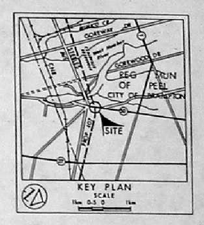
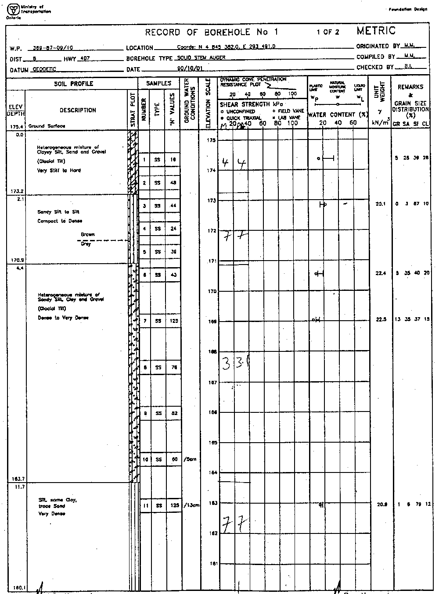
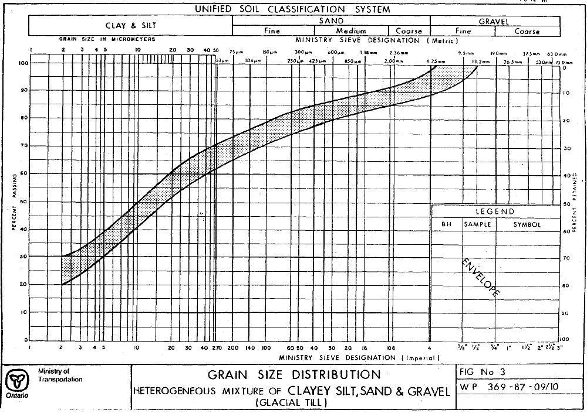

## Section 2.3.7 Report Library Information (Example)

As of version 20100915, documents in the ORMGP database are now stored as locations (LOC_TYPE_CODE of 25 - Documents) and can be treated/accessed just as any other location type.  As such, document information is stored in both the D_LOCATION and D_DOCUMENT tables.  Using DOC_ID 154 as an example (entitled '30M13-118 Highway 407 and Highway 50 Underpass'), information extracted from the document is found across a number of pages.

*Figure 2.3.7.1 Example document - cover page*

A new location would be created in D_LOCATION and the following tables populated

* LOC_NAME (154; the DOC_FOLDER_ID number, refer to Section 2.6 for details)
* LOC_NAME_ALT1 (30M13-118 Highway 407 and Highway 50 Underpass)
* LOC_TYPE_CODE (25; a document, refer to R_LOC_TYPE_CODE)

In addition, using a combination of the intersection name provided (i.e. Hwy 407  and Hwy 50 Underpass) as well as the scanned location map (below) the coordinates of the location can be determined.

*Figure 2.3.7.2 Example document - study area*

* LOC_COORD_EASTING (609424)
* LOC_COORD_NORTHING (4845361)

Note that these coordinates are approximate, only, and are generally associated with the center point of the area described by the report.  This is also indicated in the D_LOCATION_QA table

* QA_COORD_CONFIDENCE_CODE (5; 'Margin of Error: 100m - 300m', refer to R_QA_COORD_CONFIDENCE_CODE)

Note that a value of 5 or less (commonly specified as '<6') is the default worst-case cut-off value used when examining locations - any value greater than six is not used.  The choice of a '5' value may then indicate that this location should be included in these queries.

Information for populating the D_DOCUMENT table include

* DOC_YEAR (1991)
* DOC_FOLDER_ID (154; refer to Section 2.6 for details)
* DOC_AUTHOR (Ministry Of Transportation - a GEOCRES document)
* DOC_AUTHOR_AGENCY_CODE (68; 'MTO - Ministry of Transportation', refer to R_DOC_AUTHOR_AGENCY_CODE)
* DOC_FORMAT_CODE (1; 'Electronic Only', refer to R_DOC_FORMAT_CODE; in most cases, the YPDT-CAMC group will not have a copy of the original hard-copy report, only the digital/electronic version)
* DOC_LOCATION_CODE (1; 'Site', refer to R_DOC_LOCATION_CODE; this report deals very specifically about a particular location, if we were dealing with a report cover, for example, the Oak Ridges Moraine, a 3/'Regional' value would be appropriate)
* DOC_DESCRIPTION ('1 report pdf, 1 figure'; this is a free-form text field allowing a description of the available material)
* DOC_TOPIC_CODE (76; 'Geotechnical', refer to R_DOC_TOPIC_CODE)
* DOC_CLIENT_AGENCY_CODE (1; 'MOE - Ministry of the Environment', refer to R_DOC_CLIENT_AGENCY_CODE)
* DOC_PAGE_RANGE (1-25; also a free form text field; note that in later entries, a value of 25 alone would be entered)

In addition, the report contains data that could be loaded into the database.  A tag is used to both indicate its presence and whether this has been done.

* DOC_YN_LOCATION_MAP (-1; indicates a true value, there is a location map in the report; for boolean fields, any value that is not null or zero should be taken as a 'true' value; these fields are also referenced as a 'checkbox' type)

*Figure 2.3.7.3 Example document - location map*

* DOC_YN_CROSS_SECTION (-1)

*Figure 2.3.7.4 Example document - cross section*

* DOC_YN_BH_LOG (-1)

*Figure 2.3.7.5 Example document - borehole log*

* DOC_YN_GEOPHYSICS (0; a false value, there is no geophysics in this report)
* DOC_YN_PUMP_TEST (0)
* DOC_YN_MODELLING (0)
* DOC_YN_CHEMISTRY (0)
* DOC_YN_WATERLEVEL (-1)
* DOC_YN_DIGITAL_DATA (0)
* DOC_YN_ENTERED_BH_LOG (0; this is the first of the 'ENTERED' tags - in this case, at this point in time when the report was first included in the database, no borehole information was also added; it may have subsequently been entered without this field being updated)
* DOC_YN_ENTERED_GEOPHYSICS (0)
* DOC_YN_ENTERED_PUMP_TEST (0)
* DOC_YN_ENTERED_CHEMISTRY (0)
* DOC_YN_ENTERED_WATERLEVEL (0)

Note that in most reports, only that 'YN' and 'ENTERED' information pertinent to the particular report would be included and given a value of '0' or '-1' (i.e. false or true, respectively), the remainder would have a NULL value (i.e. no-value associated with the field).

Finally, a series of keyword fields (DOC_KEYWORD through DOC_KEYWORD10) can be used to add further information.  These are also free-form text fields.

* DOC_KEYWORD (bridge)
* DOC_KEYWORD2 (underpass)

While under review, it was noted that this report contains grain size analysis as well as various Atterberg Limit Tests that would be done in a lab.  As such, the DOC_YN_CHEMISTRY field should be updated (to a '-1' or true value) to reflect this (refer to Section 2.3.3 concerning the use of the D_INTERVAL_TEMPORAL_1A/1B tables).

*Figure 2.3.7.6 Example document - grainsize analysis*

