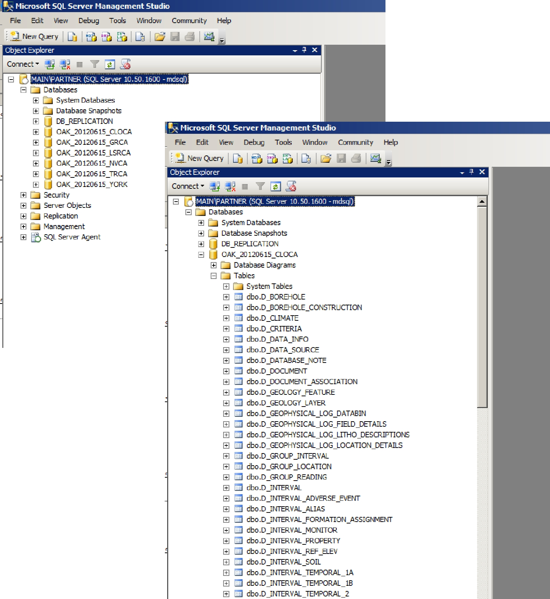
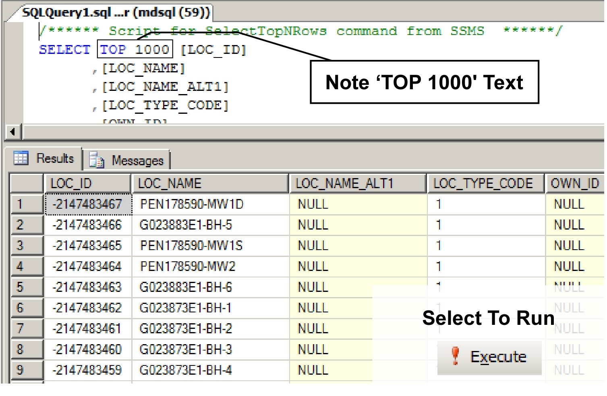

## Section 3.1.3 Microsoft SQL Management Studio (MSSQLMS)

Much like Microsoft Access, Microsoft SQL Management Studio allows connection to, and manipulation of, data within the ORMGP database.  In this instance, however, users are directly accessing the information without any (possible) filter between the information being visualized and that existing in the database.  This is unlike, for example, Microsoft Access (for which NULL values are not valid data representations) or potentially SiteFX (which can subset the available fields within a table).

SQL Management Studio is particularly powerful as it can directly affect/modify the operation of the database (and database server) itself.  As such, the level of permissions given by the partner agency's IT department to any particular user must be carefully considered.  In most cases permission is (or can be) limited to access and modification of the data only (i.e. no changes can be made to table structures, etc.).  Users should proceed carefully with this software, and become familiar with its operation before attempting any advanced tasks.

When starting the software, the user must login to the server.  In general, the login will be tied to the users regular Windows account (i.e. using 'Windows Authentication').  All permissions will be linked with this account name.  

*Figure 3.1.3.1 Connect to server and user interface*

As shown above, upon a successful login, the base window will display various items of information about or with regard to the SQL Server (e.g. the database server name; the server version - a 10 indicates SQL Server 2008, a 9 indicating SQL Server 2005; the user login name).  Selecting 'Databases - <partner database> - Tables' allows the user to browse the tables present in their version of the ORMGP database.

*Figure 3.1.3.2 Accessing tables in Management Studio*

The same can be done for 'Views' by selecting 'Databases - <partner database> - Views'.  As shown below, information within tables or views can be easily accessed by 'right clicking' on any particular <table/view> and then selecting 'Select top 1000 rows'.  Note that for SQL Server 2005, the user must instead 'right click' on the particular  <table/view> and then select 'Script Table as - SELECT to - New Query Editor Window'.  This will, however, pull all the records from the table/view unless a 'TOP 1000' is added after the resultant 'select' keyword.

*Figure 3.1.3.3 Accessing queries in Management Studio*

The default working-mode in MSSQLMS is based upon 'Structured Query Language'
(SQL) statements.  An SQL statement will be created which can then (if not already) be run using the 'Execute' button.  This record set will then be returned.

*Figure 3.1.3.4 Record set returned from a successful SQL execute*

This type of statement, once a familiarity with SQL is achieved, allows a basic query to be created which the user can then subsequently modify, thus allowing complete flexibility with regard to accessing the data from within the partner database.

Note, also, that a 'Query Designer' much like that found within Microsoft Access is also available.  It can be accessed by selecting 'New Query' then 'Query - Design Query in Editor'.

*Figure 3.1.3.5 Query designer in Management Studio*

Unlike Microsoft Access, the 'Query Designer' isn't available as the go-to option by default.  Note also that the resultant SQL statement is displayed while the query is being built in the designer.  Once complete and 'OK' is selected, the user is returned to the basic query window (where the query can then be run/executed).  Note that once the query is run, and if modifications are then subsequently required to the query, Management Studio does not return you to the Query Designer window.  If there is an existing query to be modified, the entire query can be selected followed by selecting the 'Query - Design Query in Editor' option.  If the user wishes to retain any particular query (for later application), it must be saved as a separate '.sql' file since MSSQLMS does not save queries internally.

A basic outline of the SQL language is present in Appendix A.

