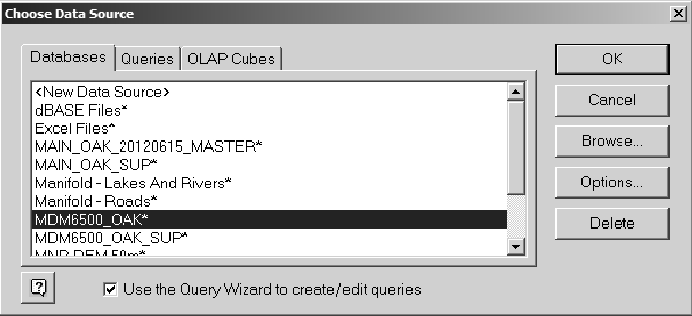
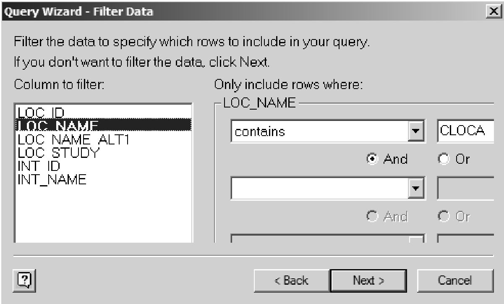

## Section 3.1.4 - Microsoft Excel

#### Microsoft Excel - Office 2003 (and earlier)

Microsoft Excel allows connection to SQL Server databases through importing specific data using the built-in import wizard (refer to 'Section 3.2.1 - Example 4 - Plot Water Levels (using Excel)' for an example of this) or through the query designer, described below.  To utilize the query designer within Excel, select 'Data - Import External Data - New Database Query'.

*Figure 3.1.4.1 Select a new database query*

Then select the appropriate data source (here, the 'MDM6500_OAK' data source is selected)

*Figure 3.1.4.2 Selection of a data source.*

The dialog box for the 'Query Wizard' will then be available, allowing the user to select what information they want to include from the database in their query.  

*Figure 3.1.4.3 Query Wizard*

Some columns from the D_LOCATION and D_INTERVAL tables have been selected (not completely shown).  Selecting 'Next' allows the user to filter the information being returned to Excel.  As an example, we'll limit the information to names containing the text 'CLOCA'.

*Figure 3.1.4.4 Filter Data*

The returned information can then be (optionally) sorted and returned to Excel.  As shown below, the user is permitted to import into the existing spreadsheet or to place the information in a new worksheet.

*Figure 3.1.4.5 Returning data to worksheet*

Notice that for the returned information, we've included both the LOC_ID and INT_ID - these are the keys that can subsequently be used for extracting additional, more specific information from the database for these locations (LOC_ID) or screens (INT_ID).

*Figure 3.1.4.6 Returned data from query.*

When building your queries and extracting information from the database in this way, remember that Excel, depending upon the version being used, has some built-in limitations with regard to the number of rows and columns that can be stored/returned (refer to the appropriate Microsoft documentation).

#### Microsoft Excel - Office 2007 (and later)

Under Office 2007 'Microsoft Query' can be found under 'Data - From Other Sources - Microsoft Query'.  

*Figure 3.1.4.7 Data from other sources.*

The remainder of the instructions are equivalent to that for 'Office 2003 ...', above.
