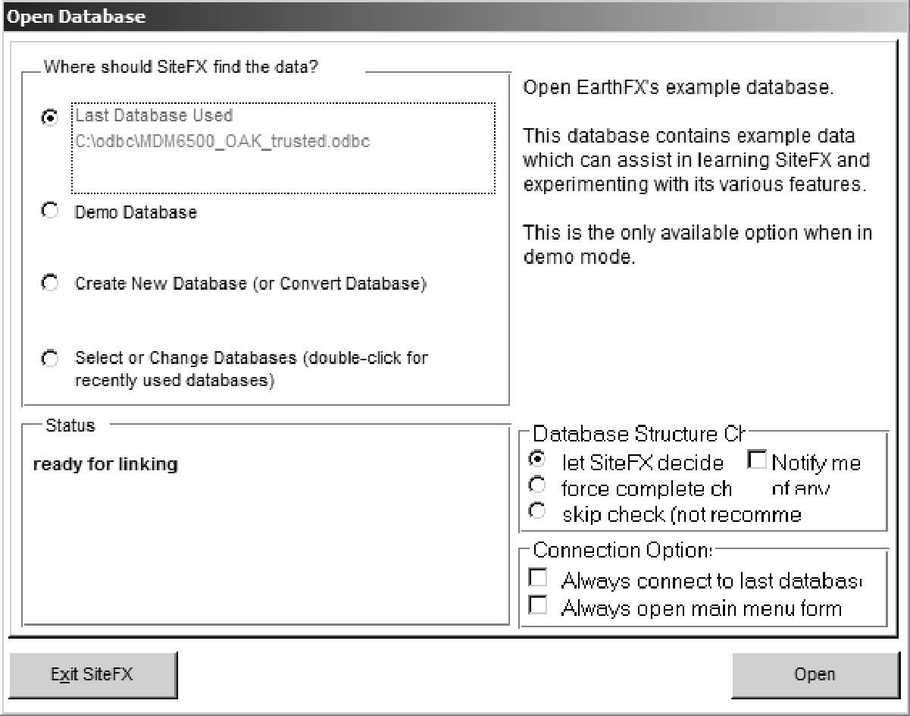
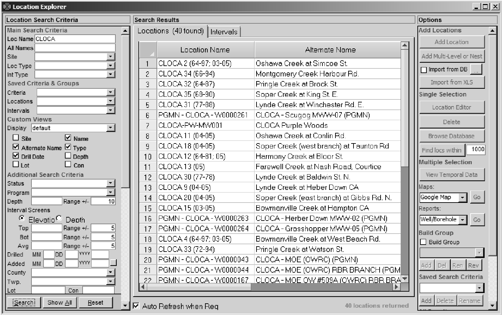

## Section 3.1.5 - SiteFX

SiteFX allows connection to compatible SQL Server databases through an ODBC file (as outlined in Section 3.1.1).  After starting SiteFX, the user will be prompted to specify the database to connect to

*Figure 3.1.5.1 SiteFX - Open Database dialog*

When connecting to the SQL Server database using SiteFX for the first time, the 'Select or Change Databases ...' option (the fourth on the list) should be selected, then 'Open'.  If the database had previously been opened, the user ODBC file would be listed under 'Last Database Used' (allowing this option to be used instead).  It is advisable when there are significant changes to the database (i.e. say upon synchronizing with the 'Master' at Downsview) to use the 'Select or Change Database...' button to ensure that SiteFX operates smoothly.  

Once the 'Open' button has been selected, the user will be prompted for the ODBC file containing the appropriate information for connecting to the SQL Server database (here, the selection would be 'MDM6500_OAK_trusted.odbc').

*Figure 3.1.5.2 SiteFX - Select ODBC file dialog*

SiteFX will then proceed to open the selected database.  It will first check that the database version is supported by this version of SiteFX and then assemble the background information it requires and, finally, SiteFX will link to the database.  At this point, at the top of the blue Sitefx screen, the user can select 'Locations - Location Explorer' to begin using the database.  The example shows the listing of locations having 'CLOCA' in their LOC_NAME field.

*Figure 3.1.5.3 SiteFX - Location Explorer*

