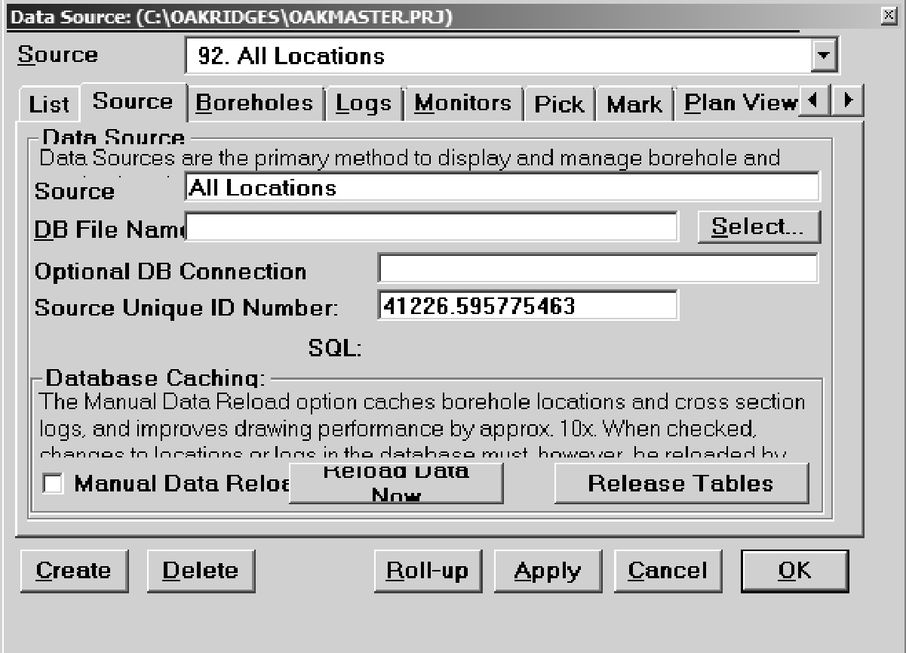

## Section 3.1.6 - Viewlog

Like SiteFX, Viewlog also allows a connection to SQL Server databases through an ODBC source (see Section 3.1.1 and 3.1.5).  Within Viewlog, connection to the database is via the 'Data Source' menu and any of the created data sources within a Viewlog project can be linked through to the SQL database.  Selecting 'Project Data - Data Source' brings up the associated dialog box.

*Figure 3.1.6.1 Viewlog - Create a data source*

To create a new data source linked to the SQL database, select 'Create'.  When (if) prompted, do not replicate the settings of the currently selected data source; add the new data source to the end of the list.  Once created, under the 'List' tab highlight the newly created data source then move to the 'Source' tab and provide a name for the data source (here, we'll call it 'All Locations').  

*Figure 3.1.6.2 Viewlog - Naming a data source*

Adjacent to the 'DB File Name' box, use the 'Select' button and browse to the appropriate ODBC file (described in Section 3.1.1 and 3.1.5; note that we're looking for a file with an '.odbc' extension).

*Figure 3.1.6.3 Viewlog - Selecting an ODBC file*

Once the database has been connected to the 'Data Source', all tables and views within the database are available to Viewlog.  To examine all locations that are present within the database, select the 'Boreholes' tab.  There, under 'Table Name', select 'dbo.D_LOCATION' (note that dbo refers to 'database object'; this is added by SQL Server).  Note that when returning to a previously created data source, if the 'Table Name' has a red background Viewlog cannot find the designated table/view (typically the table/view has been renamed or moved from the database).

*Figure 3.1.6.4 Viewlog - Selecting a table*

Once a table/view has been selected, all columns/fields within the table are visible to Viewlog.  In this case specify the following D_LOCATION columns for the appropriate text box

* Borehole name - LOC_NAME
* Borehole ID - LOC_ID (this is the most important connection and it should always be linked to the LOC_ID)
* X Location - LOC_COORD_EASTING
* Y Location - LOC_COORD_NORTHING

All other fields are generally used for cross-section setup and can remain blank.  To see the locations (in map view), under the 'List' tab select the checkbox for this data source then select 'Apply'.  The time to display all locations found in D_LOCATION will be dependent upon the total number of rows/records in the source table (in some cases, it may take some time).  The symbol (size, shape and colour) can be modified by selections under the 'Plan View' tab. 

*Figure 3.1.6.5 Viewlog - Selection of symbol for 
display (size, shape and colour)*

Refer to the Viewlog documentation regarding the size specification methodology.  The final map view result (for all locations) is shown.

*Figure 3.1.6.6 Viewlog - Display of results*

