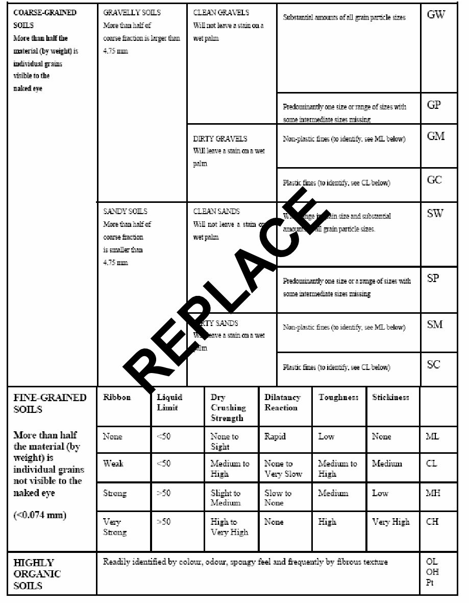
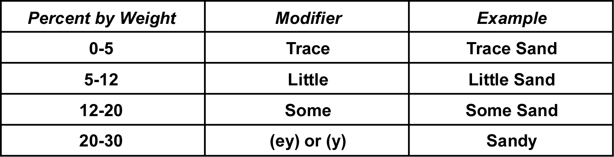
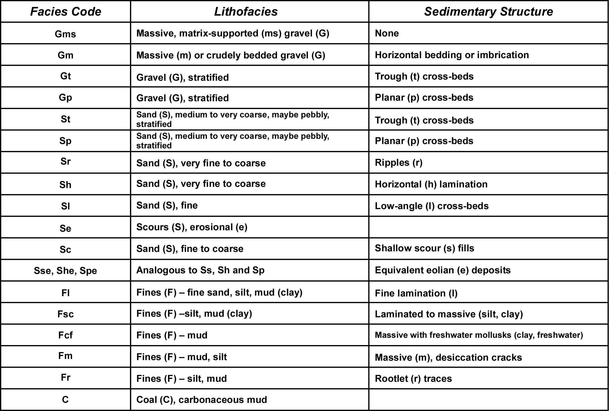

## Appendix B - Soil Classification Systems and Translation of Geologic Layers

### B.1 Unified Soil Classification System

The most common soil classification system used in geotechnical engineering
studies is the Unified Soil Classification System (USCS) (ASTM D2488-93).
Details of the USCS system are provided in the attached table (Table B.1.1).  The first step in the USCS system is to determine, on the basis of grain size, whether the soil is fine-grained (silts and clays) or coarse-grained (sands and gravels).  If 50% of the soil were to pass through a 200 mesh sieve, the soil would be described as fine-grained.  Similarly, if more than 50% of the soil were to be retained on a 200 mesh sieve, the soil would be described as coarse-grained.

The difficulty with using the USCS is that soil classified as coarse-grained (i.e. more than 50% retained on a 200 mesh sieve) may still contain considerable clay and may both look like a clay-rich soil and also behave as a plastic or cohesive soil.  Plasticity refers to the ability of a material to be deformed rapidly without cracking or crumbling and then to maintain that deformed state after the deforming force is released (e.g. molding clay into a shape).  For this reason, describing the soil according to the USCS is quite difficult to do accurately based on field observations alone.  It is more appropriate where laboratory testing of grain size (sieves and hydrometers) and physical properties (plastic and liquid limits) is completed.  This is not the case for most of the borehole logs that are likely to be encountered in the ORMGP.

As outlined in Table XXX, the USCS has a two-letter capitalized group of symbol designations (GW, GP, etc.) that is not used in other systems.  Recognizing these symbols is important in identifying that the USCS system is being used and therefore translating the descriptions appropriately.  Be aware that there is a sedimentological lithofacies classification system, which is described below, that uses two letters symbols as well; that system, however, only has the first letter capitalized.

*Table B.1.1 Unified Soil Classification System*

***Translating the USCS into Material Codes***

If the USCS system is used in a borehole log to be translated into our database, the following key points should be considered:

* Clean gravels (GW and GP) have little if any fine-grained material (silt and clay).  Therefore, silt and clay would not be placed in any of the Material 1, 2 or 3 columns.  
* Dirty gravels (GM or GC) by contrast contain fine-grained materials.  GM essentially refers to gravel with silt and GC refers to gravel with clay.  Therefore, gravel should be placed in the Material 1 column in both cases and silt should be placed in Material 2 for GM, whereas clay should be placed in Material 2 for GC.  
* The same rationale as described above for clean and dirty gravels applies to clean sand (SW, SP) and dirty sand (SM, SC).
* Often times, more than one symbol is used to describe a soil that contains many constituents.  For example SW/GW would describe a soil containing a wide range of sand and gravel grain sizes.  In this case, sand should be placed in Material 1 and gravel should be placed in the Material 2 column.  
* Fine-grained soils are described as either M - silt or C - clay.  The second letter refers to the results of the liquid limit test; those with a LL>50% are H, those below are L.  For clays, this roughly translates in practical sense to 'highly plastic' (H) or 'low plasticity' (L), although the same logic does not hold true for silts, since they are never highly plastic by nature, despite sometimes being classified as MH.  Regardless, it is probably easiest for our purposes to just use the first letter to determine whether it is a clay (C) or silt (H) for the material coding.   

### B.2 Golder Associates Classification System (GACS)

Hydrogeologists in southern Ontario often prepare borehole logs based on field observations alone or with a limited number of grain size analysis.  As a result, they often use a practical soil classification system that has been previously been described by Golder Associates (Golder) as the Golder Associates Classification System (GACS) (GAL, 1992), although other consultants undoubtedly use their own variation.  

The first step in the GACS is to determine, on the basis of performance, whether the soil behaves as a plastic (cohesive) or a non-plastic (cohesionless) material.  This can be accomplished in the field by varying tests, such as determining if a thread of the soil can be rolled with varying moisture content.  If the soil behaves plastically, then it is described as a clay (either a clay, silty clay or clayey silt).  If the soil behaves as a non-plastic material, it is then described according to the USCS for coarse-grained materials.  This distinction is made from the USCS because a soil can start to behave as a plastic soil at less than 10% volume clay content but it would be difficult, based on field observations alone to determine whether the soil had 10% clay content or 60% clay content.  Furthermore, plastic soils, regardless of clay content, are more likely to comprise aquitards than aquifers.   Cohesionless soils do not exhibit plastic behavior at any water content.  By contrast, cohesive soils exhibit plastic behavior as defined by the Atterberg limit test over a reasonably wide range of molding water contents.  Plasticity is controlled by the presence and type of clay mineral within the soil.  

In the case of plastic soils, the predominant soil type is determined based on the degree of plasticity, which can be estimated in the field by a number of field identification tests (e.g. rolling a thread).  The predominant soil type are often capitalized (SILTY CLAY) and these would be put in the Material 1 and 2 columns.  Note that in the case of this example (SILTY CLAY), silt is the second major constituent after clay, and would be placed in the Material 2 column.  Where there is greater than 30% by weight of a coarse-grained constituent, the modifier with is used - for example, SILTY CLAY with sand.  In this case clay would be placed in the Material 1 column, silt in the Material 2 column and sand in the Material 3 column.  

For non-plastic soils, major soil constituents are those that constitute 30% by weight or more of the soil.  Often times, consultant's logs will have the major constituents capitalized in a soil description.  When a single constituent dominates (typically >50%) by weight, that constituent is named (e.g. SAND). This constituent would therefore be described in the Material 1 field.   When two constituents dominate (say one 50% and one 30%), both constituents are commonly capitalized in the consultant's log (e.g. SAND and GRAVEL).  In this case, the most abundant (if identified) would be placed in the Material 1 column and the other would be placed in the Material 2 column.  

The GACS also uses modifiers 'and' and 'with' to describe soils where two constituents dominate.  The modifier 'and' is used to connect cohesionless constituents (e.g. SAND and GRAVEL).  The modifier 'with' is used to connect coarse-grained constituents to cohesive soils (e.g. CLAYEY SILT with SAND).  In the last example, silt would be noted as Material 1, clay as Material 2 and sand as Material 3.

*Table B.2.1 Golder Associates Classification Scheme (GACS)*

Minor soil constituents should be placed into the Material 3 column unless there is only one predominant constituent, in which case the minor constituent should be placed as Material 2.

Note that the modifiers are not directly applicable to clay mineral content because as little as 8 - 12% clay mineral by weight can make a soil behave as a plastic material.  Minor amounts of clay in an essentially cohesionless soil should be indicated as 'trace clay'

### B.3 Comment on Tills and Diamicts

It is important to realize that the USCS does not enable the identification of tills or diamicts.  In the GACS or similar system, sometime tills are identified in brackets after the main constituents (e.g. CLAYEY SILT (till), trace gravel).  By using the word till or diamict, the person who logged the soil implies that the soil is massive with a poorly sorted mixture of fine and coarse-grained constituents.  Use of the word till implies an interpretation of depositional setting (usually subglacial), whereas the use of the word diamict implies no associated interpreted depositional setting.  It is also important to realize that, in Southern Ontario, many tills can have the same constituents as glaciolacustrine deposits so that if the soil has been interpreted as a till, it is imperative that this interpretation be translated into our database.  

Identification of tills in one of the key challenges of our work as recognizing tills greatly aides establishing the stratigraphy.  Therefore, borehole logs in which the tills have been correctly identified are invaluable.  Because of this, if a log identifies a soil as a till, till should always be placed in the Material 3 column.  This may result in having to leave out one of the minor soil constituents but it is more important to have till in the database rather than a minor soil constituent.  For example, clay silt (TILL), trace gravel, might be either translated to CLAY (material 1), SILT (material 2), TILL (material 3).  Alternatively, gravel could be placed in the Material 2 column and silt could be left out.  

Tills / diamicts are considered in sedimentological classifications systems, described below.

### B.4 Lithofacies Classification Systems

A lithofacies classification system was developed by fluvial sedimentologists.  We may occasionally see a borehole log using this system - typically from someone involved in academic research / GSC etc.  

The original lithofacies system (Miall, 1978) employed 20 standard lithofacies
types, each had assigned code letters.  The codes are in two parts: the first
is a capital letter G, S or F, representing gravel, sand or fines,
respectively.  The second part of the code consists of one or two letters to
describe the most characteristic internal feature (structure) (not necessarily
constituent).  A brief overview of these lithofacies codes is provided in
Table B.4.1.

*Table B.4.1 Lithofacies Classification System - Miall (1978)*

If this coding system is encountered

* Check to see if there is any accompanying description that may provide details regarding the constituent grain sizes.  For example, the fines (F) may be further described as either silt or clay.  
* Use Material 1 2 and possibly 3 to put in translated interpreted grain sizes, with Material 1 being used for the most predominant grain size.
* Any textural symbols that are of relevance should be put in the Material 3
* column.  For example, in our project, we are frequently trying to determine
* whether fine-grained silts and clays are glaciolacustrine/channel-fill in origin (possibly Oak Ridges Moraine equivalent) or a till (e.g. Newmarket Till).  If the fine-grained material is laminated (Fl), it is more likely to be of lacustrine or channel fill origin as opposed to a true lodgement till in origin, so this information would go in the Material 3 column.  Our lithology symbol library in the database only has an option of 'layered' that would be appropriate in this case.

***Quaternary Geology Lithofacies Classification System***

The lithofacies classification system discussed above was adapted and modified
by Quaternary geologists to enable description and interpretation of
Quaternary (i.e. glacial) facies and depositional environments (Eyles et al,
1983).  The
classification system was modified into a four part lithofacies code.  The
code designator D was introduced for diamict.  In Southern Ontario the
overburden deposits are Quaternary deposits, therefore, this is the system we
are more likely to encounter in a local academic/scientific borehole log.
This system is summarized in Table B.4.2.

*Table B.4.2 Lithofacies Classification System - Quaternary Sediments (Eyles et al, 1983)*

It should be noted that more than one secondary code can be used.  A few examples of this are:  Dmm - matrix-supported, massive, diamict; Dmg, matrix supported, graded etc.

If this coding system is encountered, the approach is similar to that used for the previous lithofacies classification system

* Check to see if there is any accompanying description that may provide details regarding the constituent grain sizes.  For example, the fines (F) may be further described as either silt or clay.  
* Use Material 1 2 and possibly 3 to put in translated interpreted grain sizes, with Material 1 being used for the most predominant grain size.
* Use of the diamict designation (D) should be considered carefully because it be a till, possibly one of the regionally extensive till sheets that we are attempting to map in our project (e.g. Newmarket Till) or it could be some other type of diamict (debris flow etc.) that would not be as regionally significant and which should not be confused with a till.  If, based on its stratigraphic position or other evidence, you think it is a till then put TILL in the Material 3 column, otherwise, leave it as a diamicton.  The available list of lithologies to choose from in Sitefx includes both till and diamicton.
* If fine-grained materials are identified as layered (Fl), the dropdown choice of 'layered' should be put in the Material 3 code in SiteFX.  This will help identify this unit as unlikely to be a till (although not conclusively).
