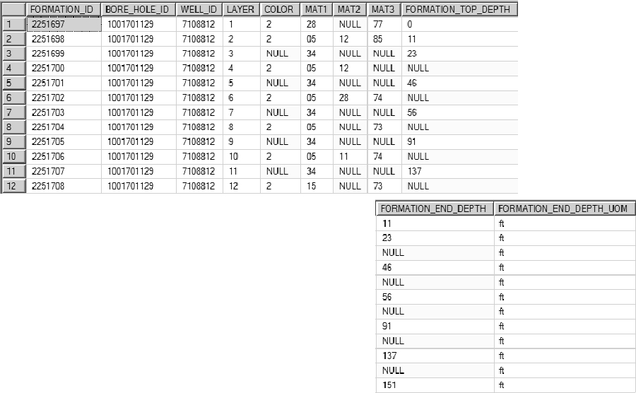
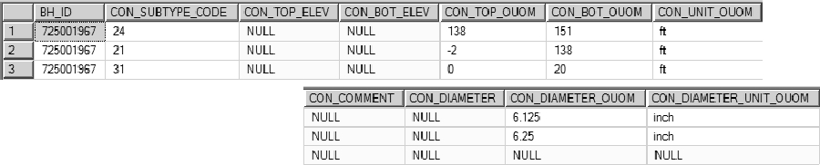
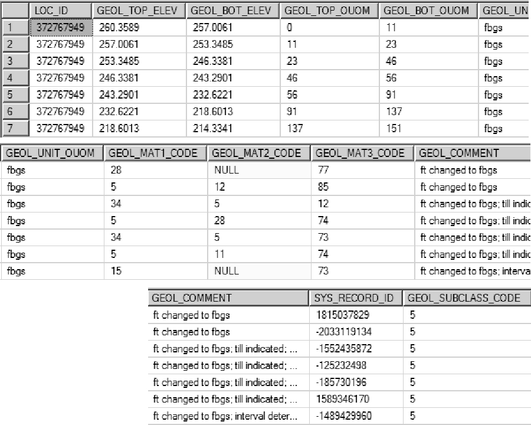
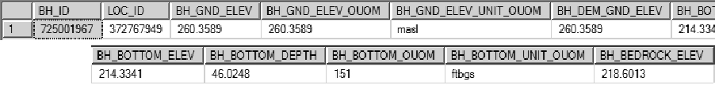

## G.5 Correction of Bedrock Wells (D_BOREHOLE and D_GEOLOGY_LAYER)

* Tables 
    + D_BOREHOLE
    + D_BOREHOLE_CONSTRUCTION
    + D_GEOLOGY_LAYER

* Views 
    + V_SYS_BH_BEDROCK_ELEV

* Estimated Recurrence Time: Periodic (as needed)

Note that these may be classified as 'Open Holes - Bedrock' within the ORMGP database.

For those boreholes that reach bedrock (especially with regard to MOE WWDB
imports), additional information from D_BOREHOLE_CONSTRUCTION can be used for
determining bedrock elevation and (if possible) correcting formation interval
problems.  An MOE WWDB example (see Table G.5.1) is used for describing the methodology.

*Table G.5.1 MOE WWDB example record*

Here, as shown, is the source data from a sample MOE well (release 2010; the 'TblFormation' table) showing the recorded formations for the particular location.  Note the missing, overlapping or (possibly) invalid layers.  From D_BOREHOLE_CONSTRUCTION

*Table G.5.2 D_BOREHOLE_CONSTRUCTION record for this location*

it can be seen (or interpreted) that the casing (CON_SUBTYPE_CODE '21') ends at '138' 'ft' (CON_BOT_OUOM and CON_UNIT_OUOM, respectively) with an open hole (CON_SUBTYPE_CODE '24') immediately below.  As the formation information records the presence of bedrock ('15' in MAT1), it can be interpreted that the bedrock depth should occur around the '138' foot-mark.  Notice that a formation interval ends at a depth '137' feet (FORMATION_END_DEPTH) - we can use this, then, as the top-of-bedrock mark and correct the bedrock layer, extending to the bottom of the borehole at '151' feet (again in FORMATION_END_DEPTH).  This leads, as a starting point, to the correction of the entire formation column, as shown (from D_GEOLOGY_LAYER).

*Table G.5.3 D_GEOLOGY_LAYER record this this location*

Note that comments have been included to explain (and track) the modifications from the original source data.  Here it appears that an additional material 'Till' (GEOL_MAT?_CODE '34') has been included for describing some of the layers; this has been incorporated either as a material code or in the comments (dependent upon the existing number of material codes used).  In this way, the number of original layers are reduced in D_GEOLOGY_LAYER recording instead the 'interpreted' layers.  The GEOL_SUBCLASS_CODE of '5' indicates that the layer is original or has been corrected.  In the case where the formation cannot be corrected (for example, if the neither of the tops or bottoms are provided) a code of '7' (i.e. 'Invalid') is instead applied.

At this point, the bedrock elevation can be extracted from D_GEOLOGY_LAYER (a value of '218.6013') and applied to D_BOREHOLE (in the BH_BEDROCK_ELEV field).

*Table G.5.4 Updated D_BOREHOLE record for this example location*

In the case that there is a single bedrock unit that has neither top nor bottom specified and all other layers have a top and bottom (or most), the default thickness of 0.3m (1ft for non-metric locations) is applied.

Note that V_SYS_BH_BEDROCK_ELEV is used for determining and checking bedrock elevations in refrence to the D_GEOLOGY_LAYER.  This process is automated and described in Appendix G.7 and G.32.

Note that these locations may have an interval type classified as 'Open Holes - Bedrock' within the ORMGP database.

