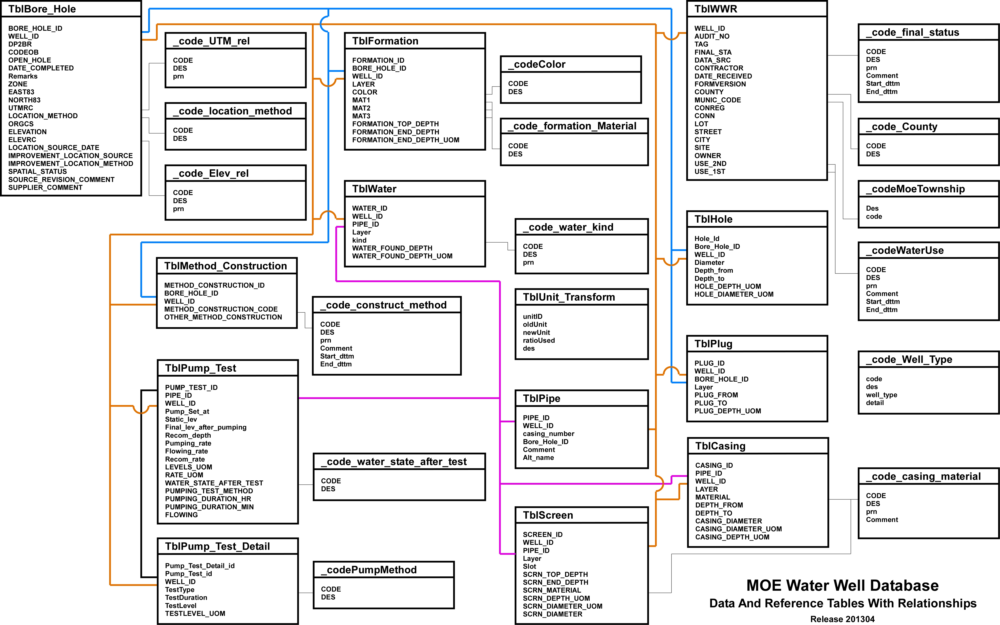

## G.10 Import of MOE Water Well Database 

* Tables (OAK_20160831_MASTER compatible)
    + D_BOREHOLE
    + D_BOREHOLE_CONSTRUCTION
    + D_DATA_SOURCE
    + D_GEOLOGY_FEATURE
    + D_GEOLOGY_LAYER
    + D_INTERVAL
    + D_INTERVAL_MONITOR
    + D_INTERVAL_REF_ELEV
    + D_INTERVAL_TEMPORAL_2
    + D_LOCATION
    + D_LOCATION_ALIAS
    + D_LOCATION_GEOM
    + D_LOCATION_PURPOSE
    + D_LOCATION_QA
    + D_LOCATION_SPATIAL
    + D_LOCATION_SPATIAL_HIST
    + D_PUMPTEST
    + D_PUMPTEST_STEP

* Tables (MOE Water Well Database, MOE_20170905)
    + TblBore_Hole
    + TblCasing
    + TblFormation
    + TblHole
    + TblMethod_Construction
    + TblPipe
    + TblPlug
    + TblPump_Test
    + TblPump_Test_Detail
    + TblScreen
    + TblWater
    + TblWWR

* Estimated Recurrence Time: As necessary 

This section describes the methodology, procedures and scripts necessary to convert the MOE Water Well Database (WWDB) to the format necessary for import into the YPDT-CAMC Database (YCDB).  The details provided are particular to the structure and state of the WWDB as of 2017-09, the date at which the updated database was made available to the YPDT-CAMC (additional notes may be included for characteristics/changes in newer versions of the WWDB).  This section presupposes that the WWDB has already been incorporated as an SQL Server database.  (Note that this can be accomplished through the use of the 'SQL Server Import and Export Data' tool; the 32-bit version is recommended in this case.)

Note that only the data tables are listed above.  In addition, various look-up tables from both databases are used as part of the conversion process.  The process itself is destructive in that modifications are made as necessary to the source tables.  As such, a backup of the WWDB should be created before proceeding.

SQL code is available both in this document are also available as an '.sql' file (found within the 'Appendix - G - Procedures - scripts' directory; the file names are of the form '<G section>_<script number>_<script name>.sql').  Note that a pair of scripts is present for each step; one for viewing the information, the other for applying/creating the information.  The separate file may contain additional code (usually described herein but not listed) that can be used as an aid in the data import process.

The relationships between the MOE WWDB tables (as of 20170905) is shown.

*Figure G.10.1 Relationship between the MOE WWDB source tables*

#### G.10.1 Determination of WELL_IDs to be imported

The WELL_ID is the primary key by which missing boreholes (from the YCDB) are determined.  Note that this is not the primary key used to distinguish between boreholes in the WWDB - the BORE_HOLE_ID (variously identified) is used instead, where multiple BORE_HOLE_IDs are associated with a single WELL_ID.  The WELL_ID is stored as LOC_ORIGINAL_NAME in D_LOCATION for many locations; both the WELL_ID and the BORE_HOLE_ID are stored as aliases in D_LOCATION_ALIAS, linked by the LOC_ID.  Inclusion of both identifiers allows back-checking of information (to the WWDB).

Approximately 768,401WELL_IDs are present in 'TblBore_Hole'.  In addition to the data already present in the YCDB, we're also using a NULL value in any of ZONE, EAST83 or NORTH83 to remove a particular WELL_ID from consideration.  The row-counter is present in the case we need to create an on-the-fly relationship to other tables.

Create the look-up table.

    select 
     ZONE
    ,count(*) as [rowcount]
    ,case 
         when ZONE=15 then 7
         when ZONE=16 then 8
         when ZONE=17 then 4
         when ZONE=18 then 5
         else null           -- the remainder of the zones should be invalid
     end 
     as [LOC_COORD_OUOM_CODE]
    FROM 
    MOE_20170905.[dbo].[TblBore_Hole] as tbh
    group by
    ZONE

*Script: G_10_01_01_ZONE.sql*

Extract the WELL_IDs.

    select
     distinct(missing.WELL_ID)
    --,ROW_NUMBER() over (order by missing.WELL_ID) as [rnum]
    ,cast(null as int) as well_id_rnum
    from 
    (
      select 
       tbh.WELL_ID
      ,v.LOC_ID
      ,tbh.ZONE
      ,tbh.EAST83
      ,tbh.NORTH83
      from 
      MOE_20170905.dbo.TblBore_Hole as tbh
      left outer join OAK_20160831_MASTER.dbo.V_SYS_MOE_LOCATIONS as v
      on cast(tbh.WELL_ID as int)=v.MOE_WELL_ID
    ) as missing
    inner join MOE_20170905.dbo.YC_20170905_LOC_COORD_OUOM_CODE as yccode
    on missing.ZONE=yccode.ZONE
    where 
    missing.LOC_ID is null 
    and yccode.ZONE is not null
    and missing.EAST83 is not null 
    and missing.NORTH83 is not null

*Script: G_10_01_02_WELL_ID.sql*

Note that the SQL 'collate' (found in previous versions) has been removed.  Instead, V_SYS_MOE_LOCATIONS is being substituted for D_LOCATION (to determine what WELL_IDs have been loaded into the database).

Get the coordinates for each of these WELL_IDs, using BORE_HOLE_ID as the primary key.  We'll use this to delimit the locations to only the YPDT-CAMC study area.

    select
    bh.BORE_HOLE_ID
    ,bh.WELL_ID
    ,bh.ZONE
    ,bh.EAST83
    ,bh.NORTH83
    from 
    MOE_20170905.dbo.TblBore_Hole as bh
    inner join MOE_20170905.dbo.YC_20170905_WELL_ID_AVAIL as avail
    on bh.WELL_ID=avail.WELL_ID

*Script: G_10_01_03_COORDS.sql*

These locations should be exported to a GIS and, by UTM Zone, checked as to whether they are within the study area (check for invalid zones and match against the WELL_IDs for correction; locations with obvious coordinate errors are dropped).  Note that we are actually using the YPDT-CAMC study area with a 25km buffer zone.  Zones 15 and 16 lie outside the YPDT-CAMC area and are not considered; NULL values are no-longer evaluated as if lying within Zone 17 and are excluded (see G_10_01_02_WELL_ID; these should be evaluated separately using county or address information).  Two new fields should be added into this table - EAST83_ORIG and NORTH83_ORG - and these should be populated with the original coordinate values only if a conversion is necessary (i.e. if the location lies within Zone 18) while EAST83 and NORTH83 should contain only Zone 17 coordinates.

Those locations that lie within the YPDT-CAMC area should be loaded into the new table YC_20170905_BORE_HOLE_ID_COORDS_YC within the MOE_20180530 database.  

Get the list of WELL_IDs that are going to be added to the YCDB.

    select
    WELL_ID
    ,cast(null as int) as well_id_rnum
    into MOE_20170905.dbo.YC_20170905_YPDT_WELL_ID
    from 
    MOE_20170905.dbo.YC_20170905_BORE_HOLE_ID_COORDS_YC as y
    group by
    WELL_ID

*Script: G_10_01_04_YPDT_WELL_ID.sql*

In the previous database (20170905) there were no instances of multiple boreholes assigned to a single well identifier.  In the current version (20180530) this is not the case - likely due to the incorporation of data within the YPDT-CAMC study area using a 25km buffer.

#### G.10.2 Determination of BORE_HOLE_ID characteristics

We'll use the BORE_HOLE_IDs from YC_20170905_BORE_HOLE_ID_COORDS_YC (the table created and imported from an external GIS) against which to characterize the locations.  First, we'll determine which BORE_HOLE_ID has geology information (from 'TblFormation').  A row-count has been added in order to create on-the-fly relationships as necessary.  In addition, a series of NULL fields are introduced that will be populated at a later stage in the process.

    select
     y.BORE_HOLE_ID
    ,y.WELL_ID
    ,ROW_NUMBER() over (order by y.BORE_HOLE_ID) as [bore_hold_id_rnum]
    ,cast(null as int) as [LOC_ID]
    ,cast(null as int) as [BH_ID]
    ,convert(int,1) as [LOC_MASTER_LOC_ID]
    ,convert(float,null) as [FM_MAX_DEPTH]
    ,convert(varchar(50),null) as [FM_MAX_DEPTH_UNITS]
    ,convert(float,null) as [MOE_MAX_DEPTH]
    ,convert(varchar(50),null) as [MOE_MAX_DEPTH_UNITS]
    ,convert(float,null) as [CON_MAX_DEPTH]
    ,convert(varchar(50),null) as [CON_MAX_DEPTH_UNITS]
    ,convert(float,null) as [MAX_DEPTH_M]
    ,cast(null as int) as NOFORMATION
    into MOE_20170905.dbo.YC_20170905_BH_ID
    from 
    MOE_20170905.dbo.YC_20170905_BORE_HOLE_ID_COORDS_YC as y

*Script: G_10_02_01_BORE_HOLE_ID.sql*

As we're using the BORE_HOLE_ID as the base key for data conversion, we don't need to check for repeating WELL_IDs (this differs from using the WELL_ID in the previous import scheme as the base key).

Note the use of a '1' value for the LOC_MASTER_LOC_ID field - this is to indicate that these boreholes are the 'master' boreholes in the case of multi-borehole locations (i.e. those locations for which the MOE has allowed a single site geology description to be submitted where multiple boreholes were drilled).  We'll update this field based on the absence/presence of formation information.  First check that there are not multiple boreholes, by WELL_ID, that contain formation information.

    select
    t2.WELL_ID
    ,t2.rcount
    from 
    (
    select 
    y.WELL_ID 
    ,count(*) as rcount
    from 
    MOE_20170905.dbo.YC_20170905_BH_ID as y
    inner join 
    (
    select
    f.BORE_HOLE_ID 
    ,count(*) as rcount
    from 
    MOE_20170905.dbo.tblFormation as f
    inner join MOE_20170905.dbo.YC_20170905_BH_ID as y
    on f.BORE_HOLE_ID=y.BORE_HOLE_ID 
    group by 
    f.bore_hole_id
    ) as t
    on y.BORE_HOLE_ID=t.BORE_HOLE_ID
    group by
    y.WELL_ID
    ) as t2
    where
    t2.rcount>1

This should return no rows if there is only a single borehole for each WELL_ID that contains formation information (no rows are returned for MOE_20170905).  All of these boreholes (i.e. with formation information) can now be considered 'master' locations - we'll temporarily assign the BORE_HOLE_ID to the LOC_MASTER_LOC_ID to specify this.

    update MOE_20170905.dbo.YC_20170905_BH_ID
    set
    LOC_MASTER_LOC_ID=y.BORE_HOLE_ID
    from 
    MOE_20170905.dbo.YC_20170905_BH_ID as y
    inner join
    (
    select
    f.BORE_HOLE_ID 
    ,count(*) as rcount
    from 
    MOE_20170905.dbo.tblFormation as f
    inner join MOE_20170905.dbo.YC_20170905_BH_ID as y
    on f.BORE_HOLE_ID=y.BORE_HOLE_ID 
    group by 
    f.bore_hole_id
    ) as t
    on
    y.BORE_HOLE_ID=t.BORE_HOLE_ID

There are considered to be 'master' locations.  Assign the appropriate BORE_HOLE_ID to the remainder (i.e. the BORE_HOLE_ID and LOC_MASTER_LOC_ID will not match in this case); various methodologies for doing so follows.  

    select
    t2.WELL_ID
    ,t2.rcount
    from 
    (
    select 
    t.WELL_ID 
    ,count(*) as rcount
    from 
    (
    select
    y.WELL_ID 
    ,y.BORE_HOLE_ID 
    ,y.LOC_MASTER_LOC_ID 
    from 
    MOE_20170905.dbo.YC_20170905_BH_ID as y
    where 
    LOC_MASTER_LOC_ID<>1
    ) as t
    group by 
    t.WELL_ID 
    ) as t2
    where 
    t2.rcount>1

If there are no rows returned (as in the case of 20170905), there are no cluster/grouped wells with formation information.  These need to be further evaluated in a subsequent step.  We'll change the '1' values to a 'null' for subsequent examination.

    update MOE_20170905.dbo.YC_20170905_BH_ID
    set
    LOC_MASTER_LOC_ID=null 
    where 
    LOC_MASTER_LOC_ID=1

*Script: G_10_02_02_MASTER_LOCATIONS.sql*

There are 5,661 rows without a declared master location - we will now try and assign them.  First evaluate those that consist of a single line, only.

Now that we have assigned a set of master locations (with formation information), check if the null LOC_MASTER_LOC_IDs are relatable.

    select
    t2.WELL_ID
    ,t3.WELL_ID
    from 
    (
    select
    t.WELL_ID
    ,t.rcount
    from 
    (
    select
    y.WELL_ID
    ,count(*) as rcount
    from 
    MOE_20180530.dbo.YC_20180530_BH_ID as y
    where 
    LOC_MASTER_LOC_ID is null
    group by
    y.WELL_ID
    ) as t
    where 
    t.rcount=1
    ) as t2
    inner join
    (
    select
    y.WELL_ID
    from 
    MOE_20180530.dbo.YC_20180530_BH_ID as y
    where 
    y.BORE_HOLE_ID=y.LOC_MASTER_LOC_ID
    group by
    y.WELL_ID
    ) as t3
    on
    t2.WELL_ID=t3.WELL_ID

If this returns any rows, check and assign the appropriate BORE_HOLE_ID as the LOC_MASTER_LOC_ID for each row (remember that these won't have any formation information directly).

    update MOE_20180530.dbo.YC_20180530_BH_ID
    set
    LOC_MASTER_LOC_ID= t.LOC_MASTER_LOC_ID
    ,NOFORMATION=1
    from 
    MOE_20180530.dbo.YC_20180530_BH_ID as y
    inner join 
    (
    select
    y.WELL_ID
    ,y.BORE_HOLE_ID
    ,y.LOC_MASTER_LOC_ID
    from 
    MOE_20180530.dbo.YC_20180530_BH_ID as y
    where 
    y.loc_master_loc_id=y.bore_hole_ID
    ) as t
    on y.well_id=t.well_id
    where 
    y.loc_master_loc_id is null

Now evaluate those that consist of a single line, only (these have no formation information as well).

    update MOE_20170905.dbo.YC_20170905_BH_ID
    set
    LOC_MASTER_LOC_ID=y.BORE_HOLE_ID
    ,NOFORMATION=1
    from 
    MOE_20170905.dbo.YC_20170905_BH_ID as y
    inner join
    (
    select
    t.WELL_ID
    ,t.rcount
    from 
    (
    select
    y.WELL_ID
    ,count(*) as rcount
    from 
    MOE_20170905.dbo.YC_20170905_BH_ID as y
    where 
    LOC_MASTER_LOC_ID is null
    group by
    y.WELL_ID
    ) as t
    where 
    t.rcount=1
    ) as t
    on y.WELL_ID=t.WELL_ID

#Script: G_10_02_03_MASTER_LOCATIONS_SINGLE.sql*

For the remainder, those WELL_IDs with no formation info but having multiple BORE_HOLE_IDs, assign the smallest BORE_HOLE_ID as the master identifier (this can be changed at a later date, as necessary; note that this was unnecessary for 20170905 but was required for 20180530).

    update MOE_20170905.dbo.YC_20170905_BH_ID
    set
    LOC_MASTER_LOC_ID=t.BORE_HOLE_ID
    ,NOFORMATION=1
    from 
    MOE_20170905.dbo.YC_20170905_BH_ID as y
    inner join
    (
    select
    y.WELL_ID
    ,min(BORE_HOLE_ID) as BORE_HOLE_ID
    from 
    MOE_20170905.dbo.YC_20170905_BH_ID as y
    where 
    y.LOC_MASTER_LOC_ID is null 
    group by
    y.WELL_ID
    ) as t
    on y.WELL_ID=t.WELL_ID

*Script: G_10_02_04_MASTER_LOCATIONS_MULTIPLE.sql*

All LOC_MASTER_LOC_IDs should now have been assigned.  

Previously, the LOC_MASTER_LOC_IDs were assigned (for non-formation locations) in the following manner:

* If only one of the boreholes has a depth associated with it (from FM_D_BOREHOLE), that borehole is designated the master. 
* If only one of the boreholes has water levels associated with it (either from pumping or measure statics), that borehole is designated the master.  
* If only one of the boreholes has any construction details, that borehole is designated the master.
* If none of the boreholes have any further details, the deepest or first LOC_ID is designated the master.

#### G.10.3 Introduction of a LOC_ID (disabled)

The contents of this section has been moved to later in the process.

#### G.10.4 Creation of formation D_LOCATION (FM_D_LOCATION)

For creating the import D_LOCATION table, a series of look-up tables should be made equating WWDB values to YCDB values.

Convert the MOE final status code to the YPDT-CAMC status code.

    select
     wwr.FINAL_STA
    ,case 
         when wwr.FINAL_STA is null then 4  -- Unknown to Unknown; this should not be used as we're converting nulls to 0
         when wwr.FINAL_STA='0'     then 4  -- Unknown to Uknown
         when wwr.FINAL_STA='1'     then 1  -- Water Supply to Active
         when wwr.FINAL_STA='2'     then 1  -- Observation to Active
         when wwr.FINAL_STA='3'     then 1  -- Test Hole to Active
         when wwr.FINAL_STA='4'     then 1  -- Recharge to Active
         when wwr.FINAL_STA='5'     then 3  -- Abandoned Supply to Abandoned
         when wwr.FINAL_STA='6'     then 3  -- Abandoned Quality to Abandoned
         when wwr.FINAL_STA='7'     then 3  -- Unfinished to Abandoned
         when wwr.FINAL_STA='8'     then 4  -- Not A Well to Unknown
         when wwr.FINAL_STA='9'     then 1  -- Dewatering to Active
         when wwr.FINAL_STA='A'     then 3  -- Abandoned-Other to Abandoned
         when wwr.FINAL_STA='B'     then 4  -- Replacement Well to Unknown
         when wwr.FINAL_STA='C'     then 4  -- Alteration to Unknown
         when wwr.FINAL_STA='D'     then 4  -- Other Status to Unknown
         when wwr.FINAL_STA='E'	then 17 -- Monitoring and Test Hole to MOE Monitoring and Test Hole
        when wwr.FINAL_STA='F'	then 18 -- Abandoned Monitoring and Test Hole to MOE Abandoned Monitoring and Test Hole
         else -9999
     end
     as [LOC_STATUS_CODE]
    ,case 
         when wwr.FINAL_STA is null then 4     -- Unknown to Unknown; this should not be used as we're converting nulls to 0
         when wwr.FINAL_STA='0'     then null  -- Unknown to Unknown
         when wwr.FINAL_STA='1'     then 1     -- Water Supply to Active
         when wwr.FINAL_STA='2'     then 2     -- Observation to Active
         when wwr.FINAL_STA='3'     then 3     -- Test Hole to Active
         when wwr.FINAL_STA='4'     then 4     -- Recharge to Active
         when wwr.FINAL_STA='5'     then 5     -- Abandoned Supply to Abandoned
         when wwr.FINAL_STA='6'     then 6     -- Abandoned Quality to Abandoned
         when wwr.FINAL_STA='7'     then 7     -- Unfinished to Abandoned
         when wwr.FINAL_STA='8'     then 8     -- Not A Well to Unknown
         when wwr.FINAL_STA='9'     then 9     -- Dewatering to Active
         when wwr.FINAL_STA='A'     then 10    -- Abandoned-Other to Abandoned
         when wwr.FINAL_STA='B'     then 11    -- Replacement Well to Unknown
         when wwr.FINAL_STA='C'     then 12    -- Alteration to Unknown
         when wwr.FINAL_STA='D'     then 13    -- Other Status to Unknown
         when wwr.FINAL_STA='E'	 then 14	   -- Abandoned Monitoring and Test Hole to MOE Abandoned Monitoring and Test Hole
         when wwr.FINAL_STA='F'	 then 15	   -- Abandoned Monitoring and Test Hole to MOE Abandoned Monitoring and Test Hole
         else -9999
     end 
     as [BH_STATUS_CODE]
    into
    MOE_20170905.dbo.YC_20170905_FINAL_STATUS
    from 
    MOE_20170905.dbo.TblWWR as wwr
    group by
    FINAL_STA
    order by 
    FINAL_STA

For null values in 'TblWWR', assign them a '0' value to match the look-up table.

    update  MOE_20170905.[dbo].[TblWWR]
    set
    FINAL_STA=0
    where
    FINAL_STA is null  

*Script: G_10_04_01_FINAL_STATUS.sql*

The look-up table for the MOE first and second use should not contain any NULLs (as they cannot be used as a key); change these values to '0'.

    update MOE_20170905.dbo.TblWWR
    set
    USE_1ST=0
    where
    USE_1ST is null

    update MOE_20170905.dbo.TblWWR
    set
    USE_2ND=0
    where
    USE_2ND is null

Create the MOE use look-up table (both the USE_1ST and USE_2ND are examined; the SQL code would be otherwise equivalent after the change in the field name).
  
    select
     wwr.USE_1ST
    ,case 
         when wwr.USE_1ST is null then 0   -- Unknown
         when wwr.USE_1ST='0'     then 0   -- Unknown
         when wwr.USE_1ST='A'     then 10  -- OTHER
         when wwr.USE_1ST='B'     then 11  -- TEST HOLE
         when wwr.USE_1ST='C'     then 12  -- DEWATERING
         when wwr.USE_1ST='D'     then 13  -- MONITORING
         when wwr.USE_1ST='E'     then 14  -- Monitoring and Test Hole
         else wwr.USE_1ST
     end
     as [MOE_USE]
    into 
    MOE_20170905.dbo.YC_20170905_MOE_USE
    from 
    MOE_20170905.dbo.TblWWR as wwr
    group by
    USE_1ST
    order by 
    USE_1ST

*Script: G_10_04_02_MOE_USE.sql*

We'll now extract D_LOCATION equivalent information from the WWDB tables.  Note that starting with the 20160531 database, the BORE_HOLE_ID is being used to differentiate between wells (instead of the WELL_ID as previously applied); in this case, the WELL_ID may be applied as the LOC_ORIGINAL_NAME in multiple cases.  The LOC_MASTER_LOC_ID should/can be used to determine the 'master' LOC_ID - i.e. the WELL_ID/BORE_HOLE_ID combination linked to the geology at a particular location.  In most cases, the LOC_ID and LOC_MASTER_LOC_ID will be same value; for those locations where a MOE 'multiple-borehole' submittal was done (i.e. multiple locations tied to single description of the geology) the LOC_ID will differ from the LOC_MASTER_LOC_ID.  In addition, a new DATA_ID must be specified (and included in D_DATA_SOURCE) for each MOE import date.  For example, the DATA_ID of '519' refers to 'MOE WWR Database - 201700905'.

    select 
    y.BORE_HOLE_ID as LOC_ID
    ,cast(bh.WELL_ID as varchar(255)) as [LOC_NAME]
    ,cast('MOE Well 20220502 - Name Witheld by MOE' as varchar(255)) as [LOC_NAME_ALT1]
    ,cast(1 as int) as [LOC_TYPE_CODE]
    ,cast(bh.WELL_ID as varchar(255)) as [LOC_ORIGINAL_NAME]
    ,y.[LOC_MASTER_LOC_ID]
    ,yccoords.[EAST83] as [LOC_COORD_EASTING]
    ,yccoords.[NORTH83] as [LOC_COORD_NORTHING]
    ,yccoords.east83_orig as LOC_COORD_EASTING_OUOM
    ,yccoords.north83_orig as LOC_COORD_NORTHING_OUOM
    ,case
    when yccoords.zone= 17 then 4
    else 5
    end as LOC_COORD_OUOM_CODE
    ,cast(wwr.COUNTY as int) as [LOC_COUNTY_CODE]
    ,cast(wwr.MUNIC_CODE as int) as [LOC_TOWNSHIP_CODE]
    ,ycfs.LOC_STATUS_CODE
    ,bh.DATE_COMPLETED as [LOC_START_DATE]
    ,cast(1 as int) as [SITE_ID]
    ,cast(1 as int) as [LOC_CONFIDENTIALITY_CODE]
    ,cast(wwr.DATA_SRC as int) as [LOC_DATA_SOURCE_CODE]
    ,cast(wwr.CONN as varchar(50)) as [LOC_CON]
    ,cast(wwr.LOT as varchar(50)) as [LOC_LOT]
    ,cast(RTRIM(LTRIM(wwr.STREET)) as varchar(255)) as [LOC_ADDRESS_INFO1]
    ,cast(RTRIM(LTRIM(wwr.CITY)) as varchar(255)) as [LOC_ADDRESS_CTY]
    ,ycmoeu1.MOE_USE as [LOC_MOE_USE_1ST_CODE]
    ,ycmoeu2.MOE_USE as [LOC_MOE_USE_2ND_CODE]
    ,524 as DATA_ID  
    into MOE_20220328.dbo.M_D_LOCATION                             
    from 
    MOE_20220328.dbo.YC_20220328_BH_ID as y
    inner join MOE_20220328.dbo.TblBore_Hole as bh
    on y.BORE_HOLE_ID=bh.BORE_HOLE_ID
    left outer join MOE_20220328.dbo.TblWWR as wwr
    on bh.WELL_ID=wwr.WELL_ID
    left outer join MOE_20220328.dbo.YC_20220328_LOC_COORD_OUOM_CODE as yccode
    on bh.ZONE=yccode.ZONE
    left outer join MOE_20220328.dbo.YC_20220328_FINAL_STATUS as ycfs
    on wwr.FINAL_STA=ycfs.FINAL_STA
    inner join MOE_20220328.dbo.YC_20220328_MOE_USE as ycmoeu1
    on wwr.USE_1ST=ycmoeu1.USE_1ST
    inner join MOE_20220328.dbo.YC_20220328_MOE_USE as ycmoeu2
    on wwr.USE_2ND=ycmoeu2.USE_1ST
    inner join MOE_20220328.dbo.YC_20220328_BORE_HOLE_ID_COORDS_YC as yccoords
    on y.BORE_HOLE_ID=yccoords.BORE_HOLE_ID

Check the LOC_ADDRESS field for zero-length values (and null them).

    update MOE_20170905.dbo.M_D_LOCATION
    set
    LOC_ADDRESS_INFO1=null 
    from 
    MOE_20170905.dbo.M_D_LOCATION as m
    where 
    len(LOC_ADDRESS_INFO1)=0

*Script: G_10_04_03_M_D_LOCATION.sql*

#### G.10.5 Determining elevations

We'll now use the source of YC_20180530_BORE_HOLE_ID_COORDS_YC (i.e. the external GIS) to determine the elevation of each location from the relevant DEMs.  We are not including any automated geocoding here (as we did in the previous conversion instructions) as this introduced a number of erroneous results.

The resultant table should be called YC_20160531_BORE_HOLE_ID_ELEVS and contain the following fields.

* BORE_HOLE_ID
* DEM_MNR 
* DEM_SRTM

For those locations falling (just) outside of the study area, their MNR elevations will be tagged with a '-9999' value.  Refer to the following script (not shown) for details.

*Script: G_10_05_ELEVATIONS.sql*

#### G.10.6 Location aliases

Multiple aliases for each location are present within the WWDB.  These include the BORE_HOLE_ID (where the WELL_ID is found in LOC_ORIGINAL_NAME), the WELL_ID, the 'MOE Tag Number' and the 'MOE Audit Number'.

As of 2022-05-02, we'll manually add a MOE_WELL_ID to the pertinent tables to use for
comparison instead of relying upon the character based WELL_ID (where we can
experience collation issues).  This should be incorporated earlier in the
import process.

Assemble the alias information for BORE_HOLE_ID.

    select 
    y.BORE_HOLE_ID as LOC_ID
    ,cast(y.BORE_HOLE_ID as varchar(255)) as LOC_NAME_ALIAS
    ,cast(3 as int) as [LOC_ALIAS_TYPE_CODE]
    ,cast(null as int) as SYS_RECORD_ID
    into MOE_20170905.dbo.M_D_LOCATION_ALIAS
    from 
    MOE_20170905.dbo.YC_20170905_BH_ID as y
    
Add the information for the 'MOE Tag Number'.
   
    insert into MOE_20170905.dbo.M_D_LOCATION_ALIAS
    (LOC_ID,LOC_NAME_ALIAS,LOC_ALIAS_TYPE_CODE)
    select 
    y.BORE_HOLE_ID as LOC_ID
    ,cast(m.TAG as varchar(255)) as LOC_NAME_ALIAS
    ,cast(1 as int) as [LOC_ALIAS_TYPE_CODE]
    from 
    MOE_20170905.dbo.YC_20170905_BH_ID as y
    inner join MOE_20170905.dbo.TblWWR as m
    on y.MOE_WELL_ID=m.MOE_WELL_ID
    where 
    m.TAG is not null

Add the information for the 'MOE Audit Number'.

    insert into MOE_20170905.dbo.M_D_LOCATION_ALIAS
    (LOC_ID,LOC_NAME_ALIAS,LOC_ALIAS_TYPE_CODE)
    select 
    y.BORE_HOLE_ID as LOC_ID
    ,cast(m.AUDIT_NO as varchar(255)) as LOC_NAME_ALIAS
    ,cast(2 as int) as [LOC_ALIAS_TYPE_CODE]
    from 
    MOE_20170905.dbo.YC_20170905_BH_ID as y
    inner join MOE_20170905.dbo.TblWWR as m
    on y.MOE_WELL_ID=m.MOE_WELL_ID
    where 
    m.AUDIT_NO is not null

Add the information for the WELL_ID.

    insert into MOE_20170905.dbo.M_D_LOCATION_ALIAS
    (LOC_ID,LOC_NAME_ALIAS,LOC_ALIAS_TYPE_CODE)
    select
    y.LOC_ID
    ,cast(y.LOC_ORIGINAL_NAME as varchar(255)) as LOC_NAME_ALIAS
    ,cast(4 as int) as [LOC_ALIAS_TYPE_CODE]
    from 
    MOE_20170905.dbo.M_D_LOCATION as y

*Script: G_10_06_01_FM_D_LOC_ALIAS.sql*

#### G.10.7 Location QA

The QA codes between the WWDB and YCDB match with the exceptions that a NULL value from the WWDB needs to be changed to a value of '9' for the YCDB.  Default the QA_ELEV_CONFIDENCE_CODE to '10' (DEM) unless the ELEVRC (from the MOE) has a value of '1'.

    select 
    y.BORE_HOLE_ID as LOC_ID
    ,case 
         when m.UTMRC is null then 9
         else m.UTMRC 
     end 
     as [QA_COORD_CONFIDENCE_CODE]
    ,case 
         when m.UTMRC is null then 9
         else m.UTMRC 
     end 
     as [QA_COORD_CONFIDENCE_CODE_ORIG]
    ,m.[LOCATION_METHOD] as [QA_COORD_METHOD]
    ,case
         when m.ELEVRC=1 then 1
         else 10
     end as [QA_ELEV_CONFIDENCE_CODE]
    ,m.ELEVRC as [QA_ELEV_CONFIDENCE_CODE_ORIG]
    into MOE_20170905.dbo.M_D_LOCATION_QA
    from 
    MOE_20170905.dbo.YC_20170905_BH_ID as y
    inner join MOE_20170905.dbo.TblBore_Hole as m
    on y.BORE_HOLE_ID=m.BORE_HOLE_ID

*Script: G_10_07_01_M_D_LOC_QA.sql*

#### G.10.8 Location elevation

The DEM elevations using the coordinates in the M_D_LOCATION table have been determined externally to this database-translation scheme and are present in YC_20160531_BORE_HOLE_ID_ELEVS (as found in Section G.10.5).  The MOE elevation is being pulled from 'TblBore_Hole - ELEVATION' and is assumed to be expressed in 'masl'.  Note that if the QA_COORD_CONFIDENCE CODE for a location has a value of '1', the final assigned elevation would be this.  Otherwise, the value from 'MNR DEM v2' (i.e. using the field 'dem_mnr') or 'SRTM DEM v4.1' (where the location appears outside of the ORMGP study area; i.e. using the field 'dem_srtm')

We'll populate M_D_LOCATION_SPATIAL_HIST with the original elevation (from the MOE) first, where present.

    select
    y.BORE_HOLE_ID as LOC_ID
    ,cast(4 as int) as LOC_COORD_HIST_CODE
    ,cast( '2021-01-19' as datetime ) as LOC_COORD_DATE
    ,ycoord.east83 as X
    ,ycoord.north83 as Y
    ,cast( 26917 as int ) as EPSG_CODE
    ,ycoord.east83_orig as X_OUOM
    ,ycoord.north83_orig as Y_OUOM
    ,cast( ( case when ycoord.zone_orig=17 then 26917 else 26918 end ) as int ) as EPSG_CODE_OUOM
    ,dlqa.qa_coord_confidence_code as QA_COORD_CODE
    ,cast( 523 as int ) as LOC_COORD_DATA_ID
    ,cast( ( case when m.location_method is not null and len(m.location_method)>0 then m.location_method else null end ) as varchar(255) ) as LOC_COORD_METHOD
    ,cast( ( case when m.elevation is not null then 2 else null end ) as int ) as LOC_ELEV_CODE 
    ,cast( ( case when m.elevation is not null then '2021-01-19' else null end ) as datetime ) as LOC_ELEV_DATE
    ,cast(m.ELEVATION as float) as LOC_ELEV
    ,cast( ( case when m.elevation is not null then 6 else null end ) as int ) as LOC_ELEV_UNIT_CODE
    ,cast(m.ELEVATION as float) as LOC_ELEV_OUOM
    ,cast( ( case when m.elevation is not null then 'masl' else null end ) as varchar(50) ) as LOC_ELEV_UNIT_OUOM
    ,cast( null as int ) as QA_ELEV_CODE
    ,cast( ( case when m.elevation is not null then 523 else null end ) as int ) as LOC_ELEV_DATA_ID
    ,cast( ( case when m.elevrc is not null and len(m.elevrc)>0 then m.elevrc else null end ) as varchar(255) ) as LOC_ELEV_COMMENT
    into MO_20210119.dbo.M_D_LOCATION_SPATIAL_HIST
    from 
    MOE_20210119.dbo.YC_20210119_BH_ID as y
    inner join MOE_20210119.dbo.TblBore_Hole as m
    on y.BORE_HOLE_ID=m.BORE_HOLE_ID
    inner join MOE_20210119.dbo.YC_20210119_BORE_HOLE_ID_COORDS_YC as ycoord
    on y.bore_hole_id=ycoord.bore_hole_id
    inner join MOE_20210119.dbo.M_D_LOCATION_QA as dlqa
    on y.bore_hole_id=dlqa.loc_id

Then the MNR DEM (v2) or SRTM DEM (v4.1); the latter is used if the first is tagged with a '-9999' value.  

    insert into MOE_20210119.dbo.M_D_LOCATION_SPATIAL_HIST
    (
    LOC_ID
    ,LOC_COORD_HIST_CODE
    ,LOC_COORD_DATE
    ,X
    ,Y
    ,EPSG_CODE
    ,X_OUOM
    ,Y_OUOM
    ,EPSG_CODE_OUOM
    ,QA_COORD_CODE
    ,LOC_COORD_DATA_ID
    ,LOC_COORD_METHOD
    ,LOC_ELEV_CODE
    ,LOC_ELEV_DATE
    ,LOC_ELEV
    ,LOC_ELEV_UNIT_CODE
    ,LOC_ELEV_OUOM
    ,LOC_ELEV_UNIT_OUOM
    ,QA_ELEV_CODE
    ,LOC_ELEV_DATA_ID
    ,LOC_ELEV_COMMENT
    )
    select
    y.BORE_HOLE_ID as LOC_ID
    ,cast(4 as int) as LOC_COORD_HIST_CODE
    ,cast( '2021-01-19' as datetime ) as LOC_COORD_DATE
    ,ycoord.east83 as X
    ,ycoord.north83 as Y
    ,cast( 26917 as int ) as EPSG_CODE
    ,ycoord.east83_orig as X_OUOM
    ,ycoord.north83_orig as Y_OUOM
    ,cast( ( case when ycoord.zone_orig=17 then 26917 else 26918 end ) as int ) as EPSG_CODE_OUOM
    ,dlqa.qa_coord_confidence_code as QA_COORD_CODE
    ,cast( 523 as int ) as LOC_COORD_DATA_ID
    ,cast( ( case when m.location_method is not null and len(m.location_method)>0 then m.location_method else null end ) as varchar(255) ) as LOC_COORD_METHOD
    ,cast( ( case when ye.dem_mnr=-9999 then 5 else 3 end ) as int ) as LOC_ELEV_CODE
    ,cast( '2021-01-19' as datetime ) as LOC_ELEV_DATE
    ,cast( ( case when ye.dem_mnr=-9999 then ye.dem_srtm else ye.dem_mnr end ) as float ) as LOC_ELEV
    ,cast( 6 as int ) as LOC_ELEV_UNIT_CODE
    ,cast( ( case when ye.dem_mnr=-9999 then ye.dem_srtm else ye.dem_mnr end ) as float ) as LOC_ELEV_OUOM
    ,cast( 'masl' as varchar(50) ) as LOC_ELEV_UNIT_OUOM
    ,cast( 10 as int ) as QA_ELEV_CODE
    ,cast( null as int ) as LOC_ELEV_DATA_ID
    ,cast( null as varchar(255) ) as LOC_ELEV_COMMENT
    ,cast( null as varchar(255) ) as LOC_ELEV_COMMENT
    from 
    MOE_20210119.dbo.YC_20210119_BH_ID as y
    inner join MOE_20210119.dbo.YC_20210119_BORE_HOLE_ID_ELEVS as ye
    on y.bore_hole_id=ye.bore_hole_id
    inner join MOE_20210119.dbo.TblBore_Hole as m
    on y.BORE_HOLE_ID=m.BORE_HOLE_ID
    inner join MOE_20210119.dbo.YC_20210119_BORE_HOLE_ID_COORDS_YC as ycoord
    on y.bore_hole_id=ycoord.bore_hole_id
    inner join MOE_20210119.dbo.M_D_LOCATION_QA as dlqa
    on y.bore_hole_id=dlqa.loc_id

*Script: G_10_08_01_M_D_LOC_ELEV.sql*

Note that the corresponding table - D_LOCATION_SPATIAL - will be created at a later step (after the D_LOCATION_SPATIAL_HIST has been imported; the required SPAT_ID will be automatically generated at that time).

#### G.10.09 Borehole information

As part of the process, a driller identifier (BH_DRILLER_CODE) must be present in R_BH_DRILLER_CODE.  Potentially, the WWDB could add new driller identifiers - these will need to be accounted for before the M_D_BOREHOLE table is created.

Determine if there are any drillers not listed in R_BH_DRILLER_CODE

    select
    m.CONTRACTOR
    from 
    MOE_20170905.dbo.TblWWR as m
    where
    m.CONTRACTOR collate database_default 
    not in 
    (
    select bh_driller_alt_code collate database_default 
    from OAK_20160831_MASTER.dbo.R_BH_DRILLER_CODE
    )

*Script: G_10_09_01_DRILLER_CODE.sql*

If any CONTRACTOR codes/names are returned, these need to be added into the R_BH_DRILLER_CODE (note that there were no new driller codes found for this version of the WWDB).

A comparison table is required for matching the MOE drill method codes to the
YPDT-CAMC drill method codes.  In some cases, the codes are not specified (or
not specified correctly).  As such, there is some effort required for
manipulating the MOE drill method codes so that they will match directly (in addition, the text field OTHER_METHOD_CONSTRUCTION in the WWDB is accessed).  Refer to the following script reference.

*Script: G_10_09_02_MOD_DRILL_METH.sql*

We can now map the MOE (modified) drill methods to the YPDT-CAMC drill method codes on a case-by-case (by BORE_HOLE_ID) basis.

    select
    y.BORE_HOLE_ID
    ,m.METHOD_CONSTRUCTION_CODE
    ,case
         when m.METHOD_CONSTRUCTION_CODE is null then 0 
         when m.METHOD_CONSTRUCTION_CODE = '0' then 0           -- Unknown
         when m.METHOD_CONSTRUCTION_CODE = '1' then 1           -- Cable-tool
         when m.METHOD_CONSTRUCTION_CODE = '2' then 2           -- Rotary Conventional
         when m.METHOD_CONSTRUCTION_CODE = '3' then 3           -- Rotary Reverse
         when m.METHOD_CONSTRUCTION_CODE = '4' then 4           -- Rotary Air
         when m.METHOD_CONSTRUCTION_CODE = '5' then 5           -- Air Percussion
         when m.METHOD_CONSTRUCTION_CODE = '6' then 6           -- Boring
         when m.METHOD_CONSTRUCTION_CODE = '7' then 7           -- Diamond
         when m.METHOD_CONSTRUCTION_CODE = '8' then 8           -- Jetting
         when m.METHOD_CONSTRUCTION_CODE = '9' then 9           -- Driving
         when m.METHOD_CONSTRUCTION_CODE = 'A' then 10          -- Hand auger digging
         when m.METHOD_CONSTRUCTION_CODE = 'B' then 0           -- Other Method
         when m.METHOD_CONSTRUCTION_CODE = 'C' then 0           -- TBD
         when m.METHOD_CONSTRUCTION_CODE = 'D' then 9           -- Direct Push
         when m.METHOD_CONSTRUCTION_CODE = 'E' then 12          -- Auger (solid stem auger)
         when m.METHOD_CONSTRUCTION_CODE = 'F' then 13          -- Hollow stem auger
         when m.METHOD_CONSTRUCTION_CODE = 'G' then 12          -- Solid stem auger
         when m.METHOD_CONSTRUCTION_CODE = 'H' then 16          -- Geoprobe
         when m.METHOD_CONSTRUCTION_CODE = 'I' then 43          -- Sonic
         when m.METHOD_CONSTRUCTION_CODE = 'Y' then 18          -- ADDED: a YC code only - Pionjar
         when m.METHOD_CONSTRUCTION_CODE = 'Z' then 46          -- ADDED: a YC code only - Rotary (dual)
         else 0
     end 
     as BH_DRILL_METHOD_CODE
    into MOE_20180530.dbo.YC_20180530_DRILL_CODE
    from 
    MOE_20180530.dbo.YC_20180530_BH_ID as y
    inner join [MOE_20160531].[dbo].[TblMethod_Construction] as m
    on y.BORE_HOLE_ID= m.BORE_HOLE_ID

*Script: G_10_09_03_DRILL_METH.sql*

We'll also need to check that a BH_DRILLER_CODE exists for every specified MOE driller.  Insert any that are missing into R_BH_DRILLER_CODE.  (Note that if we're not working against the master database, we'll need to store these values in M_R_BH_DRILLER_CODE to be incorporated later; this code is not shown here.)

    insert into [OAK_20160831_MASTER].dbo.R_BH_DRILLER_CODE
    (BH_DRILLER_DESCRIPTION,BH_DRILLER_DESCRIPTION_LONG,BH_DRILLER_ALT_CODE)
    select
    t.BH_DRILLER_DESCRIPTION
    ,t.BH_DRILLER_DESCRIPTION_LONG
    ,t.BH_DRILLER_ALT_CODE
    from 
    (
    select
    cast('MOE Driller No. ' + cast(moewwr.CONTRACTOR as varchar(255)) as varchar(255)) as BH_DRILLER_DESCRIPTION
    ,cast('MOE Driller No. ' + cast(moewwr.CONTRACTOR as varchar(255)) as varchar(255)) as BH_DRILLER_DESCRIPTION_LONG
    ,cast(moewwr.CONTRACTOR as varchar(255)) as BH_DRILLER_ALT_CODE
    from 
    MOE_20210119.dbo.YC_20210119_BH_ID as y
    left outer join MOE_20210119.dbo.TblWWR as moewwr
    on y.WELL_ID=moewwr.WELL_ID
    left outer join
    OAK_20160831_MASTER.dbo.R_BH_DRILLER_CODE as rbdc
    on moewwr.CONTRACTOR collate database_default=rbdc.BH_DRILLER_ALT_CODE collate database_default 
    where 
    rbdc.BH_DRILLER_CODE is null
    ) as t
    group by
    t.BH_DRILLER_DESCRIPTION,t.BH_DRILLER_DESCRIPTION_LONG,t.BH_DRILLER_ALT_CODE

*Script: G_10_09_04_DRILLER.sql*

The M_D_BOREHOLE table can now be assembled.  Note that we're introducing a placeholder (i.e. BH_BOTTOM_OUOM and BH_BOTTOM_UNIT_OUOM) for the borehole depths until we determine the maximum depth (of the borehole) from various methods.

For the 20200721 import, it was found that there a number of drill methods specified for the same borehole (by BORE_HOLE_ID).  These additional procedures were translated into text and added to the BH_COMMENT field.  This methodology should be standardized before the next import (there was only an ad-hoc development here; refer to the following script file for details).

    select
    y.BORE_HOLE_ID as BH_ID 
    ,y.BORE_HOLE_ID as LOC_ID
    ,cast(null as float) as BH_GND_ELEV
    ,cast(null as float) as BH_GND_ELEV_OUOM
    ,cast('masl' as varchar(50)) as BH_GND_ELEV_UNIT_OUOM
    ,cast(null as float) as BH_DEM_GND_ELEV
    ,cast(null as float) as BH_BOTTOM_ELEV
    ,cast(null as float) as BH_BOTTOM_DEPTH
    ,cast(null as float) as BH_BOTTOM_OUOM
    ,cast('mbgs' as varchar(50)) as BH_BOTTOM_UNIT_OUOM
    ,ydc.BH_DRILL_METHOD_CODE
    ,rbdc.BH_DRILLER_CODE as [BH_DRILLER_CODE]
    ,moebh.DATE_COMPLETED as [BH_DRILL_END_DATE]
    ,ycfs.BH_STATUS_CODE 
    ,cast(90 as int) as [BH_DIP]
    ,cast(0 as int) as [BH_AZIMUTH]
    ,cast(moeh.max_diameter as float) as BH_DIAMETER_OUOM
    ,cast(moeh.HOLE_DIAMETER_UOM as varchar(50)) as BH_DIAMETER_UNIT_OUOM
    ,cast(moecwt.[des] as varchar(255)) as MOE_BH_GEOLOGY_CLASS
    ,rtrim( cast( ydc.BH_COMMENT as varchar(255) ) ) as BH_COMMENT
    ,row_number() over (order by y.bore_hole_id) as rkey
    into MOE_20210119.dbo.M_D_BOREHOLE
    from 
    MOE_20210119.dbo.YC_20210119_BH_ID as y
    left outer join MOE_20210119.dbo.YC_20210119_DRILL_CODE as ydc
    on y.BORE_HOLE_ID=ydc.BORE_HOLE_ID
    left outer join
    (
    select 
    moeh.Bore_Hole_ID
    ,MAX(moeh.Diameter) as [max_diameter]
    ,moeh.HOLE_DIAMETER_UOM
    from 
    MOE_20210119.dbo.TblHole as moeh
    where
    moeh.diameter is not null
    group by 
    Bore_Hole_ID,moeh.HOLE_DIAMETER_UOM
    ) as moeh
    on y.BORE_HOLE_ID=moeh.Bore_Hole_ID
    left outer join MOE_20210119.dbo.TblWWR as moewwr
    on y.WELL_ID=moewwr.WELL_ID
    left outer join MOE_20210119.dbo.YC_20210119_FINAL_STATUS as ycfs
    on moewwr.FINAL_STA=ycfs.FINAL_STA
    inner join MOE_20210119.dbo.TblBore_Hole as moebh
    on y.BORE_HOLE_ID=moebh.BORE_HOLE_ID
    left outer join MOE_20210119.dbo._code_Well_Type as moecwt
    on moebh.CODEOB=moecwt.code
    left outer join OAK_20160831_MASTER.dbo.R_BH_DRILLER_CODE as rbdc
    on moewwr.CONTRACTOR collate database_default=rbdc.BH_DRILLER_ALT_CODE collate database_default

In order to account for any multiple drill methods used for a particular location we'll first create a view.

    create view V_DBORE_DRILL_CODES as
    select
    dbore.rkey
    ,t.min_rkey
    ,t.max_rkey
    ,t.rcount
    from
    (
    select
    loc_id
    ,min(rkey) as min_rkey
    ,max(rkey) as max_rkey
    ,count(*) as rcount
    from 
    MOE_20210119.dbo.M_D_BOREHOLE
    group by
    loc_id
    ) as t
    inner join MOE_20210119.dbo.M_D_BOREHOLE as dbore
    on t.loc_id=dbore.loc_id
    where 
    t.rcount>1
    and dbore.rkey=t.max_rkey

We can then use this as a base to create a series of temporary tables containing the additional drilling methods.  

    select
    dbore.BH_ID
    ,dbore.LOC_ID
    ,dbore.BH_DRILL_METHOD_CODE
    ,dbore.rkey
    --into MOE_20210119.dbo.YC_20210119_DBORE_DRILL_CODES_1
    --into MOE_20210119.dbo.YC_20210119_DBORE_DRILL_CODES_2
    --into MOE_20210119.dbo.YC_20210119_DBORE_DRILL_CODES_3
    --into MOE_20210119.dbo.YC_20210119_DBORE_DRILL_CODES_4
    from 
    MOE_20210119.dbo.M_D_BOREHOLE as dbore
    inner join MOE_20210119.dbo.V_DBORE_DRILL_CODES as v
    on dbore.rkey=v.rkey

After each table is created, we'll remove the particular record from M_D_BOREHOLE (until it matches the number of rows in M_D_LOCATION).

    delete from MOE_20210119.dbo.M_D_BOREHOLE
    where rkey in
    ( 
    select
    rkey
    from 
    --MOE_20210119.dbo.YC_20210119_DBORE_DRILL_CODES_1
    --MOE_20210119.dbo.YC_20210119_DBORE_DRILL_CODES_2
    --MOE_20210119.dbo.YC_20210119_DBORE_DRILL_CODES_3
    --MOE_20210119.dbo.YC_20210119_DBORE_DRILL_CODES_4
    )

These additional tables can then be used to generated the text describing these methods which can be added to the BH_COMMENT field.

    update MOE_20210119.dbo.M_D_BOREHOLE
    set
    BH_COMMENT=
    case
    when bh_comment is null then t.to_add
    else bh_comment + '; ' + t.to_add
    end
    from 
    MOE_20210119.dbo.M_D_BOREHOLE as moe
    inner join
    (
    select
    dbore.LOC_ID
    ,'Addn drill methods: '+ r1.bh_drill_method_description +
    case
    when d2.loc_id is not null then
        case
        when d3.loc_id is not null then
             '; ' + r2.bh_drill_method_description + '; ' + r3.bh_drill_method_description
        else '; ' + r2.bh_drill_method_description
        end
    else ''
    end as to_add
    from 
    MOE_20210119.dbo.M_D_BOREHOLE as dbore
    inner join MOE_20210119.dbo.YC_20210119_DBORE_DRILL_CODES_1 as d1
    on dbore.loc_id=d1.loc_id
    inner join OAK_20160831_MASTER.dbo.R_BH_DRILL_METHOD_CODE as r1
    on d1.bh_drill_method_code=r1.bh_drill_method_code
    left outer join MOE_20210119.dbo.YC_20210119_DBORE_DRILL_CODES_2 as d2
    on dbore.loc_id=d2.loc_id 
    left outer join OAK_20160831_MASTER.dbo.R_BH_DRILL_METHOD_CODE as r2
    on d2.bh_drill_method_code=r2.bh_drill_method_code
    left outer join MOE_20210119.dbo.YC_20210119_DBORE_DRILL_CODES_3 as d3
    on dbore.loc_id=d3.loc_id
    left outer join OAK_20160831_MASTER.dbo.R_BH_DRILL_METHOD_CODE as r3
    on d3.bh_drill_method_code=r3.bh_drill_method_code
    ) as t
    on moe.loc_id=t.loc_id

Note that these scripts will be modified depending upon the maximum number of drilling methods specified for any particular location.

*Script: G_10_09_05_M_D_BOREHOLE.sql*

#### G.10.10 Borehole construction information

A temporary borehole construction table is first setup allowing the various construction elements to be incorporated.  Once this is done, a random SYS_RECORD_ID can be added to the table (using a row-count relationship).

The possible construction elements includes both casing and plug information.  As the casing material list is limited, a 'CASE ? END' statement will be used instead of a look-up table.  Assemble the casing information (at least one column must have information before the row is included).

    select
    -- note that we're using BORE_HOLE_ID as a temporary BH_ID
    y.BORE_HOLE_ID as BH_ID
    ,case
    when moec.MATERIAL is null then 10      -- unknown
    when moec.MATERIAL = 1     then 21      -- steel casing
    when moec.MATERIAL = 2     then 16      -- galvanized
    when moec.MATERIAL = 3     then 23      -- concrete
    when moec.MATERIAL = 4     then 24      -- open hole
    when moec.MATERIAL = 5     then 25      -- plastic
    when moec.MATERIAL = 6     then 32      -- fibreglass
    when moec.MATERIAL = 7     then 10      -- unknown/other
    when moec.MATERIAL = 8     then 52      -- stainless steel
    else -9999
    end 
    as [CON_SUBTYPE_CODE]
    ,moec.DEPTH_FROM as [CON_TOP_OUOM]
    ,moec.DEPTH_TO as [CON_BOT_OUOM]
    ,moec.CASING_DEPTH_UOM as [CON_UNIT_OUOM]
    ,moec.CASING_DIAMETER as [CON_DIAMETER_OUOM]
    ,moec.CASING_DIAMETER_UOM as [CON_DIAMETER_UNIT_OUOM]
    ,convert(varchar(255),null) as CON_COMMENT
    from 
    MOE_20200721.dbo.YC_20200721_BH_ID as y
    inner join MOE_20200721.dbo.TblPipe as moep
    on y.BORE_HOLE_ID=moep.Bore_Hole_ID
    inner join MOE_20200721.dbo.TblCasing as moec
    on moep.PIPE_ID=moec.PIPE_ID
    where
    not
    (
    moec.DEPTH_TO is null 
    and moec.CASING_DEPTH_UOM is null 
    and moec.CASING_DIAMETER is null 
    and moec.CASING_DIAMETER_UOM is null
    )

Assemble the plug information.

    insert into MOE_20170905.dbo.YC_20170905_DBHCONS
    (BH_ID,CON_SUBTYPE_CODE,CON_TOP_OUOM,CON_BOT_OUOM,CON_UNIT_OUOM)
    select 
    ycb.BORE_HOLE_ID as BH_ID
    ,29 as CON_SUBTYPE_CODE
    ,moep.PLUG_FROM as [CON_TOP_OUOM]
    ,moep.PLUG_TO   as [CON_BOT_OUOM]
    ,moep.PLUG_DEPTH_UOM as [CON_UNIT_OUOM]
    from 
    MOE_20170905.dbo.YC_20170905_BH_ID as ycb
    inner join MOE_20170905.dbo.TblPlug as moep
    on ycb.BORE_HOLE_ID=moep.BORE_HOLE_ID
    where 
    not 
    (
    moep.PLUG_FROM is null 
    and moep.PLUG_TO is null 
    and moep.PLUG_DEPTH_UOM is null 
    )

Note that as of v20220328, the default CON_SUBTYPE_CODE has been changed from
'31' to '29'.  The CON_TOP_OUOM should always be less than the CON_BOT_OUOM values.  Check
this and correct as necessary (not shown).  

*Script: G_10_10_01_DBHCONS.sql*

A series of SYS_RECORD_IDs are now created for the records in the YC_20160531_DBHCONS table (remember that SYS_RECORD_ID is used to create a primary key for a table but cannot be used to create relationships between tables).  There will be one SYS_RECORD_ID for each row.  Here, though, we'll just implement a counter (which will function as a temporary value).  When importing into the master database, we'll replace this counter value with an actual random value.  

    SELECT 
    [BH_ID]
    ,[CON_SUBTYPE_CODE]
    ,[CON_TOP_OUOM]
    ,[CON_BOT_OUOM]
    ,[CON_UNIT_OUOM]
    ,[CON_DIAMETER_OUOM]
    ,[CON_DIAMETER_UNIT_OUOM]
    ,[CON_COMMENT]
    ,ROW_NUMBER() over (order by y.BH_ID) as SYS_RECORD_ID
    into MOE_20170905.dbo.M_D_BOREHOLE_CONSTRUCTION
    FROM 
    MOE_20170905.[dbo].[YC_20170905_DBHCONS] as y

*Script: G_10_10_02_M_D_BORE_CONS.sql*

#### G.10.11 Location primary and secondary purposes

The recorded MOE usage codes (i.e. LOC_MOE_USE_1ST_CODE and
LOC_MOE_USE_2ND_CODE as found in the M_D_LOCATION table) are used, in
conjunction (in some cases) with the BH_STATUS_CODE to assign primary and
secondary usages to each borehole.  Refer to Figure G.10.11.1 and the SQL code
for assignement logic.

***[Table G.10.11.1 Primary and Secondary Purpose assignment.](./tg_10_11_01_purposes.pdf)***

Due to its excessive length, this code is only found in the following script file.  Note that the script(s) may need to be run more than once in the case that updates to the assignment tables (above) need to be made (not shown).

*Script: G_10_11_01_M_D_LOC_PURP.sql*

#### G.10.12 Geology feature information (water found)

The D_GEOLOGY_FEATURE table (for information from the WWDB) only contains the 'Water Found' values (including the kind and depths; the rows without depths are still incorporated as placeholders, for later editing).  Create the table and include a temporary count for the SYS_RECORD_ID value.

    select
    y.BORE_HOLE_ID as LOC_ID
    ,case
    when moew.kind is null or moew.kind=0 then null -- not specified
    else moew.kind                                  -- matches YC codes
    end 
    as [FEATURE_CODE]
    ,'Water Found' as [FEATURE_DESCRIPTION]
    ,moew.WATER_FOUND_DEPTH as [FEATURE_TOP_OUOM]
    ,moew.WATER_FOUND_DEPTH_UOM as [FEATURE_UNIT_OUOM]
    ,ROW_NUMBER() over (order by y.LOC_ID) as [SYS_RECORD_ID]
    into MOE_20170905.dbo.M_D_GEOLOGY_FEATURE
    from 
    MOE_20170905.dbo.YC_20170905_BH_ID as y
    inner join MOE_20170905.dbo.TblPipe as moep
    on y.BORE_HOLE_ID=moep.Bore_Hole_ID
    inner join MOE_20170905.[dbo].[TblWater] as moew
    on moep.PIPE_ID=moew.PIPE_ID

*Script: G_10_12_01_M_D_GEOL_FEAT.sql*

#### G.10.13 Geology

The geology layer look-up codes are equivalent between the WWDB and YCDB with the exception of code '27' (i.e. 'Other').  This is to be matched to code '0' (i.e. 'Unknown') for each of the material fields (MAT1 through MAT3).  The process is not described here - refer to the following script.

*Script: G_10_13_01_GL_OTHER.sql*

All depth units from the WWDB must be in either 'ft' or 'm'; in some cases, 'inch' or 'cm' is used instead.  These should be changed - the process is not described here - refer to the following script.

*Script: G_10_13_02_GL_UNITS.sql*

The geology table (i.e. equivalent to D_GEOLOGY_LAYER) can now be created.   Note that a few modifications are made.

* If all material codes are NULL, MAT1 is assigned a '0'
* If MAT1 is null but MAT2 is not, make MAT1=MAT2 then make MAT2 NULL
* If MAT1 and MAT2 is null but MAT3 is not, make MAT1=MAT3 and NULL MAT2 and MAT3
* If any of these conditions are met, an appropriate comment is added, otherwise NULL

Review the script itself for details.

    select
    -- note that we're substituting the BORE_HOLE_ID for LOC_ID
    ycb.BORE_HOLE_ID as LOC_ID
    ,case
     when moef.COLOR is null or moef.COLOR=0 then null 
     else moef.COLOR 
    end 
    as [GEOL_MAT_COLOUR_CODE]
    ,moef.FORMATION_TOP_DEPTH as GEOL_TOP_OUOM 
    ,moef.FORMATION_END_DEPTH as GEOL_BOT_OUOM
    ,moef.FORMATION_END_DEPTH_UOM as GEOL_UNIT_OUOM
    ,moef.LAYER as GEOL_MOE_LAYER
    ,case 
     -- check if all mat fields are null
     when moef.MAT1 is null and moef.MAT2 is null and moef.MAT3 is null then 0
     -- if mat1 is null but mat2 is not, make mat1=mat2
     when moef.MAT1 is null and moef.MAT2 is not null then moef.MAT2 
     -- if mat1 and mat2 is null but mat3 is not, make mat1=mat3
     when moef.MAT1 is null and moef.MAT2 is null and moef.MAT3 is not null then moef.MAT3 
     else moef.MAT1 
    end as GEOL_MAT1_CODE
    ,case 
     -- if all mat fields are null, leave mat2 as is
     -- if mat1 is null, mat2 has been moved to mat1, return null
     -- we won't move mat3 to mat2
     when moef.MAT1 is null and moef.MAT2 is not null then null 
     else moef.MAT2 
    end as GEOL_MAT2_CODE
    ,case 
     -- if mat1 and mat2 is null but mat3 is not, make mat1=mat3
     when moef.MAT1 is null and moef.MAT2 is null and moef.MAT3 is not null then null 
     else moef.MAT3 
    end as GEOL_MAT3_CODE
    -- include some comments if we've messed about with the mat codes
    ,case 
     when moef.MAT1 is null and moef.MAT2 is null and moef.MAT3 is null then     'No material, assigned unknown'
     when moef.MAT1 is null and moef.MAT2 is not null then                       'No mat1, assigned mat2 to mat1'
     when moef.MAT1 is null and moef.MAT2 is null and moef.MAT3 is not null then 'No mat1 or mat2, assigned mat3 to mat1'
     else null 
    end as GEOL_COMMENT
    ,ROW_NUMBER() over (order by ycb.LOC_ID) as SYS_RECORD_ID
    into MOE_20170905.dbo.M_D_GEOLOGY_LAYER
    from 
    MOE_20170905.dbo.YC_20170905_BH_ID as ycb
    inner join MOE_20170905.dbo.TblFormation as moef
    on ycb.BORE_HOLE_ID=moef.BORE_HOLE_ID

*Script: G_10_13_03_M_D_GEOL_LAY.sql*

#### G.10.14 Determine maximum depth

Maximum depth for each borehole needs to be determined - this information is found in the D_BOREHOLE table as well as being used for creating the D_INTERVAL_MONITOR table.  The maximum depths themselves can come from any of formation depth, reported MOE depth or construction depths.  These fields in YC_20130923_BHID are populated and then the final, maximum depth is determined.

We'll first determine the maximum depth from construction details.  We need to make sure that the depths are in 'm' or 'ft' only.  

    select 
    ycb.LOC_ID
    ,ycb.BH_ID
    ,ycm.*
    from 
    [MOE_20170905].dbo.YC_20170905_BH_ID as ycb
    inner join [MOE_20170905].dbo.M_D_BOREHOLE_CONSTRUCTION as ycm
    on ycb.BORE_HOLE_ID=ycm.BH_ID
    where 
    not(ycm.CON_UNIT_OUOM in ('m','ft'))

The common cases are those depths specified using 'inch' or 'cm' - convert these to the appropriate units (only inches found for MOE_20170905; script not shown).

*Script: G_10_14_01_CONS_UNITS.sql*

We can now calculate the maximum depth based upon the construction details. 

    update MOE_20170905.dbo.YC_20170905_BH_ID 
    set 
    CON_MAX_DEPTH=yccon.CON_MAX_DEPTH
    ,CON_MAX_DEPTH_UNITS=yccon.CON_MAX_DEPTH_UNITS
    from 
    MOE_20170905.dbo.YC_20170905_BH_ID as ycb
    inner join
    (
    select 
    ycm.BH_ID
    ,max(ycm.CON_BOT_OUOM) as [CON_MAX_DEPTH]
    ,ycm.CON_UNIT_OUOM as CON_MAX_DEPTH_UNITS
    ,COUNT(*) as rcount
    from 
    MOE_20170905.dbo.YC_20170905_BH_ID as ycb
    inner join MOE_20170905.dbo.M_D_BOREHOLE_CONSTRUCTION as ycm
    on ycb.BORE_HOLE_ID=ycm.BH_ID
    group by
    ycm.BH_ID,ycm.CON_UNIT_OUOM
    ) as yccon
    on
    ycb.BORE_HOLE_ID=yccon.BH_ID

*Script: G_10_14_02_CONS_DEPTH.sql*

We'll now look at the maximum depth as reported by the MOE.  Similar to 'G_10_14_01_CONS_UNITS.sql', above, check that the units are 'm' or 'ft' and correct those that are not (only the check is included here, refer to the script for correction details; no corrections were necessary in MOE_20170905).

    select
    ycb.LOC_ID
    ,ycb.BH_ID
    ,moeh.*
    from 
    MOE_20170905.dbo.TblHole as moeh
    inner join MOE_20170905.dbo.YC_20170905_BH_ID as ycb
    on moeh.Bore_Hole_ID=ycb.BORE_HOLE_ID
    where
    moeh.Depth_to is not null
    and not(moeh.HOLE_DEPTH_UOM in ('m','ft'))

*Script: G_10_14_03_MOE_UNITS.sql*

Determine the maximum depth as reported by the MOE (and update YC_20170905_BH_ID).  Make sure to check the record counts in the case that multiple units are used in specifying the depths (refer to the script-file itself as this latter check is not shown here).

    update MOE_20170905.dbo.YC_20170905_BH_ID
    set
    MOE_MAX_DEPTH=moe_depth.MOE_MAX_DEPTH
    ,MOE_MAX_DEPTH_UNITS=moe_depth.MOE_MAX_DEPTH_UNITS
    from 
    MOE_20170905.dbo.YC_20170905_BH_ID as ycbh
    inner join 
    (
    select
     moeh.Bore_Hole_ID
    ,max(moeh.Depth_to) as MOE_MAX_DEPTH
    ,moeh.HOLE_DEPTH_UOM as MOE_MAX_DEPTH_UNITS
    from 
    MOE_20170905.dbo.TblHole as moeh
    inner join MOE_20170905.dbo.YC_20170905_BH_ID as ycb
    on moeh.Bore_Hole_ID=ycb.BORE_HOLE_ID
    where 
    moeh.Depth_to is not null
    group by 
    moeh.Bore_Hole_ID,moeh.HOLE_DEPTH_UOM
    ) as moe_depth
    on ycbh.BORE_HOLE_ID=moe_depth.Bore_Hole_ID

*Script: G_10_14_04_MOE_DEPTH.sql*

Determine the maximum depth of the borehole based upon the geology information (and update YC_20170905_BH_ID).  Make sure to check the record counts in the case that multiple units are used in specifying the depths (refer to the script-file itself as this latter check is not shown here).

    update MOE_20170905.dbo.YC_20170905_BH_ID 
    set
    fm_max_depth=fm_depth.FM_MAX_DEPTH
    ,fm_max_depth_units=fm_depth.FM_MAX_DEPTH_UNITS
    from 
    MOE_20170905.dbo.YC_20170905_BH_ID as ycb
    inner join
    (
    select 
    BORE_HOLE_ID
    ,max(FORMATION_END_DEPTH) as [FM_MAX_DEPTH]
    ,FORMATION_END_DEPTH_UOM as [FM_MAX_DEPTH_UNITS]
    from 
    MOE_20170905.[dbo].[TblFormation]
    where 
    BORE_HOLE_ID 
    in
    (
    select 
    BORE_HOLE_ID 
    from 
    MOE_20170905.dbo.YC_20170905_BH_ID as ycb
    )
    and FORMATION_END_DEPTH is not null
    group by
    BORE_HOLE_ID,FORMATION_END_DEPTH_UOM
    ) as fm_depth
    on ycb.BORE_HOLE_ID=fm_depth.BORE_HOLE_ID

*Script: G_10_14_05_FM_DEPTH.sql*

Now that the possible depths have been determined, convert all of them to metres (i.e. 'm').  This value is used to populate MAX_DEPTH_M in YC_20170905_BH_ID.  Note that the check and update scripts are not shown (but can be found in the script-file itself).

*Script: G_10_14_06_DEPTH_M.sql*

Determine the MAX_DEPTH_M from the other depths.

    update MOE_20170905.dbo.YC_20170905_BH_ID
    set
    MAX_DEPTH_M=md.MAX_DEPTH_M
    from 
    MOE_20170905.dbo.YC_20170905_BH_ID as ycb
    inner join 
    (
    select
    depths.BORE_HOLE_ID
    ,max(depths.adepth) as [MAX_DEPTH_M]
    from 
    (
    (
    select
    ycb.BORE_HOLE_ID
    ,ycb.FM_MAX_DEPTH as adepth
    from 
    MOE_20170905.dbo.YC_20170905_BH_ID as ycb
    where ycb.FM_MAX_DEPTH is not null
    )
    union
    (
    select
    ycb.BORE_HOLE_ID
    ,ycb.MOE_MAX_DEPTH as adepth
    from 
    MOE_20170905.dbo.YC_20170905_BH_ID as ycb
    where ycb.MOE_MAX_DEPTH is not null
    )
    union 
    (
    select
    ycb.BORE_HOLE_ID
    ,ycb.CON_MAX_DEPTH as adepth
    from 
    MOE_20170905.dbo.YC_20170905_BH_ID as ycb
    where ycb.CON_MAX_DEPTH is not null
    )
    ) as depths
    group by
    depths.BORE_HOLE_ID
    ) as md
    on ycb.BORE_HOLE_ID=md.BORE_HOLE_ID

(For MOE_20170905, 13150 rows were updated.) For those locations with NULL depths (4035), examine alternate options for determining an approximate depth.  This includes examination of FM_D_GEOLOGY_FEATURE, 'TblScreen', 'TblPump_Test' and 'TblWater' (not shown; examine script for details).  In this case, very few additional depths were determined (refer to script for details) leaving 4024 without depth data.

*Script: G_10_14_07_MAX_DEPTH.sql*

We can now populate the depths and elevations in D_BOREHOLE.

    update MOE_20210119.dbo.M_D_BOREHOLE
    set 
    BH_GND_ELEV=delev.LOC_ELEV
    ,BH_GND_ELEV_OUOM=delev.LOC_ELEV
    ,BH_DEM_GND_ELEV=delev.LOC_ELEV
    ,BH_BOTTOM_ELEV=(delev.LOC_ELEV-ycb.MAX_DEPTH_M)
    ,BH_BOTTOM_DEPTH=ycb.MAX_DEPTH_M
    ,BH_BOTTOM_OUOM=ycb.MAX_DEPTH_M
    from 
    MOE_20210119.dbo.M_D_BOREHOLE as dbore
    inner join MOE_20210119.dbo.YC_20210119_BH_ID as ycb
    on dbore.LOC_ID=ycb.BORE_HOLE_ID
    inner join 
    (
    select
    dlsh.LOC_ID
    ,LOC_ELEV
    from 
    MOE_20210119.dbo.M_D_LOCATION_SPATIAL_HIST as dlsh
    where
    dlsh.LOC_ELEV_CODE=3
    -- Only load the SRTM elev if no MNR elev
    union
    select
    dlsh.LOC_ID
    ,LOC_ELEV
    from 
    MOE_20210119.dbo.M_D_LOCATION_SPATIAL_HIST as dlsh
    where
    dlsh.LOC_ELEV_CODE=5
    ) as delev
    on dbore.LOC_ID=delev.LOC_ID

*Script: G_10_14_08_D_BORE_Update*

Note that we're assuming in the script that only a DEM value will be used to populate the assigned elevation (as found in BH_GND_ELEV).  This will need to be adjusted for any MOE location with a QA_COORD_CONFIDENCE_CODE of '1' (i.e. a surveyed location).

#### G.10.15 Screen information

Before creation of the (compatible) D_INTERVAL_MONITOR table, we need to determine the interval types present (i.e. as represented in R_INT_TYPE_CODE).  A look-up table translating the WWDB screen slot size (a text field) to the YCDB screen slot size (a numeric field) must be created first.

    select 
    moes.Slot as MOE_SLOT
    ,convert(varchar(50),moes.Slot) as YC_SLOT
    ,cast(null as float) as CONV_YC_SLOT
    into MOE_20170905.dbo.YC_20170905_MOE_SLOT
    from 
    MOE_20170905.dbo.YC_20170905_BH_ID as ycb
    inner join MOE_20170905.dbo.TblPipe as moep
    on ycb.BORE_HOLE_ID=moep.Bore_Hole_ID
    inner join MOE_20170905.dbo.TblScreen as moes
    on moep.PIPE_ID=moes.PIPE_ID
    where 
    moes.SCRN_TOP_DEPTH is not null 
    and moes.SCRN_END_DEPTH is not null 
    group by 
    moes.Slot

Note that this look-up table will likely need to be modified.  The WWDB MOE_SLOT information is in a 'text' form while the YCDB slot format is 'float' - the YC_20170905_MOE_SLOT table should have its YC_SLOT field modified until all values can be converted quickly.  A test script is available to check user edits (a non-failure indicates the conversion between databases is correct).

    select
    ycm.MOE_SLOT
    ,ycm.YC_SLOT
    ,cast(YC_SLOT as float) as CONV_YC_SLOT
    from 
    MOE_20170905.dbo.YC_20170905_MOE_SLOT as ycm

*Script: G_10_15_01_SLOT_SIZE.sql*

We can now extract the reported screens from the WWDB (i.e. using 'TblScreen', where both the bottom and top depths are present).  Substituting the 'inner join' with the 'left outer join' as indicated will allow a check of the 1-to-1 relationship between the BORE_HOLE_ID and the IDs present in 'TblPipe' and 'TblScreen' (if the counts are not the same between runs, there are multiple screens in some of the boreholes).  Detail is available in the script file.  We're storing the information in a temporary table until all interval types have been added.

    select 
    ycb.BORE_HOLE_ID as TMP_LOC_ID 
    ,18 as tmp_INT_TYPE_CODE
    ,moeslot.CONV_YC_SLOT as MON_SCREEN_SLOT
    ,moes.SCRN_MATERIAL as MON_SCREEN_MATERIAL
    ,moes.SCRN_DIAMETER as MON_DIAMETER_OUOM
    ,moes.SCRN_DIAMETER_UOM as MON_DIAMETER_UNIT_OUOM
    ,moes.SCRN_TOP_DEPTH as MON_TOP_OUOM
    ,moes.SCRN_END_DEPTH as MON_BOT_OUOM
    ,moes.SCRN_DEPTH_UOM as MON_UNIT_OUOM
    ,cast(null as varchar(255)) as MON_COMMENT
    into MOE_20170905.dbo.YC_20170905_DINTMON
    from 
    MOE_20170905.dbo.YC_20170905_BH_ID as ycb
    inner join 
    --left outer join
    MOE_20170905.dbo.TblPipe as moep
    on ycb.BORE_HOLE_ID=moep.Bore_Hole_ID
    inner join
    --left outer join
    MOE_20170905.dbo.TblScreen as moes
    on moep.PIPE_ID=moes.PIPE_ID
    left outer join
    MOE_20170905.dbo.YC_20170905_MOE_SLOT as moeslot
    on moes.Slot=moeslot.MOE_SLOT
    where 
    moes.SCRN_TOP_DEPTH is not null 
    or moes.SCRN_END_DEPTH is not null

*Script: G_10_15_02_SCR_REPORT.sql*

In this case, we're using a temporary identifier (TMP_LOC_ID) until an actual INT_ID is to be created (in the case we'll need multiple INT_IDs for each LOC_ID).  Note that we're 'parking' the interval type (i.e. TMP_INT_TYPE_CODE) here temporarily until the D_INTERVAL table is created.

We'll now find those wells classified as 'open hole' - the screen here is considered to be from the bottom of any casing down to the bottom of the hole.  (These intervals should not already be in the YC_20170905_DINTMON as there is no reported screen; remember, we've loaded the reported screens into this temporary table.)

    select 
    ycb.BORE_HOLE_ID
    ,ycdim.TMP_LOC_ID 
    ,moebh.*
    from 
    MOE_20170905.dbo.YC_20170905_BH_ID as ycb
    inner join MOE_20170905.dbo.TblBore_Hole as moebh
    on ycb.BORE_HOLE_ID=moebh.BORE_HOLE_ID
    inner join MOE_20170905.dbo.YC_20170905_DINTMON as ycdim
    on ycb.BORE_HOLE_ID=ycdim.TMP_LOC_ID
    where 
    moebh.OPEN_HOLE='Y'

This is provided as a check and should return no screens/intervals (if the previous procedures worked).

We can now determine how many 'open hole' wells have casing.  This is a check only.

    select 
    ycb.BORE_HOLE_ID 
    from 
    MOE_20170905.dbo.YC_20170905_BH_ID as ycb
    inner join MOE_20170905.dbo.TblBore_Hole as moebh
    on ycb.BORE_HOLE_ID=moebh.BORE_HOLE_ID
    left outer join MOE_20170905.dbo.M_D_BOREHOLE_CONSTRUCTION as ycbc
    on ycb.BORE_HOLE_ID=ycbc.BH_ID
    where 
    moebh.OPEN_HOLE='Y'
    -- this a list of casing info
    and ycbc.CON_SUBTYPE_CODE in (9,16,21,23,25,32)

If any rows are returned, we can then add these as well screen intervals where the interval type is classified as 'open hole, bottom-of-casing to bottom-of-hole'.  If the casing depths return a NULL value, the maximum construction depth from YC_20180530_BH_ID is substituted.  In all cases when populating the temporary interval monitor table (i.e. YC_20170905_DINTMON), we're not checking against NULL tops or zero-length screens.  This is to be considered at a later step.  For MOE_20170905, no rows were added from this process.

    insert into [MOE_20180530].dbo.YC_20180530_DINTMON
    (TMP_LOC_ID,TMP_INT_TYPE_CODE,MON_TOP_OUOM,MON_BOT_OUOM,MON_UNIT_OUOM,MON_COMMENT)
    select 
    ycb.BORE_HOLE_ID as TMP_LOC_ID
    ,21 as TMP_INT_TYPE_CODE
    --,cd.CASING_DEPTH as MON_TOP_OUOM
    ,case
    when cd.CASING_DEPTH is not null then cd.CASING_DEPTH
    else ycb.CON_MAX_DEPTH
    end as MON_TOP_OUOM
    ,ycb.MAX_DEPTH_M as MON_BOT_OUOM
    ,'m' as MON_UNIT_OUOM
    --,(ycb.MAX_DEPTH_M-cd.CASING_DEPTH) as DIFF_OPEN_HOLE
    ,'open hole; bottom-of-casing to bottom-of-hole' as MON_COMMENT
    from 
    [MOE_20180530].dbo.YC_20180530_BH_ID as ycb
    inner join [MOE_20180530].dbo.TblBore_Hole as moebh
    on ycb.BORE_HOLE_ID=moebh.BORE_HOLE_ID
    left outer join
    (
    select 
    cd.BH_ID
    ,max(CON_BOT_OUOM) as [CASING_DEPTH]
    from 
    (
    select
    ycbc.BH_ID
    ,case
    when ycbc.CON_UNIT_OUOM='ft' then ycbc.CON_BOT_OUOM*0.3048
    else ycbc.CON_BOT_OUOM 
    end 
    as CON_BOT_OUOM
    from 
    [MOE_20180530].dbo.M_D_BOREHOLE_CONSTRUCTION as ycbc
    where 
    ycbc.CON_SUBTYPE_CODE in (9,16,21,23,25,32)
    ) as cd
    group by
    cd.BH_ID
    ) as cd
    on
    ycb.BH_ID=cd.BH_ID
    where 
    moebh.OPEN_HOLE='Y'
    --and (ycb.MAX_DEPTH_M-cd.CASING_DEPTH)>0

*Script: G_10_15_03_SCR_OPENHOLE.sql*

We would now examine the number of screen intervals that are reported as 'open hole' but do not have any casing information associated with them.  In addition, we're only interested in locations that fall within the YPDT-CAMC area.  The SQL statements and explanation are thus only found in the external script.  No rows were returned from the MOE_20170905 database.  From the MOE_20180530 database, 18 records were returned - these were handled, above (Section G.10.15.03), by applying the maximum construction depth.

*Script: G_10_15_04_SCR_OPENHOLE_NC.sql*

We need to determine, now, how many locations still require a screen interval to be assigned and the particular 'assumed' type to apply.

Currently, how many locations have screens assigned?

    select
    COUNT(*) as [Distinct_LOC_ID]
    from 
    (
    select
    ycdim.TMP_LOC_ID
    ,COUNT(*) as rcount
    from 
    MOE_20170905.dbo.YC_20170905_DINTMON ycdim
    group by
    ycdim.TMP_LOC_ID
    ) as test

How many locations/intervals (using a one-to-one relationship for these MOE boreholes) remain to be assigned.

    select
    COUNT(*) as [To_Assign_tmp_LOC_IDs]
    from 
    MOE_20170905.dbo.YC_20170905_BH_ID as ybc
    where 
    ybc.BORE_HOLE_ID 
    not in
    (
    select distinct(tmp_LOC_ID) from MOE_20170905.dbo.YC_20170905_DINTMON
    )

*Script: G_10_15_05_SCR_NUMBER.sql*

Various assumptions are made for applying the screen/interval types to the remainder of the boreholes.

We'll now check for the existence of bedrock within the hole.  We can then assign the interval type 'Assumed Open Hole (Top of Bedrock to Bottom of Hole)'.  Bedrock types are defined in R_GEOL_MAT1_CODE as having a ROCK value of '1' (i.e. a 'True' value).  Add these to the YC_20170905_DINTMON table.

    insert into MOE_20170905.dbo.YC_20170905_DINTMON
    (tmp_LOC_ID,tmp_INT_TYPE_CODE,MON_TOP_OUOM,MON_BOT_OUOM,MON_UNIT_OUOM,MON_COMMENT)
    select
    bi.LOC_ID as tmp_LOC_ID
    ,22 as tmp_INT_TYPE_CODE
    ,bi.MON_TOP_OUOM
    ,case 
    when ybc.MAX_DEPTH_M>bi.MON_BOT_OUOM then ybc.MAX_DEPTH_M
    else bi.MON_BOT_OUOM
    end 
    as MON_BOT_OUOM
    ,'m' as MON_UNIT_OUOM
    ,'bedrock, no valid casing; open hole, top-of-bedrock to bottom-of-hole' as MON_COMMENT
    from  
    (  
    select 
    fmdgl.LOC_ID
    ,case 
    when fmdgl.GEOL_UNIT_OUOM='ft' then MIN(fmdgl.GEOL_TOP_OUOM)*0.3048
    else MIN(fmdgl.GEOL_TOP_OUOM)
    end as MON_TOP_OUOM
    ,case 
    when fmdgl.GEOL_UNIT_OUOM='ft' then MAX(fmdgl.GEOL_BOT_OUOM)*0.3048
    else MAX(fmdgl.GEOL_BOT_OUOM)
    end as MON_BOT_OUOM
    from
    MOE_20170905.dbo.M_D_GEOLOGY_LAYER as fmdgl
    inner join OAK_20160831_MASTER.dbo.R_GEOL_MAT1_CODE as rgmc
    on fmdgl.GEOL_MAT1_CODE=rgmc.GEOL_MAT1_CODE
    where 
    fmdgl.LOC_ID
    in
    ( 
    select
    ybc.BORE_HOLE_ID as LOC_ID
    from 
    MOE_20170905.dbo.YC_20170905_BH_ID as ybc
    where
    ybc.BORE_HOLE_ID 
    not in
    ( select tmp_LOC_ID from MOE_20170905.dbo.YC_20170905_DINTMON )
    )
    and rgmc.GEOL_MAT1_ROCK=1
    group by
    fmdgl.LOC_ID,fmdgl.GEOL_UNIT_OUOM
    ) as bi
    inner join MOE_20170905.dbo.YC_20170905_BH_ID as ybc
    on bi.LOC_ID=ybc.BORE_HOLE_ID

*Script: G_10_15_06_SCR_BEDROCK.sql*

We could use the scripts from G_10_15_05_SCR_NUMBER to determine how many locations now require intervals to be assigned (as a check).  For this remainder we will use the interval type 'Overburden - Assumed (1ft above bottom of hole)' (i.e. a value of '19' as found in R_INT_TYPE_CODE; when we're assigning a screen interval in meters, though, a '0.3' metre value is used instead).  Note that for these screens/intervals, we're imposing the metre as the depth unit (instead of checking to see how the various depth units are applied for any particular location).  Now, if the number of rows returned here doesn't match the number of rows expected, check the records that do not have a valid maximum depth (to make up the difference).

The number of rows returned here should make up the remainder (otherwise some troubleshooting will be required).  Add the overburden screens/intervals.

    insert into MOE_20170905.dbo.YC_20170905_DINTMON
    (tmp_LOC_ID,tmp_INT_TYPE_CODE,MON_TOP_OUOM,MON_BOT_OUOM,MON_UNIT_OUOM,MON_COMMENT)
    select 
    ycb.BORE_HOLE_ID as tmp_LOC_ID
    ,19 as tmp_INT_TYPE_CODE
    ,(ycb.MAX_DEPTH_M-0.3) as MON_TOP_OUOM
    ,ycb.MAX_DEPTH_M as MON_BOT_OUOM
    ,'m' as MON_UNIT_OUOM
    ,'overburden; assumed screen 0.3m above bottom' as MON_COMMENT
    from 
    MOE_20170905.dbo.YC_20170905_BH_ID as ycb
    where 
    ycb.BORE_HOLE_ID not in
    ( select tmp_LOC_ID from MOE_20170905.dbo.YC_20170905_DINTMON )
    and ycb.MAX_DEPTH_M is not null

*Script: G_10_15_07_SCR_OVERBUR.sql*

The remaining non-assigned locations (i.e. without an assigned interval) are considered to have no valid information for creation of a screen.  These will be given an interval type of 'Screen Information Omitted' (a value of '28'). 

Note that these are to be added to YC_20170905_DINTMON temporarily only (as placeholders).  They will be used for populating FM_D_INTERVAL but will not be transferred to FM_D_INTERVAL_MONITOR.

    insert into MOE_20170905.dbo.YC_20170905_DINTMON
    (TMP_LOC_ID,TMP_INT_TYPE_CODE,MON_COMMENT)
    select 
    ycb.BORE_HOLE_ID as tmp_LOC_ID
    ,28 as tmp_INT_TYPE_CODE
    ,'no valid screen determined' as MON_COMMENT
    from 
    MOE_20170905.dbo.YC_20170905_BH_ID as ycb
    where 
    ycb.BORE_HOLE_ID 
    not in
    ( select tmp_LOC_ID from MOE_20170905.dbo.YC_20170905_DINTMON )
    and ycb.MAX_DEPTH_M is null

*Script: G_10_15_08_SCR_NODATA.sql*

Make sure that the MON_TOP_OUOM is above (smaller than) MON_BOT_OUOM.

    update MOE_20170905.dbo.YC_20170905_DINTMON
    set
    MON_TOP_OUOM=MON_BOT_OUOM 
    ,MON_BOT_OUOM=MON_TOP_OUOM 
    where 
    MON_BOT_OUOM<MON_TOP_OUOM

We can now copy the information from YC_20170905_DINTMON to M_D_INTERVAL_MONITOR.  We should first check the number of records in the first table against the number of valid locations from YC_20170905_BH_ID (not shown, see the script file, below, for details).  In MOE_20160531, a value of 28,575 versus 28,188 was determined; there must be some locations with multiple intervals (in MOE_20170905, no duplicates were found).  Check that there are no duplicates and then check that there is only a single static water level reading per BORE_HOLE_ID/PIPE_ID (from the original MOE WWDB information).  Only the final SQL statement is shown (refer to the script file for additional details).

    select 
    t3.BORE_HOLE_ID
    ,t3.rcount
    from 
    (
    select 
    t2.BORE_HOLE_ID
    ,COUNT(*) as rcount
    from 
    (
    --*****
    SELECT 
    moept.[PIPE_ID]
    ,t1.BORE_HOLE_ID
    ,[WELL_ID]
    ,[Static_lev]
    ,[LEVELS_UOM]
    FROM 
    MOE_20170905.[dbo].[TblPump_Test] as moept
    inner join
    (
    select
    moetp.PIPE_ID
    ,ycb.BORE_HOLE_ID
    from 
    MOE_20170905.dbo.[YC_20170905_BH_ID] as ycb
    inner join MOE_20170905.dbo.TblPipe as moetp
    on ycb.BORE_HOLE_ID=moetp.Bore_Hole_ID
    ) as t1
    on moept.PIPE_ID=t1.PIPE_ID
    where
    moept.Static_lev is not null
    --*****
    ) as t2
    group by
    t2.BORE_HOLE_ID
    ) as t3
    where 
    t3.rcount>1

No locations were duplicated.   Check for duplicate (or null) values for screen info.

    select 
    test.TMP_LOC_ID
    ,ycd.*
    from 
    (
    select 
    TMP_LOC_ID
    ,COUNT(*) as rcount
    from 
    MOE_20170905.dbo.YC_20170905_DINTMON as ycd
    group by
    TMP_LOC_ID,MON_SCREEN_SLOT,MON_SCREEN_MATERIAL,MON_DIAMETER_OUOM,
    MON_DIAMETER_UNIT_OUOM,MON_TOP_OUOM,MON_BOT_OUOM
    ) as test
    inner join 
    MOE_20170905.dbo.YC_20170905_DINTMON as ycd
    on test.TMP_LOC_ID=ycd.TMP_LOC_ID
    where 
    test.rcount>1
    order by
    test.TMP_LOC_ID

There are 0 here for MOE_20170905 (in MOE_20160531 there were 20); any found , here, would need to be corrected after assigning a SYS_RECORD_ID.

We'll copy the YC_20170905_DINTMON to M_D_INTERVAL_MONITOR adding a blank INT_ID column and a counter SYS_RECORD_ID column.

Check that the number of rows from the source table matches the row number count in the output (not shown), then create the M_D_INTERVAL_MONITOR table.

    select 
    TMP_LOC_ID as INT_ID
    ,dim.tmp_INT_TYPE_CODE 
    ,dim.MON_SCREEN_SLOT
    ,cast(moeccm.DES as varchar(255)) as MON_SCREEN_MATERIAL
    ,dim.MON_DIAMETER_OUOM
    ,dim.MON_DIAMETER_UNIT_OUOM
    ,dim.MON_TOP_OUOM
    ,dim.MON_BOT_OUOM
    ,dim.MON_UNIT_OUOM
    ,dim.MON_COMMENT
    ,cast(null as int) as MON_FLOWING
    ,row_number() over (order by dim.TMP_LOC_ID) as SYS_RECORD_ID
    into MOE_20170905.dbo.M_D_INTERVAL_MONITOR
    from 
    MOE_20170905.dbo.YC_20170905_DINTMON as dim
    left outer join MOE_20170905.dbo._code_casing_material as moeccm
    on dim.MON_SCREEN_MATERIAL=moeccm.CODE

Note that we're copying TMP_LOC_ID to INT_ID (temporarily) and using a row counter for SYS_RECORD_ID.  Delete any duplicates (that we noticed earlier; this occurred in MOE_20160531).

    delete from MOE_20160531.dbo.M_D_INTERVAL_MONITOR
    where 
    SYS_RECORD_ID in
    (
    select
    dim.SYS_RECORD_ID
    from 
    MOE_20160531.dbo.M_D_INTERVAL_MONITOR as dim
    inner join
    (
    select
    t.INT_ID 
    ,t.keep_SRI
    from 
    (
    select 
    INT_ID
    ,COUNT(*) as rcount
    ,min(SYS_RECORD_ID) as keep_SRI
    from 
    [MOE_20160531].dbo.M_D_INTERVAL_MONITOR as dim
    group by
    INT_ID,MON_SCREEN_SLOT,MON_SCREEN_MATERIAL,MON_DIAMETER_OUOM,MON_DIAMETER_UNIT_OUOM,MON_TOP_OUOM,MON_BOT_OUOM
    ) as t
    where t.rcount>1
    ) as t2
    on dim.INT_ID=t2.INT_ID 
    where 
    dim.SYS_RECORD_ID<>t2.keep_SRI

Make sure that we're catching all the locations/intervals.

    select
    b.*
    from 
    MOE_20170905.dbo.YC_20170905_BH_ID as b
    where 
    BORE_HOLE_ID 
    not in
    (
    select
    INT_ID
    from 
    MOE_20170905.dbo.M_D_INTERVAL_MONITOR
    group by
    INT_ID
    )

If any are missing, re-introduce them from YC_20170905_DINTMON (not shown).

*Script: G_10_15_09_SCR_INT_ID_SRI.sql*

#### G.10.16 Screen information - D_INTERVAL

We can now create the actual intervals for M_D_INTERVAL using the information in M_D_LOCATION and M_D_INTERVAL_MONITOR.  Note that the LOC_ORIGINAL_NAME (i.e. WELL_ID) is being assigned to INT_NAME and the BORE_HOLE_ID (from YC_20160531_BH_ID) to INT_NAME_ALT2.

    select 
    dim.INT_ID
    ,ycb.BORE_HOLE_ID as LOC_ID
    ,dloc.LOC_ORIGINAL_NAME as INT_NAME
    ,ycb.BORE_HOLE_ID as INT_NAME_ALT2
    ,dim.tmp_INT_TYPE_CODE as INT_TYPE_CODE
    ,case 
    when dloc.LOC_START_DATE is not null then dloc.LOC_START_DATE 
    else cast('1867-07-01' as datetime)
    end as INT_START_DATE
    ,cast(1 as int) as INT_CONFIDENTIALITY_CODE
    ,cast(1 as int) as INT_ACTIVE
    ,cast(519 as int) as [DATA_ID]
    into MOE_20170905.dbo.M_D_INTERVAL
    from 
    (
    select
    dim.INT_ID
    ,dim.INT_ID as LOC_ID
    ,dim.tmp_INT_TYPE_CODE
    from 
    MOE_20170905.dbo.M_D_INTERVAL_MONITOR as dim
    group by
    dim.INT_ID,dim.tmp_INT_TYPE_CODE
    ) as dim
    inner join MOE_20170905.dbo.YC_20170905_BH_ID as ycb
    on dim.LOC_ID=ycb.BORE_HOLE_ID
    inner join MOE_20170905.dbo.M_D_LOCATION as dloc
    on ycb.BORE_HOLE_ID=dloc.LOC_ID

*Script: G_10_16_01_M_D_INTERVAL.sql*

Make sure that there isn't an error here regarding interval identifiers - there should be no duplicates (check not shown).

#### G.10.17 Interval reference elevation

We can now build the M_D_INTERVAL_REF_ELEV table using the M_D_INTERVAL and
M_D_BOREHOLE tables (we'll use a row count for populating the SYS_RECORD_ID).  Note that we're assuming a '0.75' metre stickup (assigned to REF_STICK_UP; previously this was assigned to REF_POINT) for all MOE WWDB wells.

    SELECT 
    dint.[INT_ID]
    ,case
     when dint.INT_START_DATE is not null then dint.INT_START_DATE
     else cast('1867-07-01' as datetime)
     end 
     as REF_ELEV_START_DATE
    ,cast('0.75' as varchar(50)) as REF_STICK_UP
    ,(delev.bh_gnd_elev+0.75) as [REF_ELEV]
    ,(delev.bh_gnd_elev+0.75) as [REF_ELEV_OUOM]
    ,cast('masl' as varchar(50)) as REF_ELEV_UNIT_OUOM
    ,cast('ASSIGNED_ELEV + 0.75m' as varchar(255)) as REF_COMMENT
    ,row_number() over (order by dint.INT_ID) as SYS_RECORD_ID
    ,convert(int,523) as [DATA_ID]
    into MOE_20220328.dbo.M_D_INTERVAL_REF_ELEV
    FROM 
    MOE_20220328.[dbo].[M_D_INTERVAL] as dint
    inner join MOE_20220328.dbo.M_D_BOREHOLE as delev
    on dint.loc_id=delev.loc_id
    where
    delev.bh_gnd_elev is not null

*Script: G_10_17_01_M_D_INT_REF_ELEV.sql*

#### G.10.18 Interval Temporal Data - Static Water Levels

Static water levels, from the MOE WWDB, are located within the 'TblPump_Test' table (as found in the field 'Static_lev').  We'll use PIPE_ID to access this information.  Note that a check should be made, first, to determine whether multiple static water levels are associated with any particular location (not shown; refer to script itself for details; single static water levels, only, were found in MOE_20170905).  

    select 
    dint.INT_ID
    ,cast(0 as int) as RD_TYPE_CODE
    ,cast(628 as int) as RD_NAME_CODE
    ,dint.INT_START_DATE as [RD_DATE]
    ,cast(
    case
    when moept.LEVELS_UOM like 'ft' then delev.bh_gnd_elev-(0.3048*moept.Static_lev) 
    else delev.bh_gnd_elev-moept.Static_lev 
    end
    as float
    ) as[RD_VALUE]
    ,cast(6 as int) as UNIT_CODE
    ,cast('Water Level - Manual - Static' as varchar(255)) as RD_NAME_OUOM
    ,cast(moept.Static_lev as float) as [RD_VALUE_OUOM]
    ,cast(moept.LEVELS_UOM as varchar(50)) as [RD_UNIT_OUOM]
    ,cast(1 as int) as [REC_STATUS_CODE]
    ,cast(null as varchar(255)) as RD_COMMENT
    ,cast(524 as int) as DATA_ID
    ,ROW_NUMBER() over (order by dint.INT_ID) as SYS_RECORD_ID
    from 
    MOE_20220328.dbo.TblPipe as moetp
    inner join MOE_20220328.dbo.YC_20220328_BH_ID as ycb
    on moetp.Bore_Hole_ID=ycb.BORE_HOLE_ID
    inner join MOE_20220328.dbo.TblPump_Test as moept
    on moetp.PIPE_ID=moept.PIPE_ID
    inner join MOE_20220328.dbo.M_D_LOCATION as dloc
    on ycb.BORE_HOLE_ID=dloc.LOC_ID
    inner join MOE_20220328.dbo.M_D_INTERVAL as dint
    on dloc.LOC_ID=dint.LOC_ID
    inner join MOE_20220328.dbo.M_D_BOREHOLE as delev
    on dloc.loc_id=delev.loc_id
    where 
    moept.Static_lev is not null 
    and delev.bh_gnd_elev is not null

*Script: G_10_18_01_STATIC_WLS.sql*

This table (i.e. M_D_INTERVAL_TEMPORAL_2) can be checked so that duplicate INT_IDs are found and removed.  In the case of MOE_20160531, three wells had multiple, equivalent static water levels associated with them - test extra rows can now be removed using the varying SYS_RECORD_ID values (not shown; refer to script for details).  No duplicates INT_IDs were found in MOE_20170905

#### G.10.19 Pumping Data

As a first step, we can find those boreholes that are marked as 'flowing' (note that we're not checking whether any other values are present, just if the well has been tagged).  

    select
    COUNT(*) as rcount
    from 
    MOE_20170905.dbo.M_D_INTERVAL_MONITOR as dim
    where
    dim.INT_ID
    in
    (
    select 
    dint.INT_ID
    from 
    MOE_20170905.dbo.TblPipe as moetp
    inner join MOE_20170905.dbo.YC_20170905_BH_ID as ycb
    on moetp.Bore_Hole_ID=ycb.BORE_HOLE_ID
    inner join MOE_20170905.dbo.TblPump_Test as moept
    on moetp.PIPE_ID=moept.PIPE_ID
    inner join MOE_20170905.dbo.M_D_LOCATION as dloc
    on ycb.BORE_HOLE_ID=dloc.LOC_ID
    inner join MOE_20170905.dbo.M_D_INTERVAL as dint
    on dloc.LOC_ID=dint.LOC_ID
    where 
    moept.FLOWING like 'Y'
    )

If the count returned is larger than zero we can then update those intervals in M_D_INTERVAL_MONITOR (note that the 'count(*)' could be replaced with just a '*' to examine the rows returned) with a 'is flowing' status.  

    update MOE_20170905.dbo.M_D_INTERVAL_MONITOR
    set
    MON_FLOWING=1
    where 
    INT_ID 
    in
    (
    select 
    dint.INT_ID
    from 
    MOE_20170905.dbo.TblPipe as moetp
    inner join MOE_20170905.dbo.YC_20170905_BH_ID as ycb
    on moetp.Bore_Hole_ID=ycb.BORE_HOLE_ID
    inner join MOE_20170905.dbo.TblPump_Test as moept
    on moetp.PIPE_ID=moept.PIPE_ID
    inner join MOE_20170905.dbo.M_D_LOCATION as dloc
    on ycb.BORE_HOLE_ID=dloc.LOC_ID
    inner join MOE_20170905.dbo.M_D_INTERVAL as dint
    on dloc.LOC_ID=dint.LOC_ID
    where 
    moept.FLOWING like 'Y'
    )

When selecting these (flowing locations) subsequently, use a 'is not null' check against the MON_FLOWING field.

We'll now extract those pump tests that have values in any of the 'Recom_rate' or 'Flowing_rate' columns or if there are step records (i.e. a stepped pump test) in 'TblPump_Test_Detail'.  We're assuming that all 'GPM' rates are actually 'IGPM'.  The PUMPING_TEST_METHOD is being converted from MOE codes to YPDT-CAMC codes as well.

    select 
    moept.PUMP_TEST_ID
    ,dint.INT_ID
    ,dint.INT_START_DATE as [PUMPTEST_DATE]
    ,cast(ycb.WELL_ID as varchar(20)) as PUMPTEST_NAME
    ,cast(
    case 
    when moept.LEVELS_UOM='ft' then moept.Recom_depth*0.3048
    else moept.Recom_depth
    end as float) as [REC_PUMP_DEPTH_METERS]
    ,cast(
    case 
    when moept.RATE_UOM='LPM' then moept.Recom_rate/4.55
    else moept.Recom_rate
    end as float) as [REC_PUMP_RATE_IGPM]
    ,cast(
    case 
    when moept.RATE_UOM='LPM' then moept.Flowing_rate/4.55
    else moept.Flowing_rate
    end as float) as [FLOWING_RATE_IGPM]
    ,cast(519 as int) as [DATA_ID]
    ,cast(
    case 
    when moept.PUMPING_TEST_METHOD is null then null 
    when moept.PUMPING_TEST_METHOD=0       then null
    when moept.PUMPING_TEST_METHOD=1       then 1
    when moept.PUMPING_TEST_METHOD=2       then 2
    when moept.PUMPING_TEST_METHOD=3       then 4
    when moept.PUMPING_TEST_METHOD=4       then 8
    when moept.PUMPING_TEST_METHOD=5       then 9
    else 10
    end as int) as [PUMPTEST_METHOD_CODE]
    ,cast(1 as int) as [PUMPTEST_TYPE_CODE]  -- this is a constant rate indicator
    ,cast(
    case
    when moept.WATER_STATE_AFTER_TEST is null then 0
    else moept.WATER_STATE_AFTER_TEST
    end as int) as [WATER_CLARITY_CODE]
    ,ROW_NUMBER() over (order by dint.INT_ID) as rnum
    into MOE_20170905.dbo.M_D_PUMPTEST
    from 
    MOE_20170905.dbo.TblPipe as moetp
    inner join MOE_20170905.dbo.YC_20170905_BH_ID as ycb
    on moetp.Bore_Hole_ID=ycb.BORE_HOLE_ID
    inner join MOE_20170905.dbo.TblPump_Test as moept
    on moetp.PIPE_ID=moept.PIPE_ID
    inner join MOE_20170905.dbo.M_D_LOCATION as dloc
    on ycb.BORE_HOLE_ID=dloc.LOC_ID
    inner join MOE_20170905.dbo.M_D_INTERVAL as dint
    on dloc.LOC_ID=dint.LOC_ID
    where
    (
    moept.Recom_depth is not null 
    or moept.Recom_rate is not null 
    or moept.Flowing_rate is not null 
    or moept.PUMP_TEST_ID in (select PUMP_TEST_ID from MOE_20170905.dbo.TblPump_Test_Detail)
    )

We can now modify (as an attempt to correct perceived errors) the FLOWING_RATE_IGPM field/values which should only be populated when the borehole is actually flowing.  The guidelines for doing so are:

* If MON_FLOWING (populated in M_D_INTERVAL_MONITOR) is populated then the well is assumed to be actually flowing; the value is not modified (this was determined in a previous statement)
* If MON_FLOWING is not tagged and the REC_PUMP_RATE_IGPM is equal to the FLOWING_RATE_IGPM then the well is not flowing; NULL the latter field
* If MON_FLOWING is not tagged and no REC_PUMP_RATE_IGPM but there is a FLOWING_RATE_IGPM, the well is flowing; tag MON_FLOWING
* If MON_FLOWING is not tagged and FLOWING_RATE_IGPM is less than REC_PUMP_RATE_IGPM, the well is flowing; tag MON_FLOWING
* If MON_FLOWING is not tagged and FLOWING_RATE_IGPM is more than REC_PUMP_RATE_IGPM, this is an error and the well is not flowing; null the former field

Check and clear FLOWING_RATE_IGPM if it equals REC_PUMP_RATE_IGPM.

    update MOE_20170905.dbo.M_D_PUMPTEST
    set
    FLOWING_RATE_IGPM=null 
    from 
    MOE_20170905.dbo.M_D_PUMPTEST as dpump
    where
    dpump.INT_ID
    not in
    (
    select
    dim.INT_ID
    from 
    MOE_20170905.dbo.M_D_INTERVAL_MONITOR as dim
    where
    dim.MON_FLOWING is not null 
    )
    and dpump.REC_PUMP_RATE_IGPM=dpump.FLOWING_RATE_IGPM
    
Check and assign a tag to MON_FLOWING (in FM_D_INTERVAL_MONITOR) if a value is present in FLOWING_RATE_IGPM but no REC_PUMP_RATE_IGPM is given.
    
    update MOE_20170905.dbo.M_D_INTERVAL_MONITOR
    set
    MON_FLOWING=1
    from 
    MOE_20170905.dbo.M_D_INTERVAL_MONITOR as dim
    where
    dim.INT_ID
    in
    (
    select 
    dpump.INT_ID 
    from 
    MOE_20170905.dbo.M_D_PUMPTEST as dpump
    where
    dpump.INT_ID
    in 
    (
    select
    dim.INT_ID
    from 
    MOE_20170905.dbo.M_D_INTERVAL_MONITOR as dim
    where
    dim.MON_FLOWING is null 
    )
    and dpump.REC_PUMP_RATE_IGPM is null 
    and dpump.FLOWING_RATE_IGPM is not null 
    )

Check and assign a tag to MON_FLOWING if both REC_PUMP_RATE_IGPM and FLOWING_RATE_IGPM are present and the latter is less than the former.

    update MOE_20170905.dbo.M_D_INTERVAL_MONITOR
    set
    MON_FLOWING=1
    from 
    MOE_20170905.dbo.M_D_INTERVAL_MONITOR as dim
    where
    dim.INT_ID
    in
    (
    select 
    dpump.INT_ID 
    from 
    MOE_20170905.dbo.M_D_PUMPTEST as dpump
    where
    dpump.INT_ID
    in 
    (
    select
    dim.INT_ID
    from 
    MOE_20170905.dbo.M_D_INTERVAL_MONITOR as dim
    where
    dim.MON_FLOWING is null 
    )
    and dpump.FLOWING_RATE_IGPM<dpump.REC_PUMP_RATE_IGPM
    )

If FLOWING_RATE_IGPM is greater than REC_PUMP_RATE_IGPM and MON_FLOWING is not tagged, NULL the FLOWING_RATE_IGPM field (this is considered an error).

    update MOE_20170905.dbo.M_D_PUMPTEST
    set
    FLOWING_RATE_IGPM=null 
    from 
    MOE_20170905.dbo.M_D_PUMPTEST as dpump
    where
    dpump.INT_ID
    in
    (
    select 
    dpump.INT_ID 
    from 
    MOE_20170905.dbo.M_D_PUMPTEST as dpump
    where
    dpump.INT_ID
    in 
    (
    select
    dim.INT_ID
    from 
    MOE_20170905.dbo.M_D_INTERVAL_MONITOR as dim
    where
    dim.MON_FLOWING is null 
    )
    and dpump.FLOWING_RATE_IGPM>dpump.REC_PUMP_RATE_IGPM
    )

*Script: G_10_19_01_PUMPING.sql*

Before proceeding with a determination of information to be included from 'TblPump_Test_Detail' into M_D_PUMPTEST_STEP (i.e. the actual 'stepped' data), we can use PUMP_TEST_ID as a pointer for determining which intervals need to be assigned together (i.e. joined into a single INT_ID).  

As of 20131104, we are not extracting the 'single step' held within the 'TblPump_Test' table.  It was found that this duplicated the information held within the 'TblPump_Test_Detail'.  (Instructions for doing so, however, are still found in the preceding script file under 'IMPORTANT 20131104: NO LONGER USED'.)

A single PUMP_TEST_ID should be assigned for any valid interval - when multiple INT_IDs are associated with a PUMP_TEST_ID it provides indication that the intervals (i.e. screens) are successive.  We'll use this to create a reference table.

    select
    t3.pump_test_id
    ,t3.int_id_new
    ,dpump.int_id as int_id_old
    into [MOE_20160531].dbo.YC_20160531_PUMP_INT
    from 
    (
    select 
    dpump.pump_test_id
    ,max(dpump.int_id) as int_id_new
    from 
    (
    select
    t1.pump_test_id 
    ,t1.rcount 
    from 
    (
    select
    pump_test_id 
    ,COUNT(*) as rcount
    from 
    [MOE_20160531].[dbo].[M_D_PUMPTEST]
    group by 
    pump_test_id 
    ) as t1
    where 
    t1.rcount>1
    ) as t2
    inner join 
    [MOE_20160531].[dbo].[M_D_PUMPTEST] as dpump
    on
    t2.pump_test_id=dpump.pump_test_id
    group by 
    dpump.pump_test_id 
    ) as t3
    inner join
    [MOE_20160531].[dbo].[M_D_PUMPTEST] as dpump
    on
    t3.pump_test_id=dpump.pump_test_id

If the table is empty, we don't need to proceed with the remainder of the scripts in this section (MOE_20160531 had 0 records returned; MOE_20170905 also had 0 records returned).

The remainder of this section was unnecessary for the 20160531and 20170905 MOE WWDB import.

Here, INT_ID_NEW is the INT_ID (of those available for the 'matched' intervals) to be used for reassignment while INT_ID_OLD are all the original INT_IDs that are to be affected.  FM_D_INTERVAL_MONITOR can be checked (not shown) to see how these intervals match.  Note that depths should not overlap but other details will likely vary.

We can now reassign those intervals in FM_D_INTERVAL_MONITOR to the appropriate INT_ID (remember that SYS_RECORD_ID remains to differentiate the rows).

    update [MOE_201304].dbo.FM_D_INTERVAL_MONITOR
    set
    INT_ID=ycpi.int_id_new
    from 
    [MOE_201304].dbo.YC_20130923_PUMP_INT as ycpi
    inner join 
    [moe_201304].dbo.FM_D_INTERVAL_MONITOR as dim
    on
    ycpi.int_id_old=dim.INT_ID

These intervals can now be removed from each of FM_D_INTERVAL, FM_D_INTERVAL_REF_ELEV, D_INTERVAL_TEMP_2 and D_PUMPTEST (only an example, using FM_D_INTERVAL, is shown; refer to the script file for full details).

    select
    dint.INT_ID
    from 
    [MOE_201304].dbo.FM_D_INTERVAL as dint
    where 
    dint.INT_ID 
    in
    (
    select
    ycpi.int_id_old
    from 
    [MOE_201304].dbo.yc_20130923_pump_int as ycpi
    where 
    ycpi.int_id_old 
    not in
    (
    select int_id_new from [MOE_201304].dbo.yc_20130923_pump_int 
    )
    )

    delete from [MOE_201304].dbo.FM_D_INTERVAL
    where 
    INT_ID 
    in
    (
    select
    ycpi.int_id_old
    from 
    [MOE_201304].dbo.yc_20130923_pump_int as ycpi
    where 
    ycpi.int_id_old 
    not in
    (
    select int_id_new from [MOE_201304].dbo.yc_20130923_pump_int
    )
    )

*Script: G_10_19_02_PUMP_INT_CORRECT.sql*

Some of the pump tests found in the M_D_PUMPTEST table have NULL dates (which are dependent upon a valid date for the MOE well).  In order to facilitate the use of the pumptest data, we'll assign a 'tag' date - a holder that allows users to evaluate the data which is dependent upon the time within the pumptest at which a level was measured/recorded (rather than an absolute date).  The 'tag' date chosen is '1867-07-01'; note that these dates, again, only apply to the pump test and the resultant data (not to the location as a whole; this would affect D_PUMPTEST, D_PUMPTEST_STEP and D_INTERVAL_TEMPORAL_2).  A check (after modification) would be a search for dates less than (i.e. before) '1868-01-01'.  The scripts themselves (for this entire process) are not shown here.

We can now check whether any step information is to be found in 'TblPump_Test_Detail' for the particular locations we are extracting.  Duration here is in minutes, so we're doing the conversion using the DATEADD() function (note that DATEADD() does not allow non-integer values; all times must be specified using whole minutes/seconds).  All times start at midnight (i.e. 00:00; <hours:minutes>) by default.

We'll need to evaluate this in two steps.  Here we'll extract all durations except the first (as we need to reference the two sets of information at the same time - namely the current and the previous; this removes the first duration from examination).

    select
    curr.Pump_Test_id
    ,cast(moept.Pumping_rate as float) as PUMP_RATE
    ,cast(moept.RATE_UOM as varchar(50)) as PUMP_RATE_UNITS
    ,cast(moept.Pumping_rate as float) as PUMP_RATE_OUOM
    ,cast(moept.RATE_UOM as varchar(50)) as PUMP_RATE_UNITS_OUOM
    ,dateadd(minute,curr.TestDuration,dpump.PUMPTEST_DATE) as [PUMP_START]
    ,dateadd(minute,prev.TestDuration,dpump.PUMPTEST_DATE) as [PUMP_END]
    ,cast(519 as int) as DATA_ID
    ,null as [SYS_RECORD_ID]
    ,null as [rnum]
    ,prev.TestType as [testtype]
    ,prev.TestLevel as [testlevel]
    ,prev.TESTLEVEL_UOM as [testlevel_uom]
    into MOE_20170905.dbo.YC_20170905_PUMP_STEP
    from
    (
    	select
    	moeptd.Pump_Test_id
    	,moeptd.TestDuration
    	,ROW_NUMBER() over (order by moeptd.Pump_Test_id,moeptd.TestDuration) as rnum
    	from 
    	MOE_20170905.dbo.TblPump_Test_Detail as moeptd
    	where 
    	moeptd.TestType='D'
    ) as [curr]
    inner join 
    (
    	select
    	moeptd.Pump_Test_id
    	,moeptd.TestDuration
    	,moeptd.TestLevel
    	,moeptd.TestType
    	,moeptd.TESTLEVEL_UOM
    	,ROW_NUMBER() over (order by moeptd.Pump_Test_id,moeptd.TestDuration) as rnum
    	from 
    	MOE_20170905.dbo.TblPump_Test_Detail as moeptd
    	where 
    	moeptd.TestType='D'
    ) as [prev]
    on
    curr.Pump_Test_id=prev.Pump_Test_id and curr.rnum=(prev.rnum-1)
    inner join MOE_20170905.dbo.TblPump_Test as moept
    on curr.Pump_Test_id=moept.PUMP_TEST_ID
    inner join MOE_20170905.dbo.M_D_PUMPTEST as dpump
    on curr.Pump_Test_id=dpump.pump_test_id
    inner join MOE_20170905.dbo.TblPipe as moep
    on moept.PIPE_ID=moep.PIPE_ID
    inner join MOE_20170905.dbo.YC_20170905_BH_ID as ycb
    on moep.Bore_Hole_ID=ycb.BORE_HOLE_ID
    inner join MOE_20170905.dbo.M_D_LOCATION as dloc
    on ycb.BORE_HOLE_ID=dloc.LOC_ID
    order by 
    curr.Pump_Test_id,PUMP_START

We can now create the first duration be extracting the first record from each 'Pump_Test_ID'.

    insert into MOE_20170905.dbo.YC_20170905_PUMP_STEP
    (
    [PUMP_TEST_ID]
    ,[PUMP_RATE]
    ,[PUMP_RATE_UNITS]
    ,[PUMP_RATE_OUOM]
    ,[PUMP_RATE_UNITS_OUOM]
    ,[PUMP_START]
    ,[PUMP_END]
    ,[DATA_ID]
    ,[SYS_RECORD_ID]
    ,[rnum]
    ,[testtype]
    ,[testlevel]
    ,[testlevel_uom]
    )
    select
    curr.Pump_Test_id
    ,cast(moept.Pumping_rate as float) as PUMP_RATE
    ,cast(moept.RATE_UOM as varchar(50)) as PUMP_RATE_UNITS
    ,cast(moept.Pumping_rate as float) as PUMP_RATE_OUOM
    ,cast(moept.RATE_UOM as varchar(50)) as PUMP_RATE_UNITS_OUOM
    ,dateadd(minute,0,dpump.PUMPTEST_DATE) as [PUMP_START]
    ,dateadd(minute,curr.TestDuration,dpump.PUMPTEST_DATE) as [PUMP_END]
    ,cast(519 as int) as DATA_ID
    ,cast(null as int) as [SYS_RECORD_ID]
    ,cast(null as int) as [rnum]
    ,moeptd.TestType as [testtype]
    ,moeptd.TestLevel as [testlevel]
    ,moeptd.TESTLEVEL_UOM as [testlevel_uom]
    from
    (
        select 
        moeptd.Pump_Test_id
        ,min(moeptd.TestDuration) as TestDuration
        from 
    	MOE_20170905.dbo.TblPump_Test_Detail as moeptd
    	where 
    	moeptd.TestType='D' 
    	group by
    	moeptd.Pump_Test_id
    ) as curr
    inner join MOE_20170905.dbo.TblPump_Test as moept
    on curr.Pump_Test_id=moept.PUMP_TEST_ID
    inner join MOE_20170905.dbo.TblPump_Test_Detail as moeptd
    on curr.Pump_Test_id=moeptd.Pump_Test_id and curr.TestDuration=moeptd.TestDuration
    inner join MOE_20170905.dbo.M_D_PUMPTEST as dpump
    on curr.Pump_Test_id=dpump.pump_test_id
    inner join MOE_20170905.dbo.TblPipe as moep
    on moept.PIPE_ID=moep.PIPE_ID
    inner join MOE_20170905.dbo.YC_20170905_BH_ID as ycb
    on moep.Bore_Hole_ID=ycb.BORE_HOLE_ID
    inner join MOE_20170905.dbo.M_D_LOCATION as dloc
    on ycb.BORE_HOLE_ID=dloc.LOC_ID
    where
    moeptd.TestType='D'
    order by 
    curr.Pump_Test_id,PUMP_START

*Script: G_10_19_03_PUMP_STEP.sql*

So far, we've only been extracting pumping-step data records for drawdown ('D') data - we must also extract the recovery information (i.e. 'R') as well.  Here we don't need to access the pumping information other than the final pumping time (adding it to the start of the recovery test).   The data is stored in the pump test table as a temporary measure before import into M_D_INTERVAL_TEMPORAL_2.  This data will not be imported into the actual (final) D_PUMPTEST_STEP table itself.

    insert into MOE_20170905.dbo.YC_20170905_PUMP_STEP
    (
    [PUMP_TEST_ID]
    ,[PUMP_END]
    ,[DATA_ID]
    ,[SYS_RECORD_ID]
    ,[rnum]
    ,[testtype]
    ,[testlevel]
    ,[testlevel_uom]
    )
    select
    curr.Pump_Test_id
    ,dateadd(minute,curr.TestDuration,mt.enddate) as [PUMP_END]
    ,cast(519 as int) as DATA_ID
    ,null as [SYS_RECORD_ID]
    ,null as [rnum]
    ,curr.TestType as [testtype]
    ,curr.TestLevel as [testlevel]
    ,curr.TESTLEVEL_UOM as [testlevel_uom]
    from
    (
    	select
    	moeptd.Pump_Test_id
    	,moeptd.TestDuration
    	,moeptd.TestType
    	,moeptd.TestLevel
    	,moeptd.TESTLEVEL_UOM
    	from 
    	MOE_20170905.dbo.TblPump_Test_Detail as moeptd
    	where 
    	moeptd.TestType='R'
    ) as [curr]
    inner join 
    (
    	select 
    	ycps.Pump_Test_id
    	,max(ycps.PUMP_END) as enddate
    	from 
    	MOE_20170905.dbo.YC_20170905_PUMP_STEP as ycps
    	where 
    	ycps.TestType='D' 
    	group by
    	ycps.Pump_Test_id
    ) as mt
    on
    curr.Pump_Test_id=mt.Pump_Test_id
    inner join MOE_20170905.dbo.TblPump_Test as moept
    on curr.Pump_Test_id=moept.PUMP_TEST_ID
    inner join MOE_20170905.dbo.M_D_PUMPTEST as dpump
    on curr.Pump_Test_id=dpump.pump_test_id
    inner join MOE_20170905.dbo.TblPipe as moep
    on moept.PIPE_ID=moep.PIPE_ID
    inner join MOE_20170905.dbo.YC_20170905_BH_ID as ycb
    on moep.Bore_Hole_ID=ycb.BORE_HOLE_ID
    inner join MOE_20170905.dbo.M_D_LOCATION as dloc
    on ycb.BORE_HOLE_ID=dloc.LOC_ID
    order by 
    curr.Pump_Test_id,PUMP_END

*Script: G_10_19_04_PUMP_STEP_R.sql*

We can now copy across the appropriate data to the M_D_PUMPTEST_STEP table.  Note that we're grouping the pumping rate data (based on PUMP_RATE, PUMP_RATE_UNITS, PUMP_RATE_OUOM and PUMP_RATE_UNITS_OUOM) as only variable pumping rates (and their pumping - time - interval) are to be stored in M_D_PUMPTEST_STEP.

    select
    t1.PUMP_TEST_ID
    ,t1.PUMP_RATE
    ,t1.PUMP_RATE_UNITS
    ,t1.PUMP_RATE_OUOM
    ,t1.PUMP_RATE_UNITS_OUOM
    ,t1.PUMP_START
    ,t1.PUMP_END
    ,cast(519 as int) as DATA_ID
    ,t1.SYS_RECORD_ID
    into MOE_20170905.dbo.M_D_PUMPTEST_STEP 
    from 
    (
    SELECT
    [PUMP_TEST_ID]
    ,[PUMP_RATE]
    ,[PUMP_RATE_UNITS]
    ,[PUMP_RATE_OUOM]
    ,[PUMP_RATE_UNITS_OUOM]
    ,min([PUMP_START]) as [PUMP_START]
    ,max([PUMP_END]) as [PUMP_END]
    ,ROW_NUMBER() over (order by PUMP_TEST_ID) as SYS_RECORD_ID
    FROM MOE_20170905.[dbo].[YC_20170905_PUMP_STEP]
    where 
    testtype='D'
    group by
    Pump_Test_id,PUMP_RATE,PUMP_RATE_UNITS,PUMP_RATE_OUOM,PUMP_RATE_UNITS_OUOM 
    ) as t1

*Script: G_10_19_05_PUMP_STEP_FINAL.sql*

Now we can use YC_20170905_PUMP_STEP (the temporary table) as a basis for importing the temporal pumping data into M_D_INTERVAL_TEMPORAL_2 (all of the records from the former should be added to the latter). Note that we're accessing M_D_INTERVAL_TEMPORAL_2 to determine the total number of records currently present; we'll start a new count (for the SYS_RECORD_ID) from that point.

    insert into MOE_20210119.dbo.M_D_INTERVAL_TEMPORAL_2
    (
    INT_ID
    ,RD_TYPE_CODE
    ,RD_NAME_CODE 
    ,rd_date 
    ,RD_VALUE
    ,UNIT_CODE
    ,RD_NAME_OUOM
    ,RD_VALUE_OUOM
    ,RD_UNIT_OUOM
    ,REC_STATUS_CODE
    ,RD_COMMENT
    ,DATA_ID
    ,SYS_RECORD_ID
    )
    select
    dp.INT_ID
    ,case 
    when dps.testtype='D' then cast(65 as int) -- i.e. moe pumping level
    else cast(64 as int) -- i.e. moe recovery level
    end as [RD_TYPE_CODE]
    ,cast(70899 as int) as [RD_NAME_CODE]  -- i.e. Water Level - Manual - Other
    ,dps.PUMP_END as [RD_DATE]
    ,case
    when dps.testlevel_uom='m' then delev.loc_elev-dps.testlevel
    else delev.loc_elev-(dps.testlevel*0.3048)
    end as [RD_VALUE]
    ,cast(6 as int) as [UNIT_CODE]
    ,cast('Water Level - Manual - Other' as varchar(100)) as RD_NAME_OUOM
    ,cast(dps.testlevel as float) as RD_VALUE_OUOM
    ,cast(dps.testlevel_uom as varchar(50)) as RD_UNIT_OUOM
    ,cast(1 as int) as REC_STATUS_CODE
    ,case 
    when dps.testtype='D' then cast('Pumping - Drawdown' as varchar(255))
    else cast('Pumping - Recovery' as varchar(255))
    end as [RD_COMMENT]
    ,dps.DATA_ID as [DATA_ID]
    --***** add the number to the following row
    ,3779 + ROW_NUMBER() over (order by dps.PUMP_END) as SYS_RECORD_ID
    from 
    MOE_20210119.[dbo].YC_20210119_PUMP_STEP as dps
    inner join MOE_20210119.dbo.M_D_PUMPTEST as dp
    on dps.PUMP_TEST_ID=dp.PUMP_TEST_ID
    inner join MOE_20210119.dbo.M_D_INTERVAL as dint
    on dp.INT_ID=dint.INT_ID
    inner join 
    (
    select
    dlsh.LOC_ID
    ,LOC_ELEV
    from 
    MOE_20210119.dbo.M_D_LOCATION_SPATIAL_HIST as dlsh
    where
    dlsh.LOC_ELEV_CODE=3
    -- Only load the SRTM elev if no MNR elev
    union
    select
    dlsh.LOC_ID
    ,LOC_ELEV
    from 
    MOE_20210119.dbo.M_D_LOCATION_SPATIAL_HIST as dlsh
    where
    dlsh.LOC_ELEV_CODE=5
    ) as delev
    on dint.LOC_ID=delev.LOC_ID
    where
    dps.testtype is not null
    and delev.LOC_ELEV is not null
    order by
    dp.INT_ID,RD_DATE

*Script: G_10_19_06_PUMP_TEMP_2.sql*

#### G.10.20 Population of remaining LOC_MASTER_LOC_ID

For the MOE WWDB, version as of 20160531, the LOC_MASTER_LOC_ID was populated in an earlier step (Section G.10.2).  The scripts used in the previous import have been maintained but were not used.

#### G.10.21 Reassignment of all *_ID keys

The M_* tables should now be at the point where they can be (almost) directly added into the master database.  The final step is to modify all *_ID keys so that there be no conflicts with existing keys in each of the tables in the master database.  A separate (series of) identifier look-up tables will be created for this purpose.

We'll first add the appropriate DATA_ID to D_DATA_SOURCE (in OAK_20160831_MASTER) to hold the identifier for this data.

    insert into [OAK_20160831_MASTER].[dbo].[D_DATA_SOURCE]
    (DATA_ID,DATA_TYPE,DATA_DESCRIPTION,DATA_COMMENT)
    values 
    (519,'Well Data','MOE WWR Database - 20170905','Refer to Appendix G.10 in database manual for methodology')

Determine how many LOC_IDs are present - we'll use this number to create a new series of LOC_ID's (check, first, that there are the same number of BH_IDs as LOC_IDs in the M_D_BOREHOLE and M_D_LOCATION tables as we'll use the same lookup table to populate both; not shown here).  

    select
    t1.BORE_HOLE_ID
    ,t2.NEW_ID as new_LOC_ID
    ,t1.BH_ID
    ,cast(null as int) as new_BH_ID
    ,ROW_NUMBER() over (order by t1.BORE_HOLE_ID) as rnum
    into MOE_20170905.dbo.YC_20170905_new_LOC_ID_BH_ID
    from 
    (
    select
    dloc.BORE_HOLE_ID
    ,dloc.BH_ID
    ,ROW_NUMBER() over (order by BORE_HOLE_ID) as rnum
    from 
    MOE_20170905.dbo.YC_20170905_BH_ID as dloc
    ) as t1
    inner join
    (
    select
    top 25000
    v.NEW_ID
    ,ROW_NUMBER() over (order by NEW_ID) as rnum
    from 
    OAK_20160831_MASTER.dbo.V_SYS_RANDOM_ID_001 as v
    where 
    v.NEW_ID 
    not in 
    (
    select LOC_ID from OAK_20160831_MASTER.dbo.D_LOCATION
    )
    ) as t2
    on
    t1.rnum=t2.rnum

These LOC_IDs don't already exist as part of the master database.  Now create a series of new BH_IDs.

    update MOE_20170905.dbo.YC_20170905_new_LOC_ID_BH_ID
    set
    new_BH_ID=t2.new_BH_ID
    from 
    MOE_20170905.dbo.YC_20170905_new_LOC_ID_BH_ID as y
    inner join
    (
    select
    t1.new_BH_ID
    ,ROW_NUMBER() over (order by t1.new_BH_ID) as rnum
    from 
    (
    select 
    top 25000
    v.NEW_ID as new_BH_ID
    from 
    OAK_20160831_MASTER.dbo.V_SYS_RANDOM_ID_001 as v
    where 
    v.NEW_ID 
    not in 
    (
    select BH_ID from OAK_20160831_MASTER.dbo.D_BOREHOLE
    )
    ) as t1
    ) as t2 
    on y.rnum=t2.rnum

*Script: G_10_21_01_new_LOC_ID.sql*

Create a series of new INT_IDs in roughly the same manner as the above.

    select
    t1.INT_ID
    ,t2.NEW_ID as [new_INT_ID]
    ,ROW_NUMBER() over (order by t1.INT_ID) as rnum
    into MOE_20170905.dbo.YC_20170905_new_INT_ID
    from 
    (
    select
    dint.INT_ID
    ,ROW_NUMBER() over (order by INT_ID) as rnum
    from 
    MOE_20170905.dbo.M_D_INTERVAL as dint
    ) as t1
    inner join
    (
    select
    top 25000
    v.NEW_ID
    ,ROW_NUMBER() over (order by NEW_ID) as rnum
    from 
    OAK_20160831_MASTER.dbo.V_SYS_RANDOM_ID_001 as v
    where 
    v.NEW_ID 
    not in 
    (
    select INT_ID from OAK_20160831_MASTER.dbo.D_INTERVAL
    )
    ) as t2
    on
    t1.rnum=t2.rnum

We'll have to do the same with PUMP_TEST_ID.

    select
    t1.PUMP_TEST_ID
    ,t2.NEW_ID as [new_PUMP_TEST_ID]
    ,ROW_NUMBER() over (order by t1.PUMP_TEST_ID) as rnum
    into MOE_20170905.dbo.YC_20170905_new_PUMP_TEST_ID
    from 
    (
    select
    dpump.PUMP_TEST_ID
    ,ROW_NUMBER() over (order by PUMP_TEST_ID) as rnum
    from 
    MOE_20170905.dbo.M_D_PUMPTEST as dpump
    ) as t1
    inner join
    (
    select
    top 5000
    v.NEW_ID
    ,ROW_NUMBER() over (order by NEW_ID) as rnum
    from 
    OAK_20160831_MASTER.dbo.V_SYS_RANDOM_ID_001 as v
    where 
    v.NEW_ID 
    not in 
    (
    select PUMP_TEST_ID from OAK_20160831_MASTER.dbo.D_PUMPTEST
    )
    ) as t2
    on
    t1.rnum=t2.rnum

As of the MOE 20200721 database, the D_LOCATION_ELEV and D_LOCATION_ELEV_HIST functionality (as well as D_LOCATION_COORD_HIST) have been replaced by D_LOCATION_SPATIAL and D_LOCATION_SPATIAL_HIST.  These will be populated (along with their associated identifiers) in a subsequent step.

*Script: G_10_21_02_new_INT_ID.sql*

The remainder of the identifiers only occur within single tables and, as such, no relationship tables need to be built (i.e. SYS_RECORD_ID and similar).  We can now update the identifiers within the M_* tables in preparation for final import.

***Update M_D_BOREHOLE.***

    update MOE_20170905.dbo.M_D_BOREHOLE
    set
    LOC_ID=y.new_LOC_ID
    ,BH_ID=y.new_BH_ID
    from 
    MOE_20170905.dbo.M_D_BOREHOLE as dbore
    inner join MOE_20170905.dbo.YC_20170905_new_LOC_ID_BH_ID as y
    on dbore.LOC_ID=y.BORE_HOLE_ID
    
***Update M_D_BOREHOLE_CONSTRUCTION.***
    
    update MOE_20170905.dbo.M_D_BOREHOLE_CONSTRUCTION
    set
    BH_ID=y.new_BH_ID 
    from 
    MOE_20170905.dbo.M_D_BOREHOLE_CONSTRUCTION as dbc
    inner join MOE_20170905.dbo.YC_20170905_new_LOC_ID_BH_ID as y
    on dbc.BH_ID=y.BORE_HOLE_ID
    
Also, we'll need to update the SYS_RECORD_ID for M_D_BOREHOLE_CONSTRUCTION (don't forget to check how many records there are).
    
    update MOE_20170905.dbo.M_D_BOREHOLE_CONSTRUCTION
    set 
    SYS_RECORD_ID=t2.new_SRI
    from 
    MOE_20170905.dbo.M_D_BOREHOLE_CONSTRUCTION as b
    inner join
    (
    select
    t.new_SRI
    ,ROW_NUMBER() over (order by t.new_SRI) as SYS_RECORD_ID
    from 
    (
    select
    top 50000
    v.NEW_ID as new_SRI
    from 
    OAK_20160831_MASTER.dbo.V_SYS_RANDOM_ID_001 as v
    where 
    v.NEW_ID 
    not in
    (
    select SYS_RECORD_ID from OAK_20160831_MASTER.dbo.D_BOREHOLE_CONSTRUCTION
    )
    ) as t
    ) as t2
    on b.SYS_RECORD_ID=t2.SYS_RECORD_ID

***Update M_D_GEOLOGY_FEATURE.***

    update MOE_20170905.dbo.M_D_GEOLOGY_FEATURE
    set
    LOC_ID=ycl.new_LOC_ID
    from 
    MOE_20170905.dbo.M_D_GEOLOGY_FEATURE as dgf
    inner join MOE_20170905.dbo.YC_20170905_new_LOC_ID_BH_ID as ycl
    on dgf.LOC_ID=ycl.BORE_HOLE_ID

As well as the SYS_RECORD_ID in M_D_GEOLOGY_FEATURE.

    update MOE_20170905.dbo.M_D_GEOLOGY_FEATURE
    set
    SYS_RECORD_ID=t2.NEW_ID
    from 
    MOE_20170905.dbo.M_D_GEOLOGY_FEATURE as dgf
    inner join
    (
    select
    dbc.SYS_RECORD_ID
    ,ROW_NUMBER() over (order by SYS_RECORD_ID) as rnum
    from 
    MOE_20170905.dbo.M_D_GEOLOGY_FEATURE as dbc
    ) as t1
    on 
    dgf.SYS_RECORD_ID=t1.SYS_RECORD_ID
    inner join 
    (
    select
    top 20000
    vr.NEW_ID 
    ,ROW_NUMBER() over (order by NEW_ID) as rnum
    from 
    OAK_20160831_MASTER.dbo.V_SYS_RANDOM_ID_001 as vr
    where
    vr.NEW_ID
    not in
    (
    select FEATURE_ID from [OAK_20160831_MASTER].dbo.D_GEOLOGY_FEATURE
    )
    ) as t2
    on
    t1.rnum=t2.rnum

***Update M_D_GEOLOGY_LAYER.***

    update MOE_20170905.dbo.M_D_GEOLOGY_LAYER
    set
    LOC_ID=ycl.new_LOC_ID
    from 
    MOE_20170905.dbo.M_D_GEOLOGY_LAYER as dgl
    inner join MOE_20170905.dbo.YC_20170905_new_LOC_ID_BH_ID as ycl
    on dgl.LOC_ID=ycl.BORE_HOLE_ID

Also modify the SYS_RECORD_ID in M_D_GEOLOGY_LAYER.

    update MOE_20170905.dbo.M_D_GEOLOGY_LAYER
    set
    SYS_RECORD_ID=t2.NEW_ID
    from
    MOE_20170905.dbo.M_D_GEOLOGY_LAYER as dgl
    inner join
    (
    select
    dbc.SYS_RECORD_ID
    ,ROW_NUMBER() over (order by SYS_RECORD_ID) as rnum
    from 
    MOE_20170905.dbo.M_D_GEOLOGY_LAYER as dbc
    ) as t1
    on 
    dgl.SYS_RECORD_ID=t1.SYS_RECORD_ID
    inner join 
    (
    select
    top 40000
    vr.NEW_ID 
    ,ROW_NUMBER() over (order by NEW_ID) as rnum
    from 
    OAK_20160831_MASTER.dbo.V_SYS_RANDOM_ID_001 as vr
    where
    vr.NEW_ID
    not in
    (
    select GEOL_ID from OAK_20160831_MASTER.dbo.D_GEOLOGY_LAYER
    )
    ) as t2
    on
    t1.rnum=t2.rnum

***Update M_D_LOCATION.***

    update MOE_20170905.dbo.M_D_LOCATION
    set
    LOC_ID=ycl.new_LOC_ID
    from 
    MOE_20170905.dbo.M_D_LOCATION as dloc
    inner join MOE_20170905.dbo.YC_20170905_new_LOC_ID_BH_ID as ycl
    on dloc.LOC_ID=ycl.BORE_HOLE_ID

We also need to update LOC_MASTER_LOC_ID in M_D_LOCATION.

    update MOE_20170905.dbo.M_D_LOCATION
    set
    LOC_MASTER_LOC_ID=ycl.new_LOC_ID
    from 
    MOE_20170905.dbo.M_D_LOCATION as dloc
    inner join MOE_20170905.dbo.YC_20170905_new_LOC_ID_BH_ID as ycl
    on dloc.LOC_MASTER_LOC_ID=ycl.BORE_HOLE_ID

Update M_D_LOCATION_ALIAS (a non-null value to SYS_RECORD_ID to fulfill constraint requirements).

    update MOE_20170905.dbo.M_D_LOCATION_ALIAS
    set
    LOC_ID=ycl.new_LOC_ID
    ,SYS_RECORD_ID=ycl.new_LOC_ID
    from 
    MOE_20170905.dbo.M_D_LOCATION_ALIAS as dla
    inner join MOE_20170905.dbo.YC_20170905_new_LOC_ID_BH_ID as ycl
    on dla.LOC_ID=ycl.BORE_HOLE_ID

The update of D_LOCATION_ELEV and D_LOCATION_ELEV_HIST are no longer necessary - their content is now found in D_LOCATION_SPATIAL and D_LOCATION_SPATIAL_HIST (as of MOE database version 20200721).  The latter table can now be updated.

    update MOE_20210119.dbo.M_D_LOCATION_SPATIAL_HIST
    set
    LOC_ID=ycl.new_LOC_ID
    from 
    MOE_20210119.dbo.M_D_LOCATION_SPATIAL_HIST as dlsh
    inner join MOE_20210119.dbo.YC_20210119_new_LOC_ID_BH_ID as ycl
    on dlsh.LOC_ID=ycl.BORE_HOLE_ID

***Update M_D_LOCATION_PURPOSE.***

    update MOE_20170905.dbo.M_D_LOCATION_PURPOSE
    set
    LOC_ID=ycl.new_LOC_ID
    from 
    MOE_20170905.dbo.M_D_LOCATION_PURPOSE as dpurp
    inner join MOE_20170905.dbo.YC_20170905_new_LOC_ID_BH_ID as ycl
    on dpurp.LOC_ID=ycl.BORE_HOLE_ID

***Update M_D_LOCATION_QA.***

    update MOE_20170905.dbo.M_D_LOCATION_QA
    set
    LOC_ID=ycl.new_LOC_ID
    from 
    MOE_20170905.dbo.M_D_LOCATION_QA as dlq
    inner join MOE_20170905.dbo.YC_20170905_new_LOC_ID_BH_ID as ycl
    on dlq.LOC_ID=ycl.BORE_HOLE_ID

***Update M_D_INTERVAL.***

We need to modify the LOC_ID first.

    update MOE_20170905.dbo.M_D_INTERVAL
    set
    LOC_ID=ycl.new_LOC_ID
    from 
    MOE_20170905.dbo.M_D_INTERVAL as dint
    inner join MOE_20170905.dbo.YC_20170905_new_LOC_ID_BH_ID as ycl
    on dint.LOC_ID=ycl.BORE_HOLE_IDD

Then the INT_ID.

    update MOE_20170905.dbo.M_D_INTERVAL
    set
    INT_ID=yci.new_INT_ID
    from 
    MOE_20170905.dbo.M_D_INTERVAL as dint
    inner join MOE_20170905.dbo.YC_20170905_new_INT_ID as yci
    on dint.INT_ID=yci.INT_ID

***Update FM_D_INTERVAL_MONITOR.***

Remember that there may be more than one row of information tied to a
particular INT_ID.

    update MOE_20170905.dbo.M_D_INTERVAL_MONITOR
    set
    INT_ID=yci.new_INT_ID
    from 
    MOE_20170905.dbo.M_D_INTERVAL_MONITOR as dmon
    inner join MOE_20170905.dbo.YC_20170905_new_INT_ID as yci
    on dmon.INT_ID=yci.INT_ID

Also modify the SYS_RECORD_ID in M_D_INTERVAL_MONITOR.

    update MOE_20170905.dbo.M_D_INTERVAL_MONITOR
    set
    SYS_RECORD_ID=t2.new_SRI
    from 
    MOE_20170905.dbo.M_D_INTERVAL_MONITOR as dim
    inner join
    (
    select
    t1.new_SRI
    ,ROW_NUMBER() over (order by t1.new_SRI) as SYS_RECORD_ID
    from 
    (
    select
    top 20000
    vr.NEW_ID as new_SRI
    from 
    OAK_20160831_MASTER.dbo.V_SYS_RANDOM_ID_001 as vr
    where
    vr.NEW_ID
    not in
    (
    select MON_ID from OAK_20160831_MASTER.dbo.D_INTERVAL_MONITOR
    )
    ) as t1
    ) as t2
    on dim.SYS_RECORD_ID=t2.SYS_RECORD_ID

***Update M_D_INTERVAL_REF_ELEV.***

    update MOE_20170905.dbo.M_D_INTERVAL_REF_ELEV
    set
    INT_ID=yci.new_INT_ID
    from 
    MOE_20170905.dbo.M_D_INTERVAL_REF_ELEV as dref
    inner join MOE_20170905.dbo.YC_20170905_new_INT_ID as yci
    on dref.INT_ID=yci.INT_ID

Also modify the SYS_RECORD_ID in M_D_INTERVAL_REF_ELEV.

    update MOE_20170905.dbo.M_D_INTERVAL_REF_ELEV
    set
    SYS_RECORD_ID=t2.new_SRI
    from 
    MOE_20170905.dbo.M_D_INTERVAL_REF_ELEV as dim
    inner join
    (
    select
    t1.new_SRI
    ,ROW_NUMBER() over (order by t1.new_SRI) as SYS_RECORD_ID
    from 
    (
    select
    top 20000
    vr.NEW_ID as new_SRI
    from 
    OAK_20160831_MASTER.dbo.V_SYS_RANDOM_ID_001 as vr
    where
    vr.NEW_ID
    not in
    (
    select SYS_RECORD_ID from OAK_20160831_MASTER.dbo.D_INTERVAL_REF_ELEV
    )
    ) as t1
    ) as t2
    on dim.SYS_RECORD_ID=t2.SYS_RECORD_ID

***Update M_D_INTERVAL_TEMPORAL_2.***

    update MOE_20170905.dbo.M_D_INTERVAL_TEMPORAL_2
    set
    INT_ID=yci.new_INT_ID
    from 
    MOE_20170905.dbo.M_D_INTERVAL_TEMPORAL_2 as dit2
    inner join MOE_20170905.dbo.YC_20170905_new_INT_ID as yci
    on dit2.INT_ID=yci.INT_ID

Also modify the SYS_RECORD_ID in M_D_INTERVAL_TEMPORAL_2.

    update MOE_20170905.dbo.M_D_INTERVAL_TEMPORAL_2
    set
    SYS_RECORD_ID=t2.new_SRI
    from 
    MOE_20170905.dbo.M_D_INTERVAL_TEMPORAL_2 as dim
    inner join
    (
    select
    t1.new_SRI
    ,ROW_NUMBER() over (order by t1.new_SRI) as SYS_RECORD_ID
    from 
    (
    select
    top 70000
    vr.NEW_ID as new_SRI
    from 
    OAK_20160831_MASTER.dbo.V_SYS_RANDOM_ID_001 as vr
    where
    vr.NEW_ID
    not in
    (
    select SYS_RECORD_ID from OAK_20160831_MASTER.dbo.D_INTERVAL_TEMPORAL_2
    )
    ) as t1
    ) as t2
    on dim.SYS_RECORD_ID=t2.SYS_RECORD_ID

***Update M_D_PUMPTEST.***

We'll need to first modify the INT_ID.

    update MOE_20170905.dbo.M_D_PUMPTEST
    set
    INT_ID=yci.new_INT_ID
    from 
    MOE_20170905.dbo.M_D_PUMPTEST as dpump
    inner join MOE_20170905.dbo.YC_20170905_new_INT_ID as yci
    on dpump.INT_ID=yci.INT_ID

And then modify the PUMP_TEST_ID.

    update [MOE_20160531].dbo.M_D_PUMPTEST
    set
    PUMP_TEST_ID=ycp.new_PUMP_TEST_ID
    from 
    [MOE_20160531].dbo.M_D_PUMPTEST as dpump
    inner join [MOE_20160531].dbo.YC_20160531_new_PUMP_TEST_ID as ycp
    on dpump.PUMP_TEST_ID=ycp.PUMP_TEST_ID

***Update FM_D_PUMPTEST_STEP.***

We'll need to first modify the PUMP_TEST_ID.

    update MOE_20170905.dbo.M_D_PUMPTEST_STEP
    set
    PUMP_TEST_ID=ycp.new_PUMP_TEST_ID
    from 
    MOE_20170905.dbo.M_D_PUMPTEST_STEP as dps
    inner join MOE_20170905.dbo.YC_20170905_new_PUMP_TEST_ID as ycp
    on dps.PUMP_TEST_ID=ycp.PUMP_TEST_ID

And then modify the SYS_RECORD_ID.

    update MOE_20170905.dbo.M_D_PUMPTEST_STEP
    set
    SYS_RECORD_ID=t2.new_SRI
    from 
    MOE_20170905.dbo.M_D_PUMPTEST_STEP as dps
    inner join
    (
    select
    t1.new_SRI
    ,ROW_NUMBER() over (order by t1.new_SRI) as SYS_RECORD_ID
    from 
    (
    select
    top 4000
    vr.NEW_ID as new_SRI
    from 
    OAK_20160831_MASTER.dbo.V_SYS_RANDOM_ID_001 as vr
    where
    vr.NEW_ID
    not in
    (
    select SYS_RECORD_ID from OAK_20160831_MASTER.dbo.D_PUMPTEST_STEP
    )
    ) as t1
    ) as t2
    on dps.SYS_RECORD_ID=t2.SYS_RECORD_ID

*Script: G_10_21_03_ASSIGN_IDS.sql*

This completes the identifier update for the MOE WWDB database.  These tables can be directly inserted into the master database.  However, a few additional checks should be made (see following).

#### G.10.22 Additional Checks

Additional checks are made to either correct or update various fields from the tables.  Note that for modification of depths, each of M_D_BOREHOLE, M_D_BOREHOLE_CONSTRUCTION and M_D_INTERVAL_MONITOR may need to be updated if any of the depths are changed.  

The checks should be made on a table-by-table basis.  Note that the order of import corresponds to the following list of tables.

***D_LOCATION***

Before incorporation, some basic checks should be performed to avoid errors
during insertion.  These include:

* Fields such as LOC_ADDRESS_INFO1, LOC_CON cannot carry 0-length values (i.e. blank fields; different from NULL fields); these should be converted to NULL values
* LOC_COUNTY_CODE, if unknown (a value of '99' or other invalid value) should be assigned a NULL value
* LOC_TOWNSHIP_CODE, if unknown (a value of '9999' or other invalid value) should be assigned a NULL value
* Remove all the extraneous records (the table could be backed up first); these are the rows with a NULL LOC_COORD_EASTING value

***D_BOREHOLE***

Check for negative depths - this could result from negative values being specified in the borehole construction table (correct this as well).

No additional checks.  However, if the table M_R_BH_DRILLER_CODE is present it must be added (and the BH_DRILLER_CODEs updated, as necessary) before this table (i.e. D_BOREHOLE) is updated with the new locations.

***D_BOREHOLE_CONSTRUCTION***

Check for non-zero/non-null construction details for top depths (i.e. CON_TOP_OUOM) for estimating depths where no other bottom depths (either through construction of formation details) are available.  Mark these for subsequent review of the MOE PDF sheets.  These may be changed to '123' ('Assumed Open Hole (Top of info only)') at some point in  the future.

Check for invalid diameters (CON_DIAMETER_OUOM; the units are generally 'inch') and adjust as appropriate.

***D_GEOLOGY_FEATURE***

Check if the feature has a negative depth.

***D_GEOLOGY_LAYER***

Check the top- versus bottom-depths (i.e. top must be less than bottom; GEOL_TOP_OUOM less than GEOL_BOT_OUOM) as well as any negative values.

Check whether top-depths are null and bottom-depths not null (as well as the reverse).

Check for a material code of '0' (i.e. 'Unknown') in GEOL_MAT1_CODE (in table M_D_GEOLOGY_LAYER) where a GEOL_MAT2_CODE is non-null (and then reassign; i.e. GEOL_MAT1_CODE=GEOL_MAT2_CODE); do not move GEOL_MAT3_CODE to either GEOL_MAT2_CODE or GEOL_MAT1_CODE.

***D_LOCATION_ALIAS***

No additional checks.

***D_LOCATION_PURPOSE***

Remove any duplicate purposes (i.e. the combination of primary and secondary purposes).  Add a (populated) SYS_RECORD_ID field.

***D_LOCATION_QA***

No additional checks (note that there is no QA_ELEV_CONFIDENCE_CODE_ORIG in D_LOCATION_QA).

***D_INTERVAL***

No additional checks (note that this appears to take some time to insert).

***D_INTERVAL_MONITOR***

Check for MON_TOP_OUOM below MON_BOT_OUOM in M_D_INTERVAL_MONITOR and correct.

Check the bottom against the borehole depth.

Check for MON_TOP_OUOM equal to MON_BOT_OUOM; artificially modify these screen lengths to 0.3m/1ft (modify the top; note that the bottom may have been changed in previous imports).  This keeps the BH_BOTTOM_DEPTH consistent.

***D_INTERVAL_REF_ELEV***

No additional checks.

***D_INTERVAL_TEMPORAL_2***

No additional checks.

***D_PUMPTEST***

No additional checks.

***D_PUMPTEST_STEP***

No additional checks.

*Script: G_10_22_01_CHECKS_VAR.sql*

#### G.10.23 Table incorporation

From the previous section (G.10.22), there should be no duplicate identifiers in the tables.  Each identifier should be checked if some time elapses between the creation and insertion of the data - the following script can be used as a check of the various * _IDs. 

*Script: G_10_23_01_CHECK_IDS.sql*

Use the following script for importing the transformed MOE WWDB tables into the master database (not shown).

*Script: G_10_23_02_INSERT.sql*

#### G.10.24 Subsequent procedures

Once the translated MOE WWDB information has been incorporated as part of the master database, some additional procedures need to be performed in order to update certain other tables.  

The M_D_LOCATION_SPATIAL_HIST (which replaces the use of D_LOCATION_COORD_HIST
and D_LOCATION_ELEV_HIST) should now be added to D_LOCATION_SPATIAL_HIST (in
the master database).  These new locations should also be added into
D_LOCATION_SPATIAL (using the newly generated SPAT_ID).

    insert into OAK_20160831_MASTER.dbo.D_LOCATION_SPATIAL
    (
    LOC_ID
    ,SPAT_ID
    ,DATA_ID
    ,SYS_TEMP1
    ,SYS_TEMP2
    )
    select 
    dlsh.LOC_ID
    ,dlsh.SPAT_ID
    ,523 as DATA_ID
    ,'20210119a' as SYS_TEMP1
    ,20210119 as SYS_TEMP2
    from
    (
    select
    d1.LOC_ID
    ,d1.SPAT_ID
    from 
    oak_20160831_master.dbo.D_LOCATION_SPATIAL_HIST as d1
    where
    d1.LOC_ELEV_CODE=3
    and d1.loc_coord_data_id= 523
    -- Only load the SRTM elev if no MNR elev
    union
    select
    d2.LOC_ID
    ,d2.SPAT_ID
    from 
    oak_20160831_master.dbo.D_LOCATION_SPATIAL_HIST as d2
    where
    d2.LOC_ELEV_CODE=5
    and d2.loc_coord_data_id=523
    ) as dlsh

*Script: G_10_24_01_DLOCSPAT.sql*

Other procedures include

* The various elevations and conversion from \*_OUOM values need to be undertaken (likely through SiteFX); this may entail changing 'm' and 'ft' to 'mbgs' and 'fbgs' for various \*_OUOM fields
* Determine whether a bedrock elevation should be included (see G.7; automated)
* Add the new INT_ID's to the D_INTERVAL_FORMATION_ASSIGNMENT table (see G.19; automated)
* Apply formation assignments (see G.1; automated)
* Include the new locations in the spatial table D_LOCATION_GEOM (automated)
* Modify the views that pull MOE wells using the DATA_ID; these include
* V_GEN_MOE_WELL
* V_SYS_MOE_DATA_ID
* Check the \*_OUOM coordinates for changes to scientific notation during the conversion (and correct)
* Remove INT_TYPE_CODE '28' (i.e. no valid screen determined) records from the D_INTERVAL_MONITOR table

Some of these procedures are encapsulated in the attached script.

*Script: G_10_24_02_PROCEDURES.sql*

#### G.10.25 Decommissioned Wells (Abandonment)

Pertinent to the MOE_2017095 database, a new field - ABANDONMENT_REC - has been added to 'tblWWR' to indicate that the borehole/well is a decommissioning record (rather than a 'new' borehole).  As such, a 'Y' (or 'not null') in this field should be used to change the imported MOE boreholes from a LOC_TYPE_CODE of '1' (i.e. 'Well or Borehole') to '27' (i.e. 'Decommissioned Well').  The code for doing so takes the following form.

    update D_LOCATION 
    set
    LOC_TYPE_CODE=27
    from 
    OAK_20160831_MASTER.dbo.D_LOCATION as d
    inner join OAK_20160831_MASTER.dbo.V_SYS_MOE_LOCATIONS as v
    on d.loc_id=v.loc_id
    inner join MOE_20170905.dbo.tblWWR as m
    on v.MOE_WELL_ID=cast(m.WELL_ID as int)
    where 
    m.ABANDONMENT_REC is not null
    and d.LOC_TYPE_CODE=1

As a check, the LOC_STATUS_CODE of these locations could be changed to a value of '22' (i.e. 'MOE Abandonment Record') leaving the LOC_TYPE_CODE as a '1' (i.e. a 'Well or Borehole').  This would allow the locations to be included in cross-section and evaluated with regard to the surrounding geology.  Note that the LOC_STATUS_CODE can be reverted to the original value from the MOE database as necessary.  This was done for the MOE 20200721 database (instead of applying a LOC_TYPE_CODE of '27').

*Script: G_10_25_01_DECOM.sql*

In the future, this methodology could be incorporated at an earlier stage in the MOE WWDB import procedure.  When these scripts were run for the first time (i.e. for MOE_20170905) the decommissioning tag would have also applied to boreholes from an earlier MOE WWDB import.

#### G.10.26 Update of MOE WWDB Coordinates

In the case that the MOE has updated the coordinates of previously loaded boreholes, a check should be made and any new coordinates added to the D_LOCATION_COORD_HIST table.  Refer to Appendix G.26 for additional details.

*Last Modified: 2022-05-03*
