## Section J.2 Training Exercises (Moderate)

#### Example 1a - Assembling Interval Data (Microsoft SQL Management Studio)

Using Microsoft SQL Server Management Studio (MSSQLSM) we'll assemble all pertinent information for a series of intervals in the database.  We'll use 'Query Designer' to build the query.

1.  Make sure that the partner database is selected then select the first 1000 records from the D_INTERVAL table (this is an option under 'D_INTERVAL - <right-click> - Select Top 1000 Rows').

2. Select (highlight) the resultant SQL code and choose 'Query - Design Query in Editor'

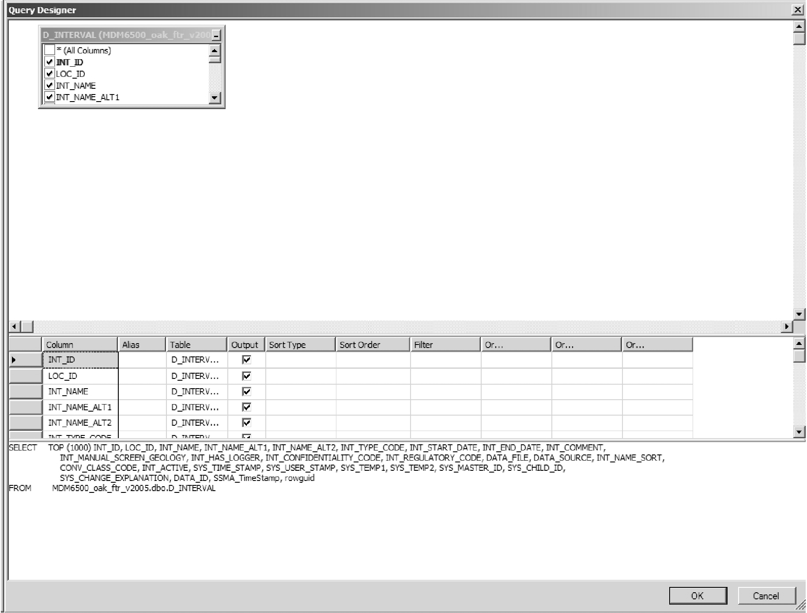
*Figure J.2.1 Microsoft SQL - Query Designer*

3. Deselect (for Output) all fields with the exception of LOC_ID, INT_ID, INT_NAME and INT_TYPE_CODE.  Add '=22' to the 'Filter' column for INT_TYPE_CODE (this limits the result of the query to only those intervals of type 'Reported Screen' - this information is found in the table R_INT_TYPE_CODE).  Deselect the INT_TYPE_CODE for 'Output'.

4. Add the tables D_BOREHOLE and R_GEOL_UNIT_CODE (in the query window '<right-click> - Add Table - <double-click on table(s)>').  Join the D_INTERVAL and D_BOREHOLE tables based upon the LOC_ID (select 'D_INTERVAL - LOC_ID' and drag to the 'D_BOREHOLE - LOC_ID').   Join the D_BOREHOLE and R_GEOL_UNIT_CODE tables based upon the BH_SURFICIAL_UNIT_CODE and the GEOL_UNIT_CODE.  Add the GEOL_UNIT_DESCRIPTION to the list of 'Output' columns and change its 'Alias' to 'Surficial Unit'.

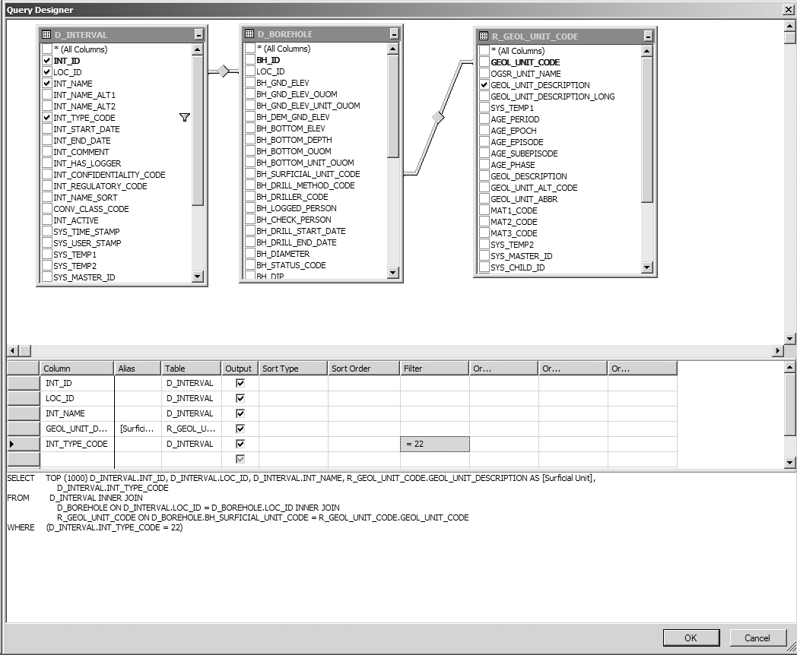
*Figure J.2.2 Microsoft SQL - Add tables*

5. Add the D_LOCATION and D_INTERVAL_MONITOR tables.  Join them to D_INTERVAL based on LOC_ID and INT_ID respectively (unless they're already joined).  Add LOC_NAME, MON_TOP_ELEV and MON_BOT_ELEV to the output fields.

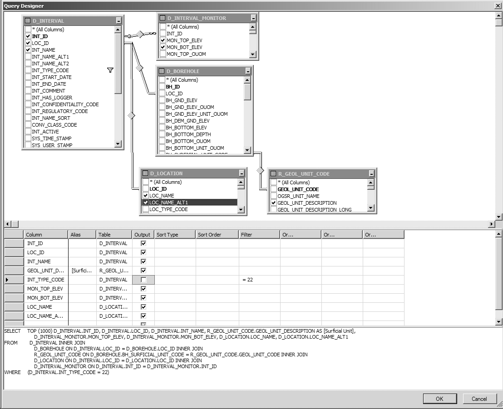
*Figure J.2.3 Microsoft SQL - Add tables*

6. Add tables D_INTERVAL_FORMATION_ASSIGNMENT and a second R_GEOL_UNIT_CODE.  Join the former to D_INTERVAL using INT_ID and break the join on the second R_GEOL_UNIT_CODE and join it to D_INTERVAL_FORMATION_ASSIGNMENT using ASSIGNED_UNIT and GEOL_UNIT_CODE.  Add a second GEOL_UNIT_DESCRIPTION from this table and make its 'Alias' 'Interval Unit'.

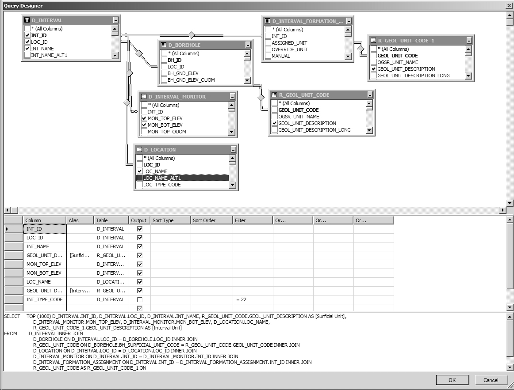
*Figure J.2.4 Microsoft SQL - Add tables*

7. Add the table D_LOCATION_ELEV and join to the D_LOCATION table using LOC_ID.  Add the ASSIGNED_ELEV to the 'Output' fields.  We'll also calculate the depths of the 'Reported Screen' - in the 'Column' field, type in 'ASSIGNED_ELEV - MON_TOP_ELEV' and give it an 'Alias' of MON_TOP_DEPTH; do the same for MON_BOT_ELEV and give it an 'Alias' of MON_BOT_DEPTH.

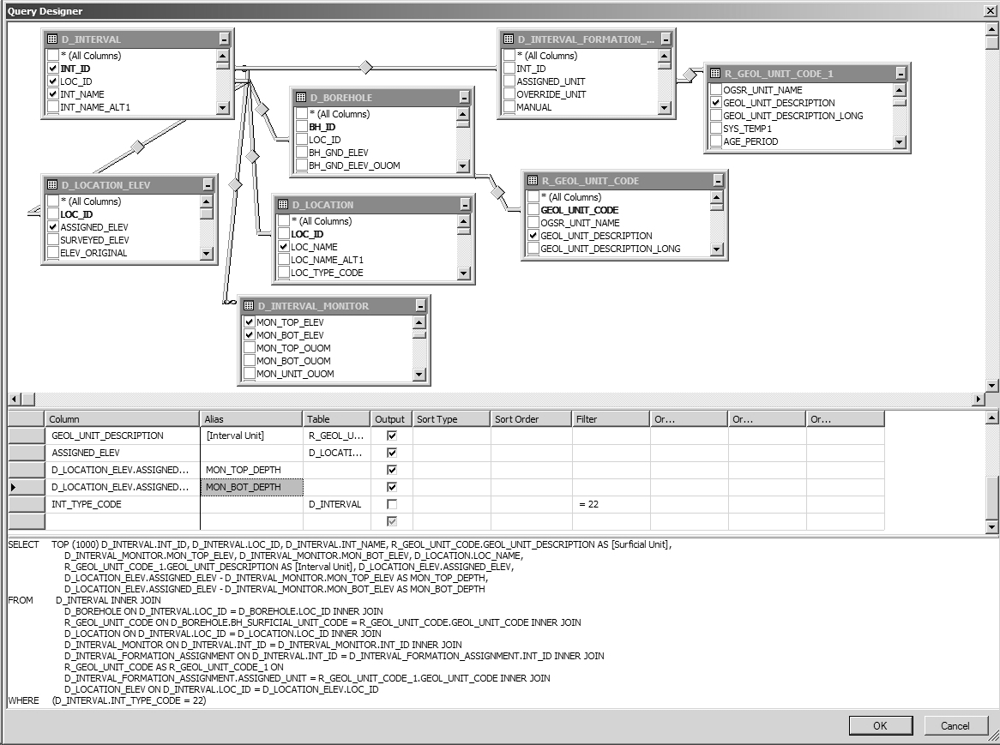
*Figure J.2.5 Microsoft SQL - Add tables*

8. Exit out of 'Query Designer' and run/execute the query.  Note that, as both INT_ID and LOC_ID are present in the results, we could subsequently relate additional tables based on those keys (say, for example, by limiting the search to those locations tagged using the SYS_TEMP2 field).  An example of the output is provided though results at each partner agency will likely be different:

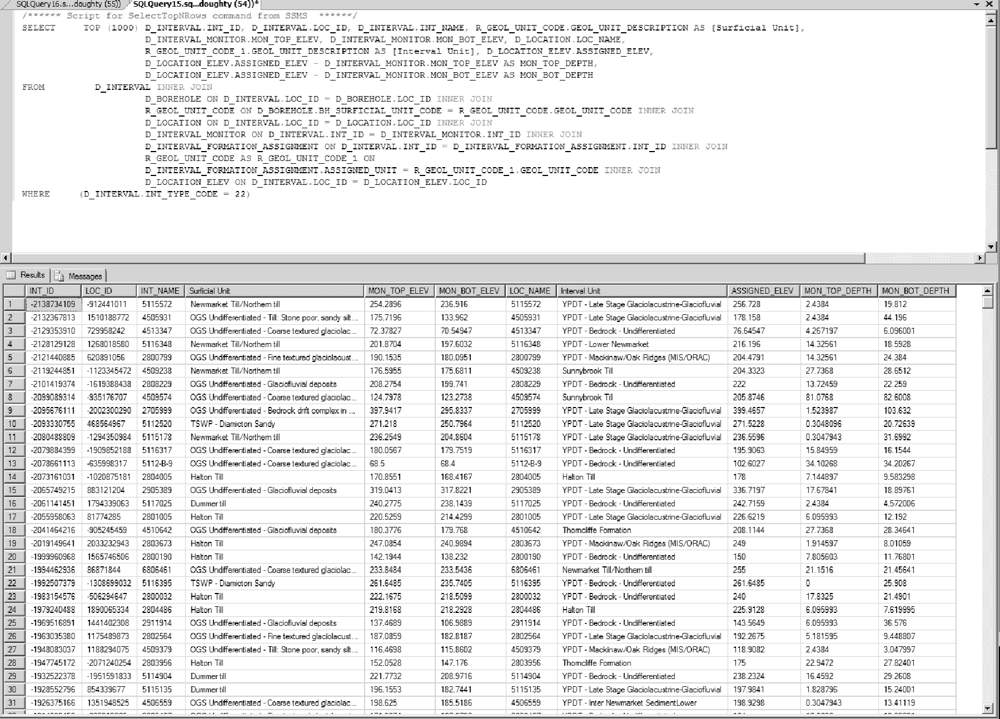
*Figure J.2.6 Microsoft SQL - Results*

#### Example 1b - Assembling Interval Data (Microsoft SQL Management Studio - Views)

The view V_GEN_HYDROGEOLGOY reproduces automatically some of the steps described in the previous example.  We'll again use MSSQLMS but, this time, using the view instead.

1.  Make sure that the partner database is selected then select the first 1000 records from the V_General_Hydrogeology view.  Note that a query can be stopped at any time by selecting the red 'Cancel Executing Query' button'.

2. Select (highlight) the resultant SQL code and choose 'Query - Design Query in Editor'.

3. Deselect all fields/columns except for: 'Location ID', 'Screen (Int) ID', 'Loc Name', 'Screen (Int) Name', 'Ground Elevation (mASL)', 'Screen Top (masl)', 'Screen Bottom (masl)', 'Interpreted Formation (Screen Top)' and 'Interpreted Formation (Screen Bottom)'.

4. Add the D_BOREHOLE and R_GEOL_UNIT_CODE tables and link based upon the LOC_ID/'Location ID' and BH_SURFICIAL_UNIT_CODE/GEOL_UNIT_CODE (as described above).  Include the GEOL_UNIT_DESCRIPTION (give it an 'Alias' of 'Surficial Unit') in the output.

5. Include the calculations for depth (described in the previous example, step 6) but subtract 'Screen Top (masl)' from 'Ground Elevation (mASL)', give it an 'Alias' of 'Screen Top Depth'; subtract 'Screen Bottom (masl)' from 'Ground Elevation (mASL)', give it an 'Alias' of 'Screen Bottom Depth'.  As the field names are somewhat long, select the second field (e.g. 'Screen Top...'), copy it, then select the first field (i.e. 'Ground Elevation ...'), add a minus (-) sign then paste the second field.

6. Exit out of 'Query Designer' and run/execute the query.  The results from this query will mimic that of the previous example without having to load multiple tables - the view itself does that internally.  However, the view is also carrying out some calculations behind the scenes such that it may actually run slower than one that is hand-built.

#### Example 2 - Importing Chemistry Data (SiteFX)

Refer to Section 2.3.4 for details regarding the formatting of laboratory/chemistry data for import into the ORMGP database.  As two tables need to be populated (i.e. D_INTERVAL_TEMPORAL_1A/1B) with this information (the first with details regarding the sample - e.g. sample date, interval sampled against, laboratory details, etc ... - while the second will contain the actual results of the analysis), data import is best accomplished using the SiteFX tool (though it can be accomplished, albeit with slightly more difficulty, using only SQL commands).

When in SiteFX, the data import option is found under 'Data - Import Data - From Files' and selecting 'Load Data' from the resultant dialog box.  The program then checks the file (in this case, an Access '.mdb' file; alternate file formats can be used) for data contents.  Import columns/fields are listed as well as the number of rows present in the file itself.  

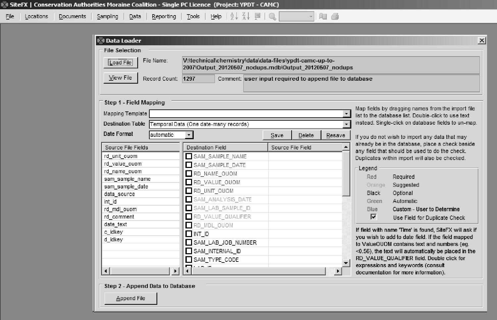
*Figure J.2.7 SiteFX - Import Data]*

The 'Destination Table' should be 'Temporal (one date, many records)'.  When importing water levels, alternatively, the selection would then be 'D_INTERVAL_TEMPORAL_2 (one date, one record)'.  The 'date' in both these cases actually corresponds to a date-time combination. The user would then 'map' the import columns/fields to the matching columns/fields within the database itself - SiteFX lists both the required and suggested fields that should be populated.  In the example, the import fields have been named to match the names of the destination fields.

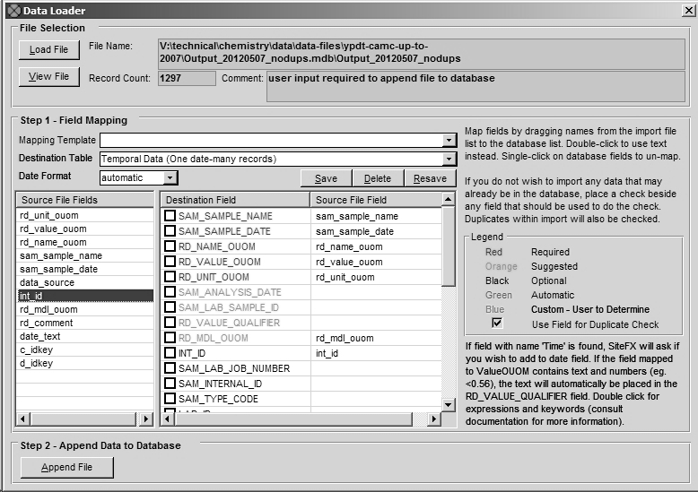
*Figure J.2.8 SiteFX - Field mapping*

Selecting 'Append File' will load the information into the database - SiteFX returns a success or failure upon completion.  In addition to populating the temporal tables, the program adds an entry into D_DATA_SOURCE that can be used for tracking - the sample itself and all sample analyses can be identified with the appropriate DATA_ID.  However, SiteFX does not populate the DATA_DESCRIPTION field - this should be done by the user.  The result is shown.

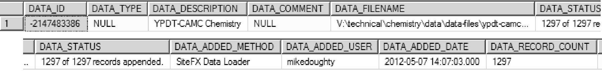
*Figure J.2.9 SiteFX data source record*

When temporal data is imported into the database through SiteFX, the program keeps a record of the transaction and its details.  If at some point in the future it's determined that the information was erroneous, SiteFX can back-out the data (i.e. remove it from the database) with little effort.  This would not be case to remove the information by hand.

#### Example 3 - Total Monthly Precipitation, Average Temperature and Water Level Data (Microsoft SQL Management Studio or Microsoft Access - SQL)

In order to simplify information the average of available results is taken.  For time-step analysis (e.g. daily or monthly time-steps, as used in recharge analysis) this information needs to be averaged based upon the specified time interval (dependent upon data availability).  This is accomplished through a conversion of the date-time field RD_DATE in D_INTERVAL_TEMPORAL_2 and a grouping of matching dates.  

For water levels this would consist of an SQL statement such as

*Figure J.2.10 Average water levels - SQL code*

Where 'Section 2' is extracting and averaging the water level information based on the interval (i.e. the INT_ID) and 'Section 1' is extracting the associated information related to the interval itself (i.e. it's location and interval name, etc ...).  

For 'Section 2', we're returning the interval identifier, the date (in the form 'yyyy-mm'), the average water level (called 'WL - Monthly Avg (masl)') and the total number of values (a count; called 'Reading Count') used to calculate the average. 

* CONVERT(varchar(7),i2.RD_DATE,121) is converting the date, pulled from the D_INTERVAL_TEMPORAL_2 table (which is being aliased/renamed as 'i2')
    + RD_DATE, from SQL Server, is returned (based upon the '121' code) in the 'yyyy-mm-dd hh:mm' format; the use of the 'varchar(7)' type-code allows us to extract the first 7 characters from the date, reducing the result to 'yyyy-mm'; making the reading a 'monthly' value
* GROUP BY i2.INT_ID,CONVERT(varchar(7),i2.RD_DATE,121)
    + As we're trying to come up with monthly values for any particular interval, we subset the returned information based upon the INT_ID and the converted (now monthly) date
* AVG(i2.RD_VALUE)
    + The actual value as found in the temporal table; as we're grouping the information (based upon INT_ID and the monthly date), this actually calculates the average of all values that correspond to a particular INT_ID and particular year-month; an 'aggregate' function
* COUNT(i2.RD_VALUE)
    + The total number of records associated with the INT_ID and year-month (that we're grouping); an 'aggregate' function
* WHERE i2.RD_NAME_CODE IN (628,629) AND i2.UNIT_CODE=6
    + We're only interested in certain water levels, namely '628' (' Water Level - Manual - Static') and '629' (' Water Level - Logger (Compensated & Corrected)' - note that these values are found in R_RD_NAME_CODE
    + In addition, we only want to include those values that have been converted to 'masl' (corresponding to a 'UNIT_CODE' of '6'; as found in R_UNIT_CODE)
* AS wla
    + As the statement (i.e. 'Section 2') is bracketed, we need to 'alias' it so that it can be referred to in 'Section 1'

For 'Section 1', we're combining the results returned from 'Section 2' (referenced as 'wla') with information concerning the interval and location associated with it.  This is accomplished through 'joining' 'Section 2' with that general location view (i.e. V_General_Locations; 'aliased' here as 'vgl').  Refer to Appendix A for details regarding the use of the 'SELECT' and 'INNER JOIN' SQL statements.

Example results (the first 10 returned - these will likely not be the same for any particular user) would then be

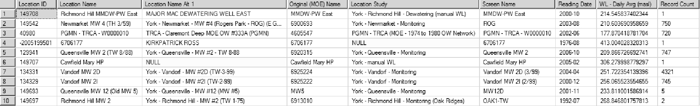
*Figure J.2.11 Average Water Levels - Results*

For temperature, the RD_NAME_CODE used is '369' (' Temperature (Air)'; water temperatures use a different code) and the UNIT_CODE would then be '3' ('C'; degrees celsius).  These would then be used to extract the RD_VALUE from D_INTERVAL_TEMPORAL_2.  Otherwise the statement is similar.

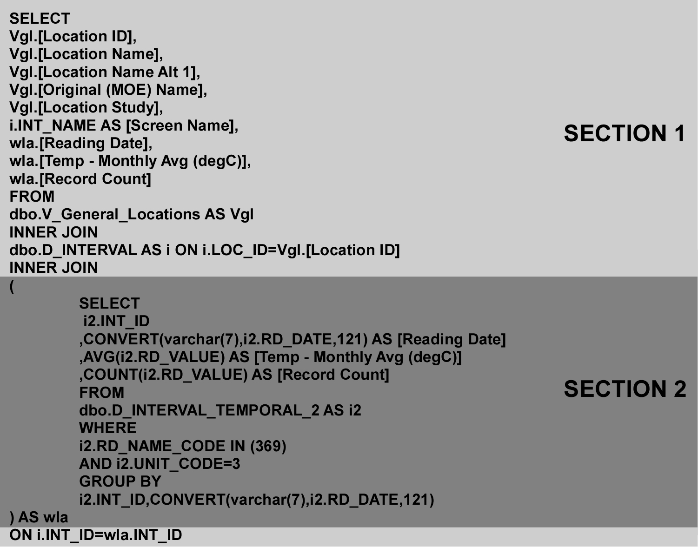
*Figure J.2.12 Average monthly temperatures - SQL code*

With the (example) results

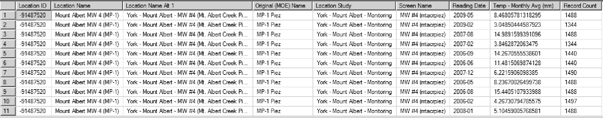
*Figure J.2.13 Average monthly temperatures - Results*

Precipitation, the last parameter we're determining monthly values for, uses an RD_NAME_CODE of '551' (' Precipitation - Day') with a UNIT_CODE of '21' ('mm').  Instead of determining the average, though, here we're looking at the total precipitation for each month.  This would then be of the form

*Figure J.2.14 Average monthly precipiation - SQL code*

where you can see the AVG keyword has been modified to SUM.  This allows a total to be calculated of all the grouped RD_VALUE's.  Example results would then be

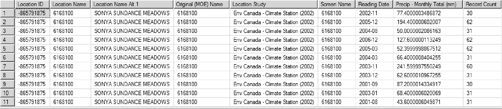
*Figure J.2.15 Average monthly precipiation - Results*

