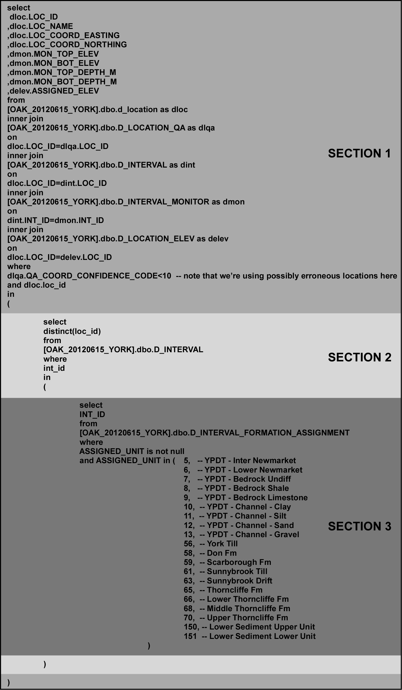
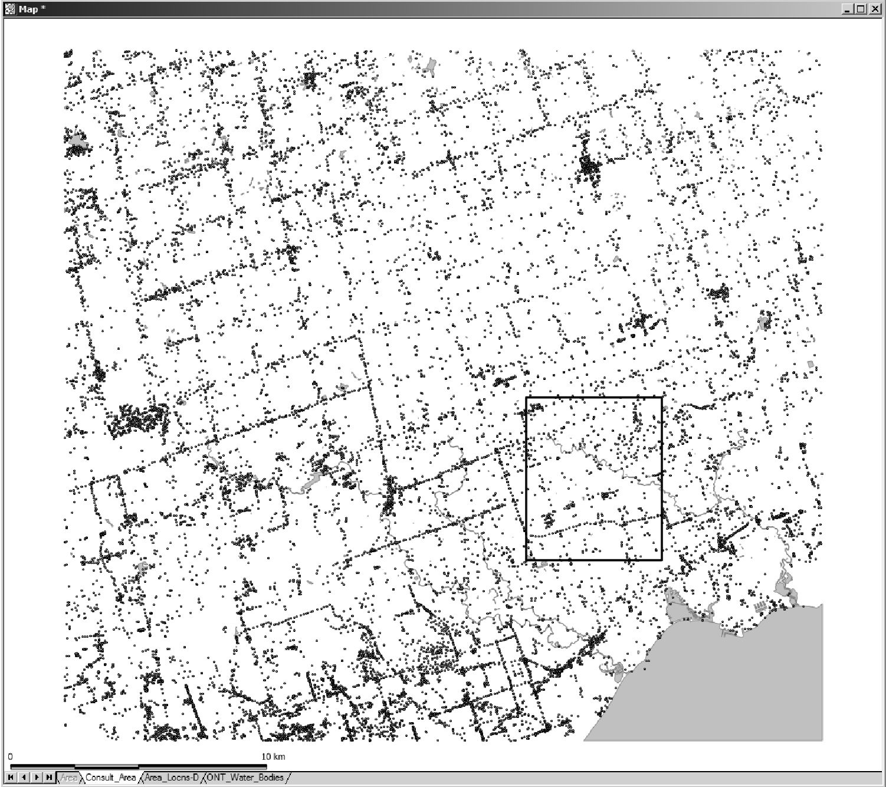
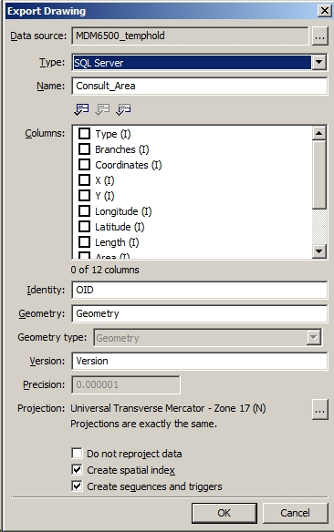
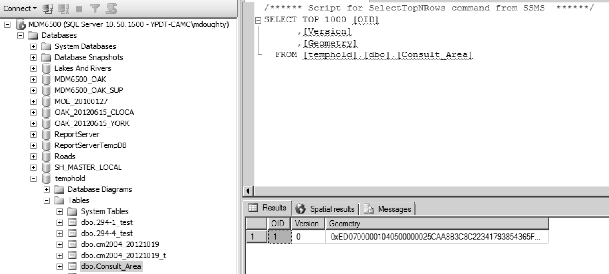
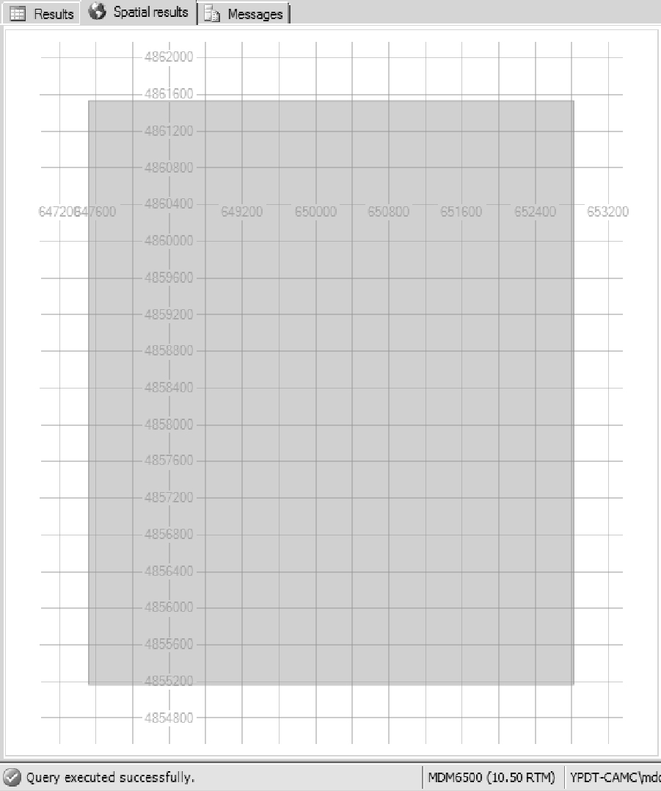
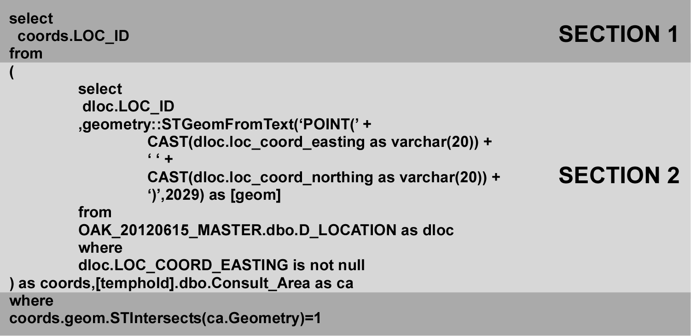
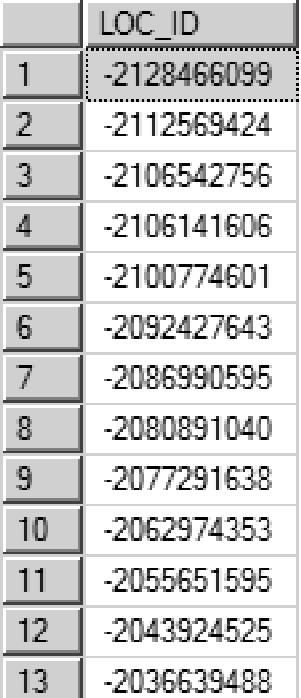
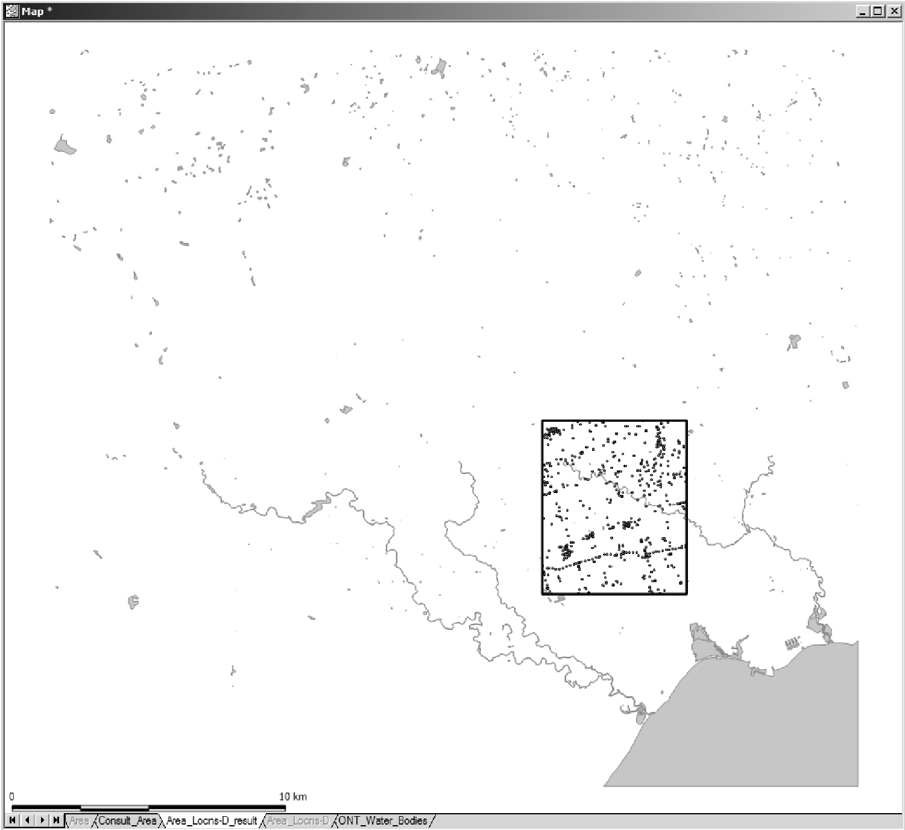

## Section J.3 Training Exercises (Difficult)

#### Example 1 - Determining Intervals Below Newmarket Till (Microsoft SQL Management Studio or Microsoft Access - SQL)

This example comprises the extraction of location- and interval-specific information for those intervals that are located below the Newmarket Till.  The SQL statement (above) has been divided into three sections, each performing a particular task (note that the Section 2 and 3 are bracketed).  When creating a query accomplishing a complicated task, it is better to work in simple steps.  The order in which each section is run is actually the reverse of what would be expected: Section 3 is run first the results of which are fed into Section 2; Section 2 is run second with the results feeding Section 1; Section 1 is run last.

*Figure J.3.1 Microsoft SQL - Query*

***Section 3***

Notice that only a single field is being returned from this section, namely the INT_ID.  This is the case when subqueries are present within a query - only a limited (in some cases only one) number of columns should be returned.  The query here is looking for intervals (to be identified by the INT_ID) which are found below the Newmarket Till.  This is accomplished by comparing the ASSIGNED_UNIT code against a list of codes corresponding to stratigraphic units found below the Newmarket Till (refer to R_GEOL_UNIT_CODE for additional code-description information).   As an aid, the unit description is included as part of the query as comments (i.e. the text occurs after a double-dash, '--').  Note also that we're not including any unassigned intervals - we first check that ASSIGNED_UNIT is not null before comparing it against the unit codes.

***Section 2***

Only a single field is being returned from this section.  In this case, the LOC_ID which is going to be the base against which will extract the information necessary for analysis.  As more than one interval can be assigned to each location, we need to remove duplicated LOC_ID's found when converting the INT_ID's (returned from Section 3) the LOC_ID's in this section.  The DISTINCT keyword does that, only returning one instance of any LOC_ID.

***Section 1***

The final section now determines and returns the information based on the LOC_ID's from Section 2 of the query.  Here we're pulling the coordinates (LOC_COORD_EASTING, LOC_COORD_NORTHING; by system default, these are UTMZ17 and NAD83 coordinates), the name, the assigned elevation (ASSIGNED_ELEV) and the top and bottom elevation and depths of the borehole screen.  Note that these fields are from multiple tables, linked by the LOC_ID (returned from Section 2).  There are a number of JOIN's made to link the necessary information together.  

One additional note on this section, we're currently using the QA coordinate code to delimit our returned results to an error of +/- 10km.  This should be changed to reflect the accuracy of the analysis (usually a QA code of less than 6; refer to R_QA_COORD_CONFIDENCE_CODE for details).

#### GIS Analysis (Non-Specific) - Introduction

The results of this query can then be fed into a GIS for further analysis.  Here we're interested in determining those wells (i.e. locations) that 

* Fall within specified polygons (e.g. WHPA's)
* The distance and depth to production wells. (for those that do fall within the specified polygons)

Note that this analysis is non-specific for a GIS, only describing in general terms the means by which to perform any particular step (or reach a certain endpoint).  If the user is unfamiliar with the GIS package they are using, a keyword search on the topics (or analysis type) described, following, would get them started on the methodology required for their particular package.  Expert GIS users can safely ignore the following outlines.

***GIS Analysis - Points And Areas***

The defined polygons (called WHPA_Poly), the municipal wells (referred to as BHS_MUNIC) and the boreholes found to be below the Northern Till (referred to as BHS_BELOW_NT) need to be incorporated in the GIS package.  The latter projection has been previously described - make sure that the projections of each layer match.

***GIS Analysis - Topology Overlay***

The user needs to determine a 'contained-within' relationship between BHS_BELOW_NT and WHPA.  This is commonly referred to as a 'Topology Overlay' where attributes can be (or are) copied between overlapping objects (or are otherwise tagged) with the meaning that they encompass some (or all) of the same spatial area.  Once it has been determined which points in BHS_BELOW_NT are found within a WHPA_Poly, the remainder can be removed.

Note that this operation can also be accomplished through a 'Select Touching' or (more correctly) 'Select Contained Within' operation.  The operation may also be known as an 'Identity Overlay'.

***GIS Analysis - Nearest Neighbour***

Using the BHS_BELOW_NT and BHS_MUNIC layers, the user can carry out a 'Nearest Neighbour' analysis which determines which municipal well is closest to the boreholes below the Northern Till.  In general, a straight line segment is drawn between the two locations and tagged with an (below NT) identifier and a distance - alternatively, the distance and (municipal) identifier can be added directly to the BHS_BELOW_NT table.

***GIS_Analysis - Depths***

Once there is a relationship between the BHS_BELOW_NT and BHS_MUNIC layers, a straight subtraction can occur between the top screen elevations for both boreholes.  This calculates the vertical offsets between the screens.

If a new layer was created in the 'Nearest Neighbour' analysis, the objects in that layer need to be associated with both the BHS_BELOW_NT and BHS_MUNIC layers before calculation (as we'll need the elevations from both).  This may be accomplished through a 'Spatial Overlay', where attributes are transferred between each other based upon their spatial location - in some cases, the fields need to be present in both tables  before the analysis.

#### Example 2 - Extracting Consultant Information By Area (Microsoft SQL Management Studio with Spatial SQL or GIS)

There are various methods by which to extract information from a designated area.  This generally arises when the user wishes to delimit the information provided to a third-party through specification of a spatial boundary.  Given the following example area

*Figure J.3.2 Study area extents*

where the points indicate locations found within the ORMGP database, how do you determine what locations are found within the black boundary-polygon/project-area.  As the boundary is rectangular, the determination of what locations lie within is fairly straightforward.  Provided with (or determining) that the minimum-maximum coordinates are:

* Minimum Easting - 629481
* Maximum Easting - 659107
* Minimum Northing - 4848108
* Maximum Northing - 4875111

An SQL query to extract the LOC_ID's that fall within the area (as a first step before extracting the remainder of the desired information) would be

    SELECT
    LOC_ID
    FROM 
    D_LOCATION
    WHERE
    LOC_COORD_EASTING BETWEEN 629481 AND 659107
    AND LOC_COORD_NORTHING BETWEEN 4848108 AND 4875111

However, if the boundary was not rectangular, this query would not be appropriate.  Instead, for example, the user would use an external package (for example, Viewlog or a GIS package - ArcMap, etc ...) to plot the locations from D_LOCATION (using the LOC_COORD_EASTING and LOC_COORD_NORTHING fields).  Then, using the boundary-polygon, a 'Contained Within' or other similar 'Overlay' analysis would be run, extracting the LOC_ID's that are found within the boundary.  These could then be 'marked' - that is, a value placed in either of the SYS_TEMP1 or SYS_TEMP2 fields in D_LOCATION indicating that it lies within the boundary-polygon.  If the value placed in the SYS_TEMP2 field was '20121030', then the query to extract the location identifier would be

    SELECT
    LOC_ID
    FROM
    D_LOCATION
    WHERE
    SYS_TEMP2=20121020

This would duplicate the results from the previous query (i.e. using, directly, the coordinates of the boundary-polygon).

An alternative method would allow the user to query the SQL Server (i.e. the ORMGP) database directly.  This requires loading the boundary-polygon directly into a supplementary SQL Server database - such a database holds temporary tables, views or other objects that the user requires to be compared/run-against the ORMGP database.  This avoids inclusion of any information in the ORMGP database that is not considered 'official' (refer to Appendix F for examples of accessory/supplementary databases and their objects currently in use at the ORMGP).

Here is an example of loading the boundary-polygon ('Consult_Area') into a temporary database ('MDM6500_temphold') using Manifold GIS.  (Most GIS packages should be able to load spatial information into SQL Server.  See Nielson (2008) for a free non-GIS software which will also load spatial files into SQL Server.) 

*Figure J.3.3 Incorporation of polygons in database*

Notice that:

* The 'Data source' is 'MDM6500_temphold'; this is the name of the database into which we're exporting the polygon
* The 'Type' is designated as 'SQL Server'; this software has the capability of working with spatial objects and has had it's SQL syntax expanded to include spatial operations
* 'Identity' is a new (created) field/column to be used as a primary key (here, the default name is 'OID')
* 'Geometry' allows specification of 'Geometry' or 'Geographic'; the former is for Cartesian coordinates (e.g. UTM coordinates) while the latter is for Latitude-Longitude coordinates.
* A spatial index (checked under 'Create spatial index') must be created to allow SQL Server to interact with the object
* The projection must match that of a supported projection in SQL Server; these are identified by the European Petroleum Survey Group (EPSG) standard (now the OGP Geomatics Committee); in our case, we should be using code '2029' which matches to 'Universal Transverse Mercator - Zone 17 (N), WGS84' (note that the WGS84 datum corresponds to the NAD83 datum used by the ORMGP database, with minor differences)

This is directly loaded into the 'MDM6500_temphold' database and looks, to all appearances, as a regular table. 

*Figure J.3.4 Incorporation of polygons in database*

Notice the presence of a 'Geometry' column - this contains the spatial information attributed to the original boundary-polygon, now part of the 'Consult_Area' table/object.  If we examine the 'Spatial results' tab, we can see a representation of the object.

*Figure J.3.5 Spatial visualization in database*

A grid has also been plotted showing the coordinates (which should match those described earlier).  A limited capability for zooming/navigating across a spatial dataset is provided (though it's not useful or necessary in this instance).

In order to compare the locations from D_LOCATION against that of 'Consult_Area' (i.e. the polygon), we need to convert the points (i.e. the coordinates) to a 'Geometry' type then run an 'Intersect' or 'Contains' operation.  This is accomplished in a single step using the following SQL statement

*Figure J.3.6 Spatial query using geometry*

***Section 2***

This section is copying the LOC_ID, LOC_COORD_EASTING and LOC_COORD_NORTHING values for each location in D_LOCATION and converting the latter two to a 'Geometry' object - a spatial object against which we'll be comparing the 'Consult_Area' polygon.  The 'geometry::STGeomFromText' keyword is a built-in function of SQL Server ; this does the actual conversion.  It requires a text string as input; that is being set using the 'CAST' statements (along with the '+' which, in this instance, is concatenating the individual text strings together into a single text string; note that there is a single ' ' shown - this is a space surrounded by single brackets).  The output from this section would be a 'Geometry' object linked to a LOC_ID.

***Section 1***

This section does the actual comparison using the 'coords.geom.STIntersects' operation.  This returns a 'True' (or 1) value when the geometries of the two objects (i.e. 'coords.geom' and 'ca.Geometry') cross (or intersect).  When this value is 'True', we're returning the LOC_ID.  The output from this script, then, is a single column containing the overlapping LOC_ID's to 'Consult_Area'.

*Figure J.3.7 Spatial query field results*

This could then be used as input into another query pulling, for example, all location or borehole information corresponding to the 'Consult_Area' polygon.  The selected locations are shown below (in comparison to the first location distribution figure).

*Figure J.3.8 Spatial query results*

